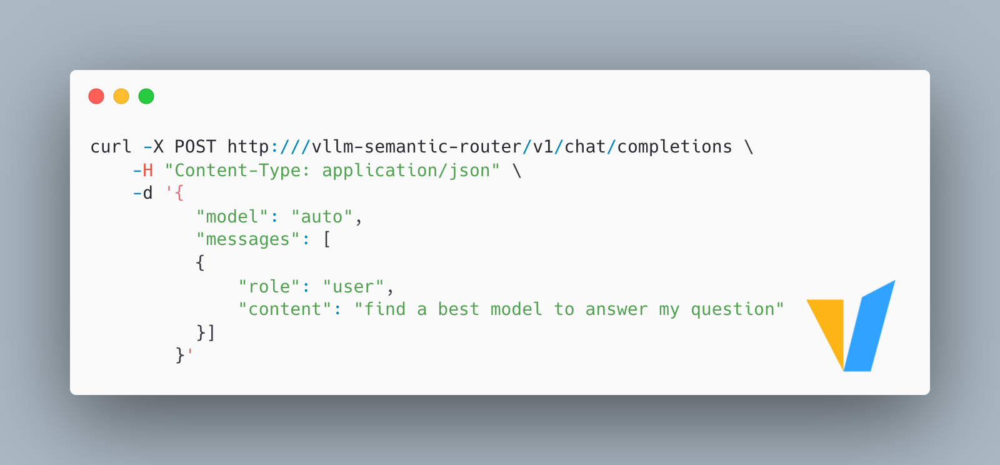
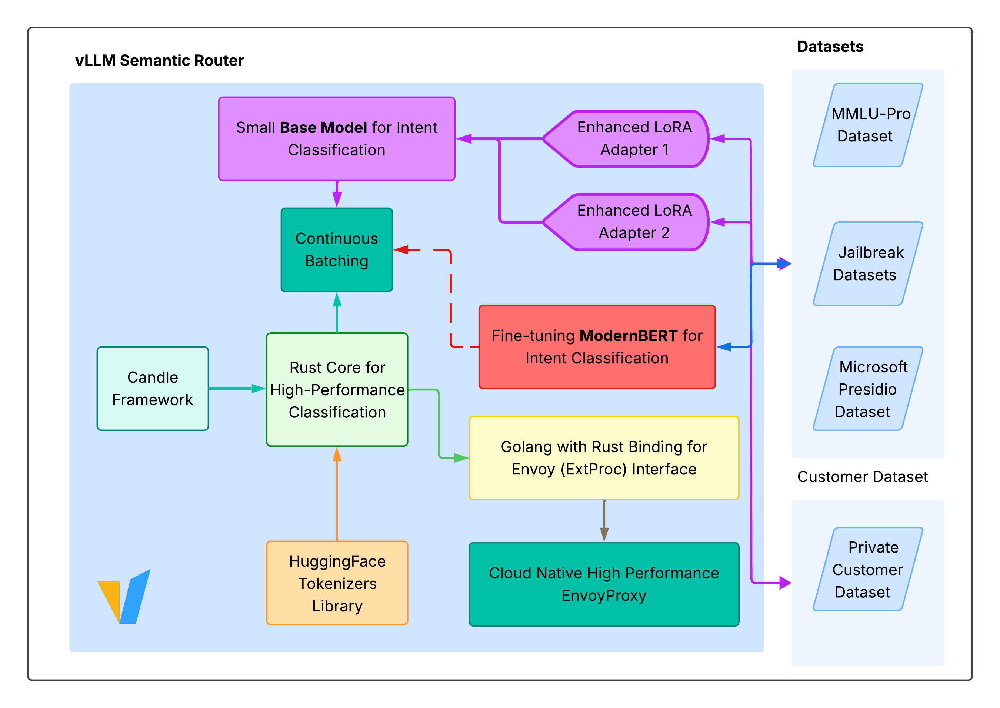
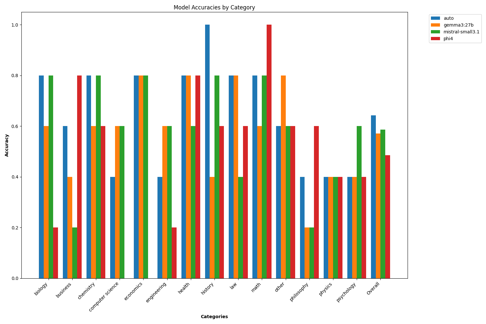

<div align="center">


[](https://vllm-semantic-router.com)
[](https://huggingface.co/LLM-Semantic-Router)
[](LICENSE)
[](https://crates.io/crates/candle-semantic-router)


**📚 [Complete Documentation](https://vllm-semantic-router.com) | 🚀 [Quick Start](https://vllm-semantic-router.com/docs/getting-started/installation) | 📣 [Blog](https://vllm-semantic-router.com/blog/) | 📖 [API Reference](https://vllm-semantic-router.com/docs/api/router/)**



</div>

## Innovations ✨



### Intelligent Routing 🧠

#### Auto-Reasoning and Auto-Selection of Models

An **Mixture-of-Models** (MoM) router that intelligently directs OpenAI API requests to the most suitable models from a defined pool based on **Semantic Understanding** of the request's intent (Complexity, Task, Tools).

This is achieved using BERT classification. Conceptually similar to Mixture-of-Experts (MoE) which lives *within* a model, this system selects the best *entire model* for the nature of the task.

As such, the overall inference accuracy is improved by using a pool of models that are better suited for different types of tasks:



The screenshot below shows the LLM Router dashboard in Grafana.


The router is implemented in two ways: 

- Golang (with Rust FFI based on the [candle](https://github.com/huggingface/candle) rust ML framework)
- Python
Benchmarking will be conducted to determine the best implementation.

#### Auto-Selection of Tools

Select the tools to use based on the prompt, avoiding the use of tools that are not relevant to the prompt so as to reduce the number of prompt tokens and improve tool selection accuracy by the LLM.

### Enterprise Security 🔒

#### PII detection

Detect PII in the prompt, avoiding sending PII to the LLM so as to protect the privacy of the user.

#### Prompt guard

Detect if the prompt is a jailbreak prompt, avoiding sending jailbreak prompts to the LLM so as to prevent the LLM from misbehaving.

### Similarity Caching ⚡️

Cache the semantic representation of the prompt so as to reduce the number of prompt tokens and improve the overall inference latency.

## Documentation 📖

For comprehensive documentation including detailed setup instructions, architecture guides, and API references, visit:

**👉 [Complete Documentation at Read the Docs](https://vllm-semantic-router.com/)**

The documentation includes:

- **[Installation Guide](https://vllm-semantic-router.com/docs/getting-started/installation/)** - Complete setup instructions
- **[System Architecture](https://vllm-semantic-router.com/docs/architecture/system-architecture/)** - Technical deep dive
- **[Model Training](https://vllm-semantic-router.com/docs/training/training-overview/)** - How classification models work
- **[API Reference](https://vllm-semantic-router.com/docs/api/router/)** - Complete API documentation

## Community 👋

For questions, feedback, or to contribute, please join `#semantic-router` channel in vLLM Slack.

## Citation

If you find Semantic Router helpful in your research or projects, please consider citing it:

```
@misc{semanticrouter2025,
  title={vLLM Semantic Router},
  author={vLLM Semantic Router Team},
  year={2025},
  howpublished={\url{https://github.com/vllm-project/semantic-router}},
}
```

## Star History 🔥

We opened the project at Aug 31, 2025. We love open source  and collaboration ❤️

[](https://www.star-history.com/#vllm-project/semantic-router&Date)
