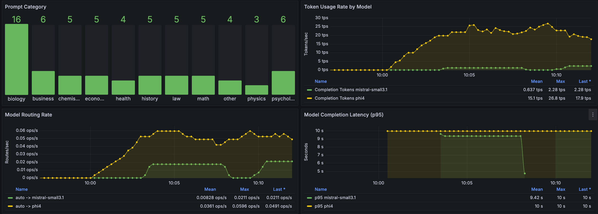

# LLM Semantic Router

<div align="center">


[](https://llm-semantic-router.readthedocs.io/en/latest/)
[](LICENSE)
[](https://crates.io/crates/candle-semantic-router)

**📚 [Complete Documentation](https://llm-semantic-router.readthedocs.io/en/latest/) | 🚀 [Quick Start](https://llm-semantic-router.readthedocs.io/en/latest/getting-started/quick-start/) | 🏗️ [Architecture](https://llm-semantic-router.readthedocs.io/en/latest/architecture/system-architecture/) | 📖 [API Reference](https://llm-semantic-router.readthedocs.io/en/latest/api/router/)**

</div>

## Auto-selection of model

An Envoy External Processor (ExtProc) that acts as an external **Mixture-of-Models (MoM)** router. It intelligently directs OpenAI API requests to the most suitable backend model from a defined pool based on semantic understanding of the request's intent. This is achieved using BERT classification. Conceptually similar to Mixture-of-Experts (MoE) which lives *within* a model, this system selects the best *entire model* for the nature of the task.

As such, the overall inference accuracy is improved by using a pool of models that are better suited for different types of tasks:


The detailed design doc can be found [here](https://docs.google.com/document/d/1BwwRxdf74GuCdG1veSApzMRMJhXeUWcw0wH9YRAmgGw/edit?usp=sharing).

The screenshot below shows the LLM Router dashboard in Grafana.



The router is implemented in two ways: Golang (with Rust FFI based on Candle) and Python. Benchmarking will be conducted to determine the best implementation.

## Auto-selection of tools

Select the tools to use based on the prompt, avoiding the use of tools that are not relevant to the prompt so as to reduce the number of prompt tokens and improve tool selection accuracy by the LLM.

## PII detection

Detect PII in the prompt, avoiding sending PII to the LLM so as to protect the privacy of the user.

## Prompt guard

Detect if the prompt is a jailbreak prompt, avoiding sending jailbreak prompts to the LLM so as to prevent the LLM from misbehaving.

## Semantic cache

Cache the semantic representation of the prompt so as to reduce the number of prompt tokens and improve the overall inference latency.

## 📖 Documentation

For comprehensive documentation including detailed setup instructions, architecture guides, and API references, visit:

**👉 [Complete Documentation at Read the Docs](https://llm-semantic-router.readthedocs.io/en/latest/)**

The documentation includes:
- **[Installation Guide](https://llm-semantic-router.readthedocs.io/en/latest/getting-started/installation/)** - Complete setup instructions
- **[Quick Start](https://llm-semantic-router.readthedocs.io/en/latest/getting-started/quick-start/)** - Get running in 5 minutes
- **[System Architecture](https://llm-semantic-router.readthedocs.io/en/latest/architecture/system-architecture/)** - Technical deep dive
- **[Model Training](https://llm-semantic-router.readthedocs.io/en/latest/training/training-overview/)** - How classification models work
- **[API Reference](https://llm-semantic-router.readthedocs.io/en/latest/api/router/)** - Complete API documentation

## Quick Usage

### Prerequisites

- Rust
- Envoy
- Huggingface CLI

### Run the Envoy Proxy

This listens for incoming requests and uses the ExtProc filter.
```bash
make run-envoy
```

### Download the models

```bash
make download-models
```

### Run the Semantic Router (Go Implementation)

This builds the Rust binding and the Go router, then starts the ExtProc gRPC server that Envoy communicates with.
```bash
make run-router
```

Once both Envoy and the router are running, you can test the routing logic using predefined prompts:

```bash
# Test the tools auto-selection
make test-tools

# Test the auto-selection of model
make test-prompt

# Test the prompt guard
make test-prompt-guard

# Test the PII detection
make test-pii
```

This will send curl requests simulating different types of user prompts (Math, Creative Writing, General) to the Envoy endpoint (`http://localhost:8801`). The router should direct these to the appropriate backend model configured in `config/config.yaml`.

## Testing

A comprehensive test suite is available to validate the functionality of the Semantic Router. The tests follow the data flow through the system, from client request to routing decision.

### Prerequisites

Install test dependencies:
```bash
pip install -r tests/requirements.txt
```

### Running Tests

Make sure both the Envoy proxy and Router are running:
```bash
make run-envoy  # In one terminal
make run-router  # In another terminal
```
### Running e2e Tests
Run all tests in sequence:
```bash
python e2e-tests/run_all_tests.py
```

Run a specific test:
```bash
python e2e-tests/00-client-request-test.py
```

Run only tests matching a pattern:
```bash
python e2e-tests/run_all_tests.py --pattern "0*-*.py"
```

Check if services are running without running tests:
```bash
python e2e-tests/run_all_tests.py --check-only
```

The test suite includes:
- Basic client request tests
- Envoy ExtProc interaction tests
- Router classification tests
- Semantic cache tests
- Category-specific tests
- Metrics validation tests

