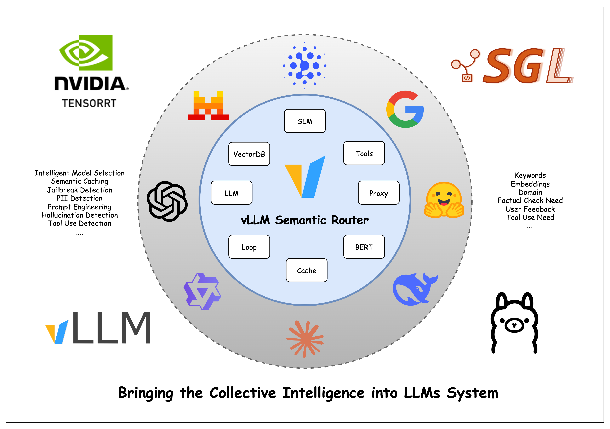
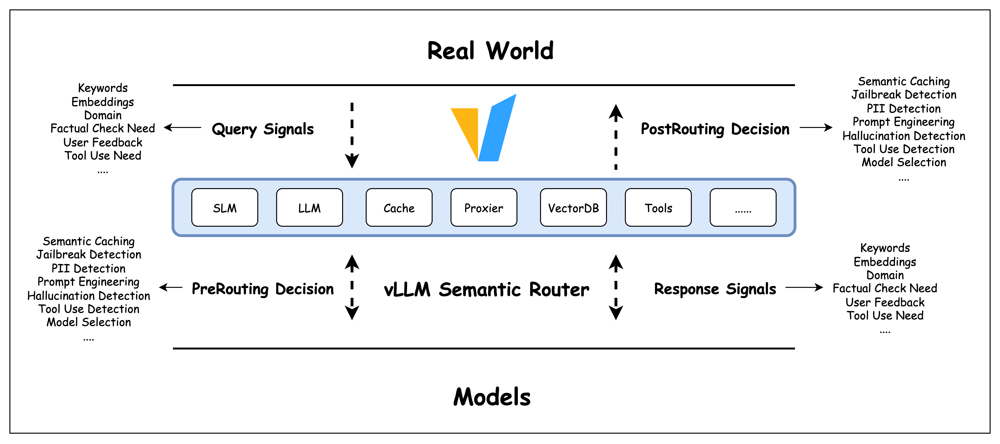

<div align="center">


[](https://vllm-semantic-router.com)
[](https://huggingface.co/LLM-Semantic-Router)
[](LICENSE)
[](https://crates.io/crates/candle-semantic-router)

[](https://deepwiki.com/vllm-project/semantic-router)

**🎯 [Playground](https://play.vllm-semantic-router.com) | 📚 [Website](https://vllm-semantic-router.com) | 🚀 [Quick Start](https://vllm-semantic-router.com/docs/installation) | 📣 [Blog](https://vllm-semantic-router.com/blog/) | 📖 [Publications](https://vllm-semantic-router.com/publications/)**

</div>

---

*Latest News* 🔥

- [2026/01/05] Iris v0.1 is Released: [vLLM Semantic Router v0.1 Iris: The First Major Release](https://blog.vllm.ai/2026/01/05/vllm-sr-iris.html)
- [2025/12/16] Collaboration: [AMD × vLLM Semantic Router: Building the System Intelligence Together](https://blog.vllm.ai/2025/12/16/vllm-sr-amd.html)
- [2025/12/15] New Blog: [Token-Level Truth: Real-Time Hallucination Detection for Production LLMs](https://blog.vllm.ai/2025/12/14/halugate.html)
- [2025/11/19] New Blog: [Signal-Decision Driven Architecture: Reshaping Semantic Routing at Scale](https://blog.vllm.ai/2025/11/19/signal-decision.html)
- [2025/11/03] Our paper [Category-Aware Semantic Caching for Heterogeneous LLM Workloads](https://arxiv.org/abs/2510.26835) published
- [2025/10/27] New Blog: [Scaling Semantic Routing with Extensible LoRA](https://blog.vllm.ai/2025/10/27/semantic-router-modular.html)
- [2025/10/12] Our paper [When to Reason: Semantic Router for vLLM](https://arxiv.org/abs/2510.08731) accepted by NeurIPS 2025 MLForSys.
- [2025/10/08] Collaboration: vLLM Semantic Router with [vLLM Production Stack](https://github.com/vllm-project/production-stack) Team.
- [2025/09/01] Released the project: [vLLM Semantic Router: Next Phase in LLM inference](https://blog.vllm.ai/2025/09/11/semantic-router.html).

---

## Goals

We are building the **System Level Intelligence** for Mixture-of-Models (MoM), bringing the **Collective Intelligence** into **LLM systems**, answering the following questions:

1. How to capture the missing signals in request, response and context?
2. How to combine the signals to make better decisions?
3. How to collaborate more efficiently between different models?
4. How to secure the real world and LLM system from jailbreaks, pii leaks, hallucinations?
5. How to collect the valuable signals and build a self-learning system?



### Where it lives

It lives between the real world and models:



### Architecture

A quick overview of the current architecture:


## Quick Start

### Installation

> [!TIP]
> We recommend that you setup a Python virtual environment to manage dependencies.

```bash
$ python -m venv vsr
$ source vsr/bin/activate
$ pip install vllm-sr
```

Installed successfully if you see the following help message:

```bash
$ vllm-sr

       _ _     __  __       ____  ____
__   _| | |_ _|  \/  |     / ___||  _ \
\ \ / / | | | | |\/| |_____\___ \| |_) |
 \ V /| | | |_| | |  |_____|___) |  _ <
  \_/ |_|_|\__,_|_|  |     |____/|_| \_\

vLLM Semantic Router - Intelligent routing for vLLM

Usage: vllm-sr [OPTIONS] COMMAND [ARGS]...

  vLLM Semantic Router CLI - Intelligent routing and caching for vLLM
  endpoints.

Options:
  --version  Show version and exit.
  --help     Show this message and exit.

Commands:
  config  Print generated configuration.
  init    Initialize vLLM Semantic Router configuration.
  dashboard  Launch the vLLM Semantic Router dashboard.
  logs    Show logs from vLLM Semantic Router service.
  serve   Start vLLM Semantic Router.
  status  Show status of vLLM Semantic Router services.
  stop    Stop vLLM Semantic Router.
```

> [!TIP]
> You can specify the HF_ENDPOINT, HF_TOKEN, and HF_HOME environment variables to configure the Hugging Face credentials.

```bash
# Set environment variables (optional)
export HF_ENDPOINT=https://huggingface.co  # Or use mirror: https://hf-mirror.com
export HF_TOKEN=your_token_here  # Only for gated models
export HF_HOME=/path/to/cache  # Optional: custom cache directory

# Start the service - models download automatically
# Environment variables are automatically passed to the container
vllm-sr serve
```

### Configuration

**File Descriptor Limits**: The CLI automatically sets file descriptor limits to 65,536 for Envoy proxy. For custom limits:

```bash
export VLLM_SR_NOFILE_LIMIT=100000  # Optional: custom limit (min: 8192)
vllm-sr serve
```

See the [vllm-sr README](src/vllm-sr/README.md#configuration) for detailed configuration options and troubleshooting.

## Documentation 📖

For comprehensive documentation including detailed setup instructions, architecture guides, and API references, visit:

Complete Documentation at Read the **[Docs](https://vllm-semantic-router.com/)**

The documentation includes:

- **[Installation Guide](https://vllm-semantic-router.com/docs/installation/)** - Complete setup instructions
- **[System Architecture](https://vllm-semantic-router.com/docs/intro/#architecture-overview)** - Technical deep dive
- **[Model Training](https://vllm-semantic-router.com/docs/training/training-overview/)** - How classification models work
- **[API Reference](https://vllm-semantic-router.com/docs/api/router/)** - Complete API documentation

## Community 👋

For questions, feedback, or to contribute, please join `#semantic-router` channel in vLLM Slack.

### Community Meetings 📅

We host bi-weekly community meetings to sync up with contributors across different time zones:

- **First Tuesday of the month**: 9:00-10:00 AM EST (accommodates US EST, EU, and Asia Pacific contributors)
  - [Zoom Link](https://us05web.zoom.us/j/84122485631?pwd=BB88v03mMNLVHn60YzVk4PihuqBV9d.1)
  - [Google Calendar Invite](https://us05web.zoom.us/meeting/tZAsdeuspj4sGdVraOOR4UaXSstrH2jjPYFq/calendar/google/add?meetingMasterEventId=4jjzUKSLSLiBHtIKZpGc3g)
  - [ics file](https://drive.google.com/file/d/15wO8cg0ZjNxdr8OtGiZyAgkSS8_Wry0J/view?usp=sharing)
- **Third Tuesday of the month**: 1:00-2:00 PM EST (accommodates US EST and California contributors)
  - [Zoom Link](https://us06web.zoom.us/j/86871492845?pwd=LcTtXm9gtGu23JeWqXxbnLLCCvbumB.1)
  - [Google Calendar Invite](https://us05web.zoom.us/meeting/tZIlcOispzkiHtH2dlkWlLym68bEqvuf3MU5/calendar/google/add?meetingMasterEventId=PqWz2vk7TOCszPXqconGAA)
  - [ics file](https://drive.google.com/file/d/1T54mwYpXXoV9QfR76I56BFBPNbykSsTw/view?usp=sharing)
- Meeting Recordings: [YouTube](https://www.youtube.com/@vLLMSemanticRouter/videos)

Join us to discuss the latest developments, share ideas, and collaborate on the project!

## Citation

If you find Semantic Router helpful in your research or projects, please consider citing it:

```
@misc{semanticrouter2025,
  title={vLLM Semantic Router},
  author={vLLM Semantic Router Team},
  year={2025},
  howpublished={\url{https://github.com/vllm-project/semantic-router}},
}
```

## Star History 🔥

We opened the project at Aug 31, 2025. We love open source  and collaboration ❤️

[](https://www.star-history.com/#vllm-project/semantic-router&Date)

## Sponsors 👋

We are grateful to our sponsors who support us:

---

[**AMD**](https://www.amd.com) provides us with GPU resources and [ROCm™](https://www.amd.com/en/products/software/rocm.html) Software for training and researching the frontier router models, enhancing e2e testing, and building online models playground.

<div align="center">
<a href="https://www.amd.com">
  
</a>
</div>

---
