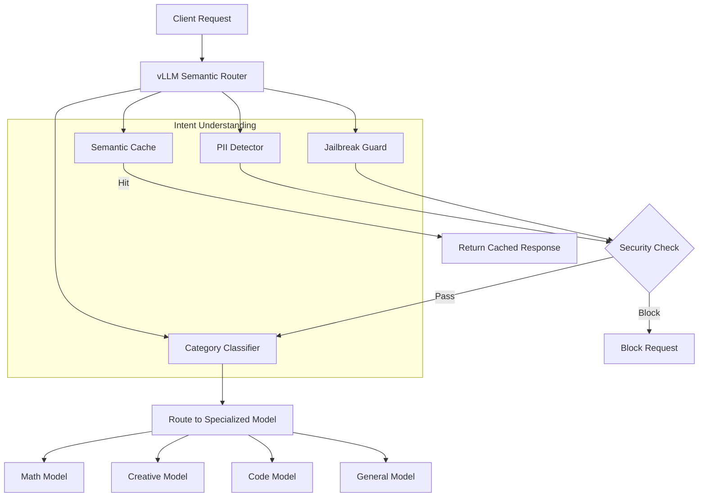

# LLM Semantic Router

**📚 [Complete Documentation](https://llm-semantic-router.readthedocs.io/en/latest/) | 🚀 [Quick Start](https://llm-semantic-router.readthedocs.io/en/latest/getting-started/quick-start/) | 🏗️ [Architecture](https://llm-semantic-router.readthedocs.io/en/latest/architecture/system-architecture/) | 📖 [API Reference](https://llm-semantic-router.readthedocs.io/en/latest/api/router/)**

## Overview

### Auto-Selection of Models

An **Mixture-of-Models** (MoM) router that intelligently directs OpenAI API requests to the most suitable models from a defined pool based on **Semantic Understanding** of the request's intent (Complexity, Task, Tools).

This is achieved using BERT classification. Conceptually similar to Mixture-of-Experts (MoE) which lives *within* a model, this system selects the best *entire model* for the nature of the task.

As such, the overall inference accuracy is improved by using a pool of models that are better suited for different types of tasks:

The screenshot below shows the LLM Router dashboard in Grafana.

The router is implemented in two ways: Golang (with Rust FFI based on Candle) and Python. Benchmarking will be conducted to determine the best implementation.

### Auto-Selection of Tools

Select the tools to use based on the prompt, avoiding the use of tools that are not relevant to the prompt so as to reduce the number of prompt tokens and improve tool selection accuracy by the LLM.

### PII detection

Detect PII in the prompt, avoiding sending PII to the LLM so as to protect the privacy of the user.

### Prompt guard

Detect if the prompt is a jailbreak prompt, avoiding sending jailbreak prompts to the LLM so as to prevent the LLM from misbehaving.

### Semantic Caching

Cache the semantic representation of the prompt so as to reduce the number of prompt tokens and improve the overall inference latency.

## 📖 Documentation

For comprehensive documentation including detailed setup instructions, architecture guides, and API references, visit:

**👉 [Complete Documentation at Read the Docs](https://llm-semantic-router.readthedocs.io/en/latest/)**

The documentation includes:
- **[Installation Guide](https://llm-semantic-router.readthedocs.io/en/latest/getting-started/installation/)** - Complete setup instructions
- **[Quick Start](https://llm-semantic-router.readthedocs.io/en/latest/getting-started/quick-start/)** - Get running in 5 minutes
- **[System Architecture](https://llm-semantic-router.readthedocs.io/en/latest/architecture/system-architecture/)** - Technical deep dive
- **[Model Training](https://llm-semantic-router.readthedocs.io/en/latest/training/training-overview/)** - How classification models work
- **[API Reference](https://llm-semantic-router.readthedocs.io/en/latest/api/router/)** - Complete API documentation
