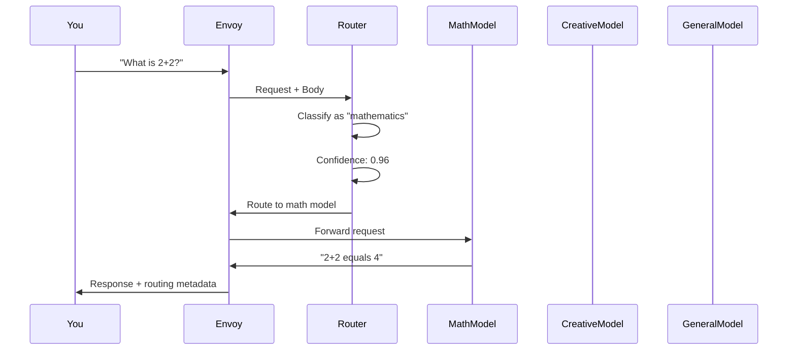

# Quick Start Guide

This guide will get you up and running with the Semantic Router in just a few minutes. Follow these steps to see the router in action with intelligent model selection.

## Prerequisites

Before starting, ensure you have completed the [Installation Guide](installation.md) and have:

- ✅ Semantic Router installed and built
- ✅ Pre-trained models downloaded
- ✅ Envoy proxy configured
- ✅ Backend LLM endpoints ready (or using Ollama for testing)

## 5-Minute Quick Start

### Step 1: Start the Services

Open two terminals and start the required services:

**Terminal 1 - Start Envoy Proxy:**
```bash
cd semantic_router
make run-envoy
```

**Terminal 2 - Start Semantic Router:**
```bash
cd semantic_router  
make run-router
```

You should see output similar to:
```
Starting LLM Router ExtProc server on port 50051...
[INFO] Models loaded successfully
[INFO] Semantic cache initialized
[INFO] Server ready to accept connections
```

### Step 2: Test Basic Routing

Send your first request to see the router in action:

```bash
curl -X POST http://localhost:8801/v1/chat/completions \
  -H "Content-Type: application/json" \
  -d '{
    "model": "gpt-3.5-turbo",
    "messages": [
      {"role": "user", "content": "What is the derivative of x^2?"}
    ]
  }'
```

**What happens:** The router detects this is a mathematics query and routes it to the math-specialized model.

### Step 3: Try Different Query Types

Test different categories to see intelligent routing:

#### Creative Writing Query
```bash
curl -X POST http://localhost:8801/v1/chat/completions \
  -H "Content-Type: application/json" \
  -d '{
    "model": "gpt-3.5-turbo", 
    "messages": [
      {"role": "user", "content": "Write a short poem about artificial intelligence"}
    ]
  }'
```

#### Code Generation Query
```bash
curl -X POST http://localhost:8801/v1/chat/completions \
  -H "Content-Type: application/json" \
  -d '{
    "model": "gpt-3.5-turbo",
    "messages": [
      {"role": "user", "content": "Write a Python function to reverse a string"}
    ]
  }'
```

#### General Knowledge Query
```bash
curl -X POST http://localhost:8801/v1/chat/completions \
  -H "Content-Type: application/json" \
  -d '{
    "model": "gpt-3.5-turbo",
    "messages": [
      {"role": "user", "content": "What is the capital of France?"}
    ]
  }'
```

### Step 4: Check Routing Headers

The router adds metadata to responses showing routing decisions:

```bash
curl -X POST http://localhost:8801/v1/chat/completions \
  -H "Content-Type: application/json" \
  -v \
  -d '{
    "model": "gpt-3.5-turbo",
    "messages": [
      {"role": "user", "content": "Calculate 15% of 280"}
    ]
  }' | jq '.'
```

Look for these headers in the response:
- `x-selected-model`: Which model was selected
- `x-routing-confidence`: Confidence score of the routing decision
- `x-selected-endpoint`: Which backend endpoint was used

## Understanding the Routing Process

### Routing Decision Flow

When you send a request, here's what happens:



### Key Features in Action

#### 1. **Category Classification**
- Math queries → Math-optimized model
- Creative requests → Creative writing model
- Code questions → Code generation model
- General queries → Balanced general model

#### 2. **Security Protection** 
- PII detection blocks sensitive information
- Jailbreak guard prevents malicious prompts
- Safe routing ensures appropriate model selection

#### 3. **Performance Optimization**
- Semantic caching for repeated queries
- Tool auto-selection reduces token usage
- Smart routing balances cost and quality

## Running the Test Suite

Test all features with the comprehensive test suite:

```bash
# Install test dependencies
pip install -r e2e-tests/requirements.txt

# Run all tests
cd e2e-tests
python run_all_tests.py
```

The test suite covers:
- ✅ Basic request routing
- ✅ Category classification accuracy
- ✅ PII detection and blocking
- ✅ Jailbreak attempt prevention  
- ✅ Semantic cache functionality
- ✅ Tool auto-selection
- ✅ Performance metrics

## Monitoring Your Router

### View Routing Statistics

```bash
# Check Envoy statistics
curl http://localhost:8801/stats | grep semantic_router

# Check router health
curl http://localhost:50051/health
```

### Real-time Monitoring

If you have Grafana set up:
1. Import the dashboard: `deploy/llm-router-dashboard.json`
2. View real-time routing metrics
3. Monitor performance and accuracy

## Example Use Cases

### 1. Educational Platform

Route student questions to specialized models:

```python
import requests

# Math homework help
response = requests.post('http://localhost:8801/v1/chat/completions', json={
    "model": "gpt-3.5-turbo",
    "messages": [{"role": "user", "content": "How do I solve quadratic equations?"}]
})

# Creative writing assignment  
response = requests.post('http://localhost:8801/v1/chat/completions', json={
    "model": "gpt-3.5-turbo", 
    "messages": [{"role": "user", "content": "Help me write a story about time travel"}]
})
```

### 2. Developer Assistance

Route coding questions appropriately:

```python
# Algorithm question → Code model
response = requests.post('http://localhost:8801/v1/chat/completions', json={
    "model": "gpt-3.5-turbo",
    "messages": [{"role": "user", "content": "Implement bubble sort in Java"}]
})

# Math theory → Math model
response = requests.post('http://localhost:8801/v1/chat/completions', json={
    "model": "gpt-3.5-turbo",
    "messages": [{"role": "user", "content": "Explain Big O notation"}]
})
```

### 3. Customer Support

Intelligent routing for support queries:

```python
# Technical issue → General model
response = requests.post('http://localhost:8801/v1/chat/completions', json={
    "model": "gpt-3.5-turbo",
    "messages": [{"role": "user", "content": "How do I reset my password?"}]
})

# Billing calculation → Math model
response = requests.post('http://localhost:8801/v1/chat/completions', json={
    "model": "gpt-3.5-turbo", 
    "messages": [{"role": "user", "content": "Calculate my prorated refund for 15 days"}]
})
```

## Configuration Tips

### Adjust Routing Sensitivity

Edit `config/config.yaml` to tune routing behavior:

```yaml
router:
  classification:
    confidence_threshold: 0.7  # Lower = more specialized routing
    fallback_model: "general"  # Fallback for low confidence
    
  security:
    enable_pii_detection: true
    pii_action: "block"  # or "mask" or "allow"
    
  cache:
    similarity_threshold: 0.85  # Higher = more cache hits
    ttl_seconds: 3600
```

### Add Custom Models

Add your own specialized models:

```yaml
router:
  endpoints:
    my_legal_model:
      url: "http://my-legal-model:8080"
      model_type: "legal"
      timeout: 300
      
    my_medical_model:
      url: "http://my-medical-model:8080"
      model_type: "medical"  
      timeout: 600
```

## Next Steps

Now that you have the router running:

1. **[Configuration Guide](configuration.md)** - Customize your setup
2. **[Architecture Overview](../architecture/system-architecture.md)** - Understand how it works
3. **[Training Guide](../training/training-overview.md)** - Train custom classification models
4. **[API Reference](../api/router.md)** - Detailed API documentation

## Troubleshooting

### Common Issues

**Router not starting:**
```bash
# Check if models are downloaded
ls -la models/

# Check configuration
cat config/config.yaml

# Check logs
./bin/router -config config/config.yaml -v
```

**Routing not working:**
```bash
# Check Envoy status
curl http://localhost:8801/stats | grep extproc

# Check router connectivity
curl http://localhost:50051/health

# Verify model endpoints are accessible
curl http://localhost:11434/health
```

**Performance issues:**
```bash
# Check memory usage
free -h

# Monitor CPU usage
top -p $(pgrep router)

# Check cache hit rates
curl http://localhost:8801/stats | grep cache_hit
```

## Getting Help

- **Documentation**: Full documentation at [docs/](../index.md)
- **Examples**: More examples in `examples/` directory
- **Issues**: Report bugs on [GitHub](https://github.com/semantic-router/semantic-router/issues)
- **Community**: Join our [Discord/Slack community]

Congratulations! You now have a working Semantic Router that intelligently routes queries to specialized models. Explore the advanced features and customize it for your specific use case.
