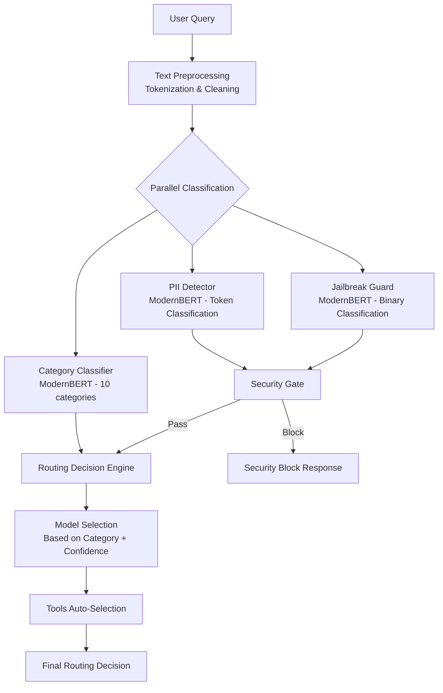

# Router Implementation Details

This document provides detailed insights into the core routing algorithms, classification logic, and implementation specifics of the Semantic Router.

## Classification Pipeline

### Multi-Stage Classification Architecture

The Semantic Router employs a multi-stage classification pipeline that combines several specialized models:



### Implementation Details

#### Category Classification Logic

```go
type CategoryClassifier struct {
    model           *ModernBERTModel
    tokenizer       *ModernBERTTokenizer
    labelMapping    map[int]string
    confidenceThreshold float64
}

func (cc *CategoryClassifier) ClassifyIntent(query string) (*Classification, error) {
    // Tokenize input
    tokens := cc.tokenizer.Tokenize(query)
    
    // Run inference
    logits, err := cc.model.Forward(tokens)
    if err != nil {
        return nil, err
    }
    
    // Apply softmax to get probabilities
    probabilities := softmax(logits)
    
    // Find best classification
    maxIdx, maxProb := argmax(probabilities)
    category := cc.labelMapping[maxIdx]
    
    return &Classification{
        Category:      category,
        Confidence:    maxProb,
        Probabilities: probabilities,
        ProcessingTime: time.Since(start),
    }, nil
}

// Routing decision logic
func (r *OpenAIRouter) makeRoutingDecision(classification *Classification) *RoutingDecision {
    // High confidence - use specialized model
    if classification.Confidence > 0.85 {
        return &RoutingDecision{
            SelectedModel: r.getSpecializedModel(classification.Category),
            Reason:        "High confidence specialized routing",
            Confidence:    classification.Confidence,
        }
    }
    
    // Medium confidence - use category-appropriate model with fallback
    if classification.Confidence > 0.6 {
        return &RoutingDecision{
            SelectedModel: r.getCategoryModel(classification.Category),
            FallbackModel: r.Config.DefaultModel,
            Reason:        "Medium confidence routing with fallback",
            Confidence:    classification.Confidence,
        }
    }
    
    // Low confidence - use general model
    return &RoutingDecision{
        SelectedModel: r.Config.DefaultModel,
        Reason:        "Low confidence, using general model",
        Confidence:    classification.Confidence,
    }
}
```

## Semantic Caching Implementation

### Cache Architecture

```go
type SemanticCache struct {
    embeddings  map[string][]float32    // Query embeddings
    responses   map[string]CachedResponse
    similarity  SimilarityCalculator
    ttl         time.Duration
    maxEntries  int
    mutex       sync.RWMutex
}

type CachedResponse struct {
    Response    interface{}
    Timestamp   time.Time
    Model       string
    Embeddings  []float32
    HitCount    int
}

// Cache lookup with semantic similarity
func (sc *SemanticCache) Get(query string) (interface{}, bool) {
    sc.mutex.RLock()
    defer sc.mutex.RUnlock()
    
    // Generate query embedding
    queryEmbedding := sc.generateEmbedding(query)
    
    // Find most similar cached query
    bestSimilarity := 0.0
    var bestMatch *CachedResponse
    
    for cachedQuery, embedding := range sc.embeddings {
        similarity := sc.similarity.CosineSimilarity(queryEmbedding, embedding)
        
        if similarity > bestSimilarity && similarity > sc.similarityThreshold {
            bestSimilarity = similarity
            if response, exists := sc.responses[cachedQuery]; exists {
                bestMatch = &response
            }
        }
    }
    
    if bestMatch != nil && time.Since(bestMatch.Timestamp) < sc.ttl {
        bestMatch.HitCount++
        return bestMatch.Response, true
    }
    
    return nil, false
}
```

## Tools Auto-Selection

### Tool Relevance Algorithm

```go
type ToolsSelector struct {
    toolsDB           *tools.ToolsDatabase
    relevanceModel    *RelevanceModel
    maxTools          int
    confidenceThreshold float64
}

func (ts *ToolsSelector) SelectRelevantTools(
    query string, 
    availableTools []Tool,
) []Tool {
    var selectedTools []Tool
    
    // Score each tool for relevance
    for _, tool := range availableTools {
        relevanceScore := ts.calculateRelevance(query, tool)
        
        if relevanceScore > ts.confidenceThreshold {
            tool.RelevanceScore = relevanceScore
            selectedTools = append(selectedTools, tool)
        }
    }
    
    // Sort by relevance score
    sort.Slice(selectedTools, func(i, j int) bool {
        return selectedTools[i].RelevanceScore > selectedTools[j].RelevanceScore
    })
    
    // Limit number of tools
    if len(selectedTools) > ts.maxTools {
        selectedTools = selectedTools[:ts.maxTools]
    }
    
    return selectedTools
}

func (ts *ToolsSelector) calculateRelevance(query string, tool Tool) float64 {
    // Combine multiple relevance signals
    keywordScore := ts.calculateKeywordRelevance(query, tool)
    semanticScore := ts.calculateSemanticRelevance(query, tool)
    categoryScore := ts.calculateCategoryRelevance(query, tool)
    
    // Weighted combination
    return 0.4*keywordScore + 0.4*semanticScore + 0.2*categoryScore
}
```

## Security Implementation

### PII Detection Pipeline

```go
type PIIDetector struct {
    tokenClassifier  *ModernBERTTokenClassifier
    piiPatterns     map[string]*regexp.Regexp
    confidence      float64
}

func (pd *PIIDetector) DetectPII(text string) (*PIIDetectionResult, error) {
    result := &PIIDetectionResult{
        HasPII:   false,
        Entities: []PIIEntity{},
    }
    
    // Token-level classification with ModernBERT
    tokens := pd.tokenClassifier.Tokenize(text)
    predictions, err := pd.tokenClassifier.Predict(tokens)
    if err != nil {
        return nil, err
    }
    
    // Extract PII entities
    entities := pd.extractEntities(tokens, predictions)
    
    // Additional pattern-based detection for high-precision
    patternEntities := pd.detectWithPatterns(text)
    
    // Combine results
    allEntities := append(entities, patternEntities...)
    
    if len(allEntities) > 0 {
        result.HasPII = true
        result.Entities = allEntities
    }
    
    return result, nil
}
```

### Jailbreak Detection

```go
type JailbreakGuard struct {
    classifier     *ModernBERTBinaryClassifier
    patterns       []JailbreakPattern
    riskThreshold  float64
}

func (jg *JailbreakGuard) AssessRisk(query string) (*SecurityAssessment, error) {
    // ML-based detection
    mlScore, err := jg.classifier.PredictRisk(query)
    if err != nil {
        return nil, err
    }
    
    // Pattern-based detection
    patternScore := jg.calculatePatternScore(query)
    
    // Combined risk score
    overallRisk := 0.7*mlScore + 0.3*patternScore
    
    return &SecurityAssessment{
        RiskScore:    overallRisk,
        IsJailbreak:  overallRisk > jg.riskThreshold,
        MLScore:      mlScore,
        PatternScore: patternScore,
        Reasoning:    jg.explainDecision(overallRisk, mlScore, patternScore),
    }, nil
}
```

## Performance Optimizations

### Model Loading and Caching

```go
type ModelManager struct {
    models     map[string]*LoadedModel
    modelLock  sync.RWMutex
    warmupPool sync.Pool
}

// Lazy loading with warming
func (mm *ModelManager) GetModel(modelName string) (*LoadedModel, error) {
    mm.modelLock.RLock()
    if model, exists := mm.models[modelName]; exists {
        mm.modelLock.RUnlock()
        return model, nil
    }
    mm.modelLock.RUnlock()
    
    // Upgrade to write lock
    mm.modelLock.Lock()
    defer mm.modelLock.Unlock()
    
    // Double-check pattern
    if model, exists := mm.models[modelName]; exists {
        return model, nil
    }
    
    // Load model
    model, err := mm.loadModel(modelName)
    if err != nil {
        return nil, err
    }
    
    // Warm up model
    go mm.warmupModel(model)
    
    mm.models[modelName] = model
    return model, nil
}
```

### Batch Processing

```go
type BatchProcessor struct {
    batchSize     int
    batchTimeout  time.Duration
    pendingBatch  []ProcessingRequest
    batchMutex    sync.Mutex
    flushTimer    *time.Timer
}

func (bp *BatchProcessor) ProcessRequest(req ProcessingRequest) {
    bp.batchMutex.Lock()
    defer bp.batchMutex.Unlock()
    
    bp.pendingBatch = append(bp.pendingBatch, req)
    
    // Flush if batch is full
    if len(bp.pendingBatch) >= bp.batchSize {
        bp.flushBatch()
        return
    }
    
    // Set timer for timeout-based flushing
    if bp.flushTimer == nil {
        bp.flushTimer = time.AfterFunc(bp.batchTimeout, bp.flushBatch)
    }
}

func (bp *BatchProcessor) flushBatch() {
    if len(bp.pendingBatch) == 0 {
        return
    }
    
    // Process entire batch together for better GPU utilization
    results := bp.classifier.ProcessBatch(bp.pendingBatch)
    
    // Distribute results back to individual requests
    for i, result := range results {
        bp.pendingBatch[i].ResultChannel <- result
    }
    
    // Reset batch
    bp.pendingBatch = bp.pendingBatch[:0]
    if bp.flushTimer != nil {
        bp.flushTimer.Stop()
        bp.flushTimer = nil
    }
}
```

## Monitoring and Observability

### Request Tracing

```go
type RequestTracer struct {
    spans map[string]*Span
    mutex sync.RWMutex
}

func (rt *RequestTracer) StartSpan(requestID, operation string) *Span {
    span := &Span{
        RequestID: requestID,
        Operation: operation,
        StartTime: time.Now(),
        Tags:      make(map[string]interface{}),
    }
    
    rt.mutex.Lock()
    rt.spans[requestID+":"+operation] = span
    rt.mutex.Unlock()
    
    return span
}

func (rt *RequestTracer) FinishSpan(span *Span) {
    span.EndTime = time.Now()
    span.Duration = span.EndTime.Sub(span.StartTime)
    
    // Log detailed timing information
    log.WithFields(log.Fields{
        "request_id": span.RequestID,
        "operation":  span.Operation,
        "duration":   span.Duration.Milliseconds(),
        "tags":       span.Tags,
    }).Info("Operation completed")
    
    rt.mutex.Lock()
    delete(rt.spans, span.RequestID+":"+span.Operation)
    rt.mutex.Unlock()
}
```

### Performance Metrics

```go
// Detailed performance tracking
type PerformanceTracker struct {
    classificationLatency prometheus.Histogram
    cacheHitRatio        prometheus.Gauge
    securityCheckLatency prometheus.Histogram
    routingAccuracy      prometheus.Gauge
}

func (pt *PerformanceTracker) RecordClassification(
    category string, 
    confidence float64, 
    duration time.Duration,
) {
    pt.classificationLatency.Observe(duration.Seconds())
    
    // Track accuracy by category
    accuracyMetric := pt.routingAccuracy.WithLabelValues(category)
    accuracyMetric.Set(confidence)
}
```

This implementation provides the foundation for intelligent, secure, and performant LLM routing. The next section covers [Model Training](../training/training-overview.md), detailing how the classification models are developed and optimized.
