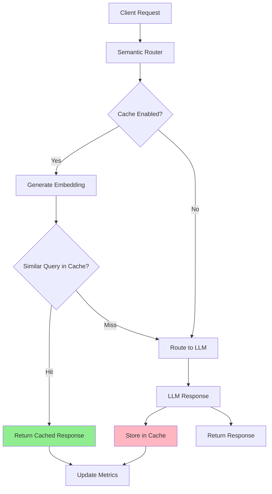

# Semantic Cache

Semantic Router provides intelligent caching that understands request similarity using semantic embeddings. Instead of exact string matching, it identifies semantically similar queries to serve cached responses, reducing latency and LLM inference costs.

## Architecture



## Backend Options

### Memory Backend (Development)

- **Use case**: Development, testing, single-instance deployments
- **Pros**: Fast startup, no external dependencies
- **Cons**: Data lost on restart, limited to single instance

### Milvus Backend (Production/Persistent)

- **Use case**: Production, distributed deployments
- **Pros**: Persistent storage, horizontally scalable, high availability
- **Cons**: Requires Milvus cluster setup

## Configuration

### Memory Backend

```yaml
semantic_cache:
  enabled: true
  backend_type: "memory"
  similarity_threshold: 0.8
  max_entries: 1000
  ttl_seconds: 3600
```

### Milvus Backend

```yaml
semantic_cache:
  enabled: true
  backend_type: "milvus"
  backend_config_path: "config/cache/milvus.yaml"
  similarity_threshold: 0.8
  ttl_seconds: 3600
```

## Testing Cache Functionality

### Test Memory Backend

Start the router with memory cache:

```bash
# Run the router
make run-router
```

Test cache behavior:

```bash
# Send identical requests to see cache hits
curl -X POST http://localhost:8080/v1/chat/completions \
  -H "Content-Type: application/json" \
  -d '{
    "model": "auto",
    "messages": [{"role": "user", "content": "What is machine learning?"}]
  }'

# Send similar request (should hit cache due to semantic similarity)
curl -X POST http://localhost:8080/v1/chat/completions \
  -H "Content-Type: application/json" \
  -d '{
    "model": "auto",
    "messages": [{"role": "user", "content": "Explain machine learning"}]
  }'
```

### Test Milvus Backend

Start Milvus container:

```bash
make start-milvus
```

Update configuration to use Milvus:

```bash
# Edit config/config.yaml
sed -i 's/backend_type: "memory"/backend_type: "milvus"/' config/config.yaml
sed -i 's/# backend_config_path:/backend_config_path:/' config/config.yaml
```

Run with Milvus support:

```bash
# Run the router
make run-router
```

Stop Milvus when done:

```bash
make stop-milvus
```

## Monitoring Cache Performance

### Available Metrics

The router exposes Prometheus metrics for cache monitoring:

| Metric | Type | Description |
|--------|------|-------------|
| `llm_cache_hits_total` | Counter | Total cache hits |
| `llm_cache_misses_total` | Counter | Total cache misses |
| `llm_cache_operations_total` | Counter | Cache operations by backend, operation, and status |
| `llm_cache_operation_duration_seconds` | Histogram | Duration of cache operations |
| `llm_cache_entries_total` | Gauge | Current number of cache entries |

### Cache Metrics Dashboard

Access metrics via:

- **Metrics endpoint**: `http://localhost:9190/metrics`
- **Built-in stats**: Available via cache backend `GetStats()` method

Example Prometheus queries:

```promql
# Cache hit rate
rate(llm_cache_hits_total[5m]) / (rate(llm_cache_hits_total[5m]) + rate(llm_cache_misses_total[5m]))

# Average cache operation duration
rate(llm_cache_operation_duration_seconds_sum[5m]) / rate(llm_cache_operation_duration_seconds_count[5m])

# Cache operations by backend
sum by (backend) (rate(llm_cache_operations_total[5m]))
```

### Cache Performance Analysis

Monitor these key indicators:

1. **Hit Ratio**: Higher ratios indicate better cache effectiveness
2. **Operation Latency**: Cache lookups should be significantly faster than LLM calls
3. **Entry Count**: Monitor cache size for memory management
4. **Backend Performance**: Compare memory vs Milvus operation times

## Configuration Best Practices

### Development Environment

```yaml
semantic_cache:
  enabled: true
  backend_type: "memory"
  similarity_threshold: 0.85  # Higher threshold for more precise matching
  max_entries: 500           # Smaller cache for testing
```

### Production Environment

```yaml
semantic_cache:
  enabled: true
  backend_type: "milvus"
  backend_config_path: "config/cache/milvus.yaml"
  similarity_threshold: 0.8   # Balanced threshold
```

### Milvus Production Configuration

```yaml
# config/cache/milvus.yaml
connection:
  host: "milvus-cluster.prod.example.com" # Replace with your Milvus cluster endpoint
  port: 443
  auth:
    enabled: true
    username: "semantic-router" # Replace with your Milvus username
    password: "${MILVUS_PASSWORD}" # Replace with your Milvus password
  tls:
    enabled: true

development:
  drop_collection_on_startup: false  # Preserve data
  auto_create_collection: false      # Pre-create collections
```
