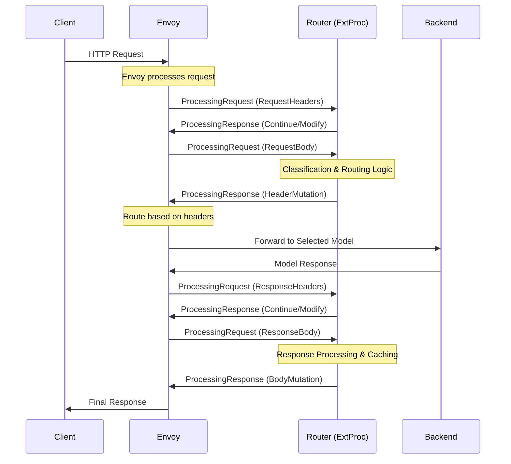

# Envoy ExtProc Integration

The Semantic Router leverages Envoy's External Processing (ExtProc) filter to implement intelligent routing decisions. This integration provides a clean separation between traffic management (Envoy) and business logic (Semantic Router), enabling sophisticated routing capabilities while maintaining high performance.

## Understanding Envoy ExtProc

### What is ExtProc?

External Processing (ExtProc) is an Envoy filter that allows external services to participate in request and response processing. Unlike other extension mechanisms, ExtProc provides:

- **Streaming Processing**: Handle requests and responses as they flow through Envoy
- **Full Control**: Modify headers, body, and routing decisions
- **Low Latency**: Optimized gRPC communication between Envoy and external services
- **Fault Tolerance**: Built-in failure handling and timeout management

### ExtProc vs Other Extension Methods

| Extension Method | Use Case | Latency | Flexibility | Complexity |
|------------------|----------|---------|-------------|------------|
| **HTTP Filters** | Simple transformations | Lowest | Limited | Low |
| **WebAssembly (WASM)** | Sandboxed logic | Low | Medium | Medium |
| **ExtProc** | Complex business logic | Medium | High | Medium |
| **HTTP Callouts** | External API calls | High | High | High |

**Why ExtProc for Semantic Routing?**

- **Complex ML Models**: Need full Python/Go ecosystem for BERT models
- **Dynamic Decision Making**: Requires sophisticated classification logic
- **State Management**: Needs caching and request tracking
- **Observability**: Requires comprehensive metrics and logging

## ExtProc Protocol Architecture

### Communication Flow



### Processing Modes

ExtProc can be configured to process different parts of the request/response lifecycle:

```yaml
# Envoy ExtProc Configuration
processing_mode:
  request_header_mode: "SEND"      # Process request headers
  response_header_mode: "SEND"     # Process response headers  
  request_body_mode: "BUFFERED"    # Process entire request body
  response_body_mode: "BUFFERED"   # Process entire response body
  request_trailer_mode: "SKIP"     # Skip request trailers
  response_trailer_mode: "SKIP"    # Skip response trailers
```

**Mode Options:**

- `SKIP`: Don't send to ExtProc (fastest)
- `SEND`: Send headers/trailers only
- `BUFFERED`: Send entire body (required for content analysis)
- `STREAMED`: Send body in chunks (for streaming)

## Semantic Router ExtProc Implementation

### Go Implementation Structure

```go
// Main ExtProc Server
type Server struct {
    router *OpenAIRouter
    server *grpc.Server  
    port   int
}

// Router implements the ExtProc service interface
type OpenAIRouter struct {
    Config               *config.RouterConfig
    CategoryDescriptions []string
    Classifier           *classification.Classifier
    PIIChecker           *pii.PolicyChecker
    Cache                *cache.SemanticCache
    ToolsDatabase        *tools.ToolsDatabase
    
    pendingRequests     map[string][]byte
    pendingRequestsLock sync.Mutex
}

// Implements the ExtProc service interface
var _ ext_proc.ExternalProcessorServer = &OpenAIRouter{}
```

### gRPC Service Implementation

```go
// Process handles the bidirectional streaming RPC
func (r *OpenAIRouter) Process(stream ext_proc.ExternalProcessor_ProcessServer) error {
    log.Println("Started processing a new request")
    
    ctx := &RequestContext{
        Headers: make(map[string]string),
        RequestID: generateRequestID(),
    }

    for {
        // Receive request from Envoy
        req, err := stream.Recv()
        if err != nil {
            return r.handleStreamError(err)
        }

        // Process based on request type
        response, err := r.processRequest(ctx, req)
        if err != nil {
            return err
        }

        // Send response back to Envoy
        if err := stream.Send(response); err != nil {
            return err
        }
    }
}
```

### Request Processing Pipeline

#### 1. Request Headers Processing

```go
func (r *OpenAIRouter) handleRequestHeaders(
    ctx *RequestContext, 
    headers *ext_proc.ProcessingRequest_RequestHeaders,
) (*ext_proc.ProcessingResponse, error) {
    
    // Extract and store headers
    for _, header := range headers.RequestHeaders.Headers.Headers {
        ctx.Headers[header.Key] = header.Value
    }
    
    // Extract request metadata
    ctx.Method = ctx.Headers[":method"]
    ctx.Path = ctx.Headers[":path"] 
    ctx.ContentType = ctx.Headers["content-type"]
    
    // Continue processing - we need the body for classification
    return &ext_proc.ProcessingResponse{
        Response: &ext_proc.ProcessingResponse_RequestHeaders_{
            RequestHeaders: &ext_proc.ProcessingResponse_RequestHeaders{},
        },
    }, nil
}
```

#### 2. Request Body Processing (Core Logic)

```go
func (r *OpenAIRouter) handleRequestBody(
    ctx *RequestContext,
    body *ext_proc.ProcessingRequest_RequestBody,
) (*ext_proc.ProcessingResponse, error) {
    
    // Extract request body
    requestBody := body.RequestBody.Body
    
    // Parse OpenAI API request
    var openAIRequest OpenAIRequest
    if err := json.Unmarshal(requestBody, &openAIRequest); err != nil {
        return nil, fmt.Errorf("failed to parse OpenAI request: %w", err)
    }
    
    // Extract user query from messages
    userQuery := extractUserQuery(openAIRequest.Messages)
    
    // Step 1: Check semantic cache
    if cachedResponse, found := r.Cache.Get(userQuery); found {
        return r.handleCacheHit(cachedResponse)
    }
    
    // Step 2: Security checks
    if blocked, reason := r.performSecurityChecks(userQuery); blocked {
        return r.handleSecurityBlock(reason)
    }
    
    // Step 3: Classify query intent  
    classification, err := r.Classifier.ClassifyIntent(userQuery)
    if err != nil {
        return nil, err
    }
    
    // Step 4: Select optimal model
    selectedEndpoint := r.selectModelEndpoint(classification)
    
    // Step 5: Auto-select relevant tools
    selectedTools := r.autoSelectTools(userQuery, openAIRequest.Tools)
    
    // Step 6: Modify request if needed
    modifiedRequest := r.modifyRequest(openAIRequest, selectedTools)
    modifiedBody, _ := json.Marshal(modifiedRequest)
    
    // Step 7: Set routing headers for Envoy
    headerMutations := []*core.HeaderValueOption{
        {
            Header: &core.HeaderValue{
                Key:   "x-vsr-destination-endpoint", 
                Value: selectedEndpoint,
            },
            Append: &wrapperspb.BoolValue{Value: false},
        },
        {
            Header: &core.HeaderValue{
                Key:   "x-selected-model",
                Value: classification.Category,
            },
            Append: &wrapperspb.BoolValue{Value: false},
        },
        {
            Header: &core.HeaderValue{
                Key:   "x-routing-confidence",
                Value: fmt.Sprintf("%.3f", classification.Confidence),
            },
            Append: &wrapperspb.BoolValue{Value: false},
        },
    }
    
    // Record routing decision for monitoring
    r.recordRoutingDecision(ctx, classification, selectedEndpoint)
    
    return &ext_proc.ProcessingResponse{
        Response: &ext_proc.ProcessingResponse_RequestBody_{
            RequestBody: &ext_proc.ProcessingResponse_RequestBody{
                Response: &ext_proc.BodyResponse{
                    BodyMutation: &ext_proc.BodyMutation{
                        Mutation: &ext_proc.BodyMutation_Body{
                            Body: modifiedBody,
                        },
                    },
                },
            },
        },
        ModeOverride: &ext_proc.ProcessingMode{
            RequestHeaderMode: ext_proc.ProcessingMode_SEND,
            ResponseHeaderMode: ext_proc.ProcessingMode_SEND,
        },
        DynamicMetadata: r.buildDynamicMetadata(classification),
    }, nil
}
```

#### 3. Response Processing

```go
func (r *OpenAIRouter) handleResponseBody(
    ctx *RequestContext,
    responseBody *ext_proc.ProcessingRequest_ResponseBody,
) (*ext_proc.ProcessingResponse, error) {
    
    // Parse model response
    var modelResponse OpenAIResponse
    if err := json.Unmarshal(responseBody.ResponseBody.Body, &modelResponse); err != nil {
        return nil, err
    }
    
    // Store in semantic cache for future requests
    if ctx.UserQuery != "" {
        r.Cache.Store(ctx.UserQuery, modelResponse, ctx.SelectedModel)
    }
    
    // Record response metrics
    r.recordResponseMetrics(ctx, modelResponse)
    
    // Add routing metadata to response
    modifiedResponse := r.addRoutingMetadata(modelResponse, ctx)
    modifiedBody, _ := json.Marshal(modifiedResponse)
    
    return &ext_proc.ProcessingResponse{
        Response: &ext_proc.ProcessingResponse_ResponseBody_{
            ResponseBody: &ext_proc.ProcessingResponse_ResponseBody{
                Response: &ext_proc.BodyResponse{
                    BodyMutation: &ext_proc.BodyMutation{
                        Mutation: &ext_proc.BodyMutation_Body{
                            Body: modifiedBody,
                        },
                    },
                },
            },
        },
    }, nil
}
```

## Envoy Configuration for ExtProc

### Complete Configuration Example

```yaml
# config/envoy.yaml
static_resources:
  listeners:
  - name: listener_0
    address:
      socket_address:
        address: 0.0.0.0
        port_value: 8801
    filter_chains:
    - filters:
      - name: envoy.filters.network.http_connection_manager
        typed_config:
          "@type": type.googleapis.com/envoy.extensions.filters.network.http_connection_manager.v3.HttpConnectionManager
          stat_prefix: ingress_http
          
          # Comprehensive access logging
          access_log:
          - name: envoy.access_loggers.stdout
            typed_config:
              "@type": type.googleapis.com/envoy.extensions.access_loggers.stream.v3.StdoutAccessLog
              log_format:
                json_format:
                  time: "%START_TIME%"
                  method: "%REQ(:METHOD)%"
                  path: "%REQ(X-ENVOY-ORIGINAL-PATH?:PATH)%"
                  response_code: "%RESPONSE_CODE%"
                  duration: "%DURATION%"
                  selected_model: "%REQ(X-SELECTED-MODEL)%"
                  selected_endpoint: "%REQ(x-vsr-destination-endpoint)%"
                  routing_confidence: "%REQ(X-ROUTING-CONFIDENCE)%"
          
          # Route configuration with dynamic routing
          route_config:
            name: local_route
            virtual_hosts:
            - name: local_service
              domains: ["*"]
              routes:
              # Dynamic routing based on ExtProc decisions
              - match:
                  prefix: "/"
                  headers:
                  - name: "x-vsr-destination-endpoint"
                    string_match:
                      exact: "endpoint1"
                route:
                  cluster: math_model_cluster
                  timeout: 300s
              - match:
                  prefix: "/"
                  headers:
                  - name: "x-vsr-destination-endpoint"  
                    string_match:
                      exact: "endpoint2"
                route:
                  cluster: creative_model_cluster
                  timeout: 300s
              - match:
                  prefix: "/"
                  headers:
                  - name: "x-vsr-destination-endpoint"
                    string_match:
                      exact: "endpoint3"
                route:
                  cluster: code_model_cluster
                  timeout: 300s
              # Fallback route
              - match:
                  prefix: "/"
                route:
                  cluster: general_model_cluster
                  timeout: 300s
          
          # HTTP filters chain
          http_filters:
          # ExtProc filter - MUST come before router filter
          - name: envoy.filters.http.ext_proc
            typed_config:
              "@type": type.googleapis.com/envoy.extensions.filters.http.ext_proc.v3.ExternalProcessor
              
              # gRPC service configuration
              grpc_service:
                envoy_grpc:
                  cluster_name: semantic_router_extproc
                timeout: 30s
              
              # Processing mode configuration  
              processing_mode:
                request_header_mode: "SEND"
                response_header_mode: "SEND"
                request_body_mode: "BUFFERED"     # Required for content analysis
                response_body_mode: "BUFFERED"    # Default: router flips to STREAMED at runtime for SSE
                request_trailer_mode: "SKIP"
                response_trailer_mode: "SKIP"
              
              # Failure handling
              failure_mode_allow: true            # Continue on ExtProc failure
              allow_mode_override: true           # Allow ExtProc to change modes
              message_timeout: 300s               # Timeout for ExtProc responses
              max_message_timeout: 600s           # Maximum allowed timeout

> Note on SSE (streaming):
>
> When the upstream responds with `Content-Type: text/event-stream`, the router sets a per-message
> `ModeOverride` with `response_body_mode: STREAMED` so the first chunk reaches ExtProc immediately.
> This enables accurate TTFT measurement on the first token. No manual change to the static
> `processing_mode` is required as long as `allow_mode_override: true` is set (it is in the default configs).
              
              # Advanced configuration
              mutation_rules:
                allow_all_routing: true
                allow_envoy: true
                disallow_system: false
                disallow_x_forwarded: false
              
              # Stats configuration  
              stats_config:
                stats_matches:
                - name: "extproc_requests"
                  actions:
                  - name: "extproc_requests_total"
                    action: 
                      "@type": type.googleapis.com/envoy.extensions.filters.http.fault.v3.HTTPFault

          # Router filter - MUST come after ExtProc
          - name: envoy.filters.http.router
            typed_config:
              "@type": type.googleapis.com/envoy.extensions.filters.http.router.v3.Router
              suppress_envoy_headers: true

  # Backend model clusters
  clusters:
  # ExtProc service cluster
  - name: semantic_router_extproc
    connect_timeout: 5s
    type: STATIC
    lb_policy: ROUND_ROBIN
    typed_extension_protocol_options:
      envoy.extensions.upstreams.http.v3.HttpProtocolOptions:
        "@type": type.googleapis.com/envoy.extensions.upstreams.http.v3.HttpProtocolOptions
        explicit_http_config:
          http2_protocol_options:
            # Optimize for ExtProc communication
            connection_keepalive:
              interval: 30s
              timeout: 5s
            max_concurrent_streams: 1000
    load_assignment:
      cluster_name: semantic_router_extproc
      endpoints:
      - lb_endpoints:
        - endpoint:
            address:
              socket_address:
                address: 127.0.0.1
                port_value: 50051
    
    # Health checking for ExtProc
    health_checks:
    - timeout: 5s
      interval: 10s
      unhealthy_threshold: 3
      healthy_threshold: 2
      grpc_health_check:
        service_name: "semantic-router"

  # Model endpoint clusters
  - name: math_model_cluster
    connect_timeout: 30s
    type: STRICT_DNS
    lb_policy: ROUND_ROBIN
    load_assignment:
      cluster_name: math_model_cluster
      endpoints:
      - lb_endpoints:
        - endpoint:
            address:
              socket_address:
                address: 127.0.0.1
                port_value: 11434
    # Health checks for model endpoints
    health_checks:
    - timeout: 10s
      interval: 15s
      unhealthy_threshold: 3
      healthy_threshold: 2
      http_health_check:
        path: "/health"
        expected_statuses:
        - start: 200
          end: 299

  - name: creative_model_cluster
    # Similar configuration for creative model...
    
  - name: code_model_cluster  
    # Similar configuration for code model...
    
  - name: general_model_cluster
    # Similar configuration for general model...
```

## Performance Optimization

### Reducing ExtProc Latency

#### 1. Connection Pooling and Keepalives

```yaml
# Optimize gRPC connection to ExtProc
grpc_service:
  envoy_grpc:
    cluster_name: semantic_router_extproc
  timeout: 10s  # Reduced from default 30s

# Cluster optimization
typed_extension_protocol_options:
  envoy.extensions.upstreams.http.v3.HttpProtocolOptions:
    explicit_http_config:
      http2_protocol_options:
        connection_keepalive:
          interval: 30s      # Keep connections alive
          timeout: 5s
        max_concurrent_streams: 1000  # Allow many parallel requests
```

#### 2. Selective Processing

```yaml
# Only process what's necessary
processing_mode:
  request_header_mode: "SEND"        # Always needed for routing
  response_header_mode: "SKIP"       # Skip if not needed
  request_body_mode: "BUFFERED"      # Required for classification
  response_body_mode: "BUFFERED"     # Only if caching enabled
```

#### 3. Failure Mode Configuration

```yaml
# Fast failure handling
failure_mode_allow: true     # Don't block traffic on ExtProc failure
message_timeout: 30s         # Reasonable timeout
max_message_timeout: 60s     # Emergency timeout
```

### Memory Management

#### Request Context Pooling

```go
// Pool request contexts to reduce GC pressure
var requestContextPool = sync.Pool{
    New: func() interface{} {
        return &RequestContext{
            Headers: make(map[string]string, 10),
        }
    },
}

func (r *OpenAIRouter) Process(stream ext_proc.ExternalProcessor_ProcessServer) error {
    // Get context from pool
    ctx := requestContextPool.Get().(*RequestContext)
    defer func() {
        // Clean and return to pool
        ctx.Reset()
        requestContextPool.Put(ctx)
    }()
    
    // Process request...
}
```

## Error Handling and Resilience

### ExtProc Error Handling

```go
func (r *OpenAIRouter) handleStreamError(err error) error {
    if err == io.EOF {
        log.Println("Stream ended gracefully")
        return nil
    }

    // Handle gRPC status-based errors
    if s, ok := status.FromError(err); ok {
        switch s.Code() {
        case codes.Canceled, codes.DeadlineExceeded:
            log.Println("Stream canceled gracefully")
            return nil
        case codes.Unavailable:
            log.Printf("ExtProc temporarily unavailable: %v", err)
            return err
        default:
            log.Printf("gRPC error: %v", err)
            return err
        }
    }

    // Handle context cancellation
    if errors.Is(err, context.Canceled) || errors.Is(err, context.DeadlineExceeded) {
        log.Println("Stream canceled gracefully")
        return nil
    }

    log.Printf("Unexpected error receiving request: %v", err)
    return err
}
```

### Graceful Degradation

```go
func (r *OpenAIRouter) handleClassificationFailure(
    query string, 
    err error,
) *RoutingDecision {
    log.Printf("Classification failed: %v, using fallback", err)
    
    // Increment failure metrics
    classificationFailures.Inc()
    
    // Return safe fallback decision
    return &RoutingDecision{
        Category:       "general",
        Confidence:     0.0,
        SelectedModel:  r.Config.DefaultModel,
        Fallback:       true,
        FailureReason:  err.Error(),
    }
}
```

## Monitoring ExtProc Integration

### Key Metrics to Track

```go
// ExtProc-specific metrics
var (
    extprocRequestsTotal = prometheus.NewCounterVec(
        prometheus.CounterOpts{
            Name: "extproc_requests_total",
            Help: "Total ExtProc requests by type",
        },
        []string{"request_type", "status"},
    )
    
    extprocProcessingDuration = prometheus.NewHistogramVec(
        prometheus.HistogramOpts{
            Name: "extproc_processing_duration_seconds",
            Help: "Time spent processing ExtProc requests",
            Buckets: []float64{0.001, 0.005, 0.01, 0.025, 0.05, 0.1, 0.25, 0.5, 1.0},
        },
        []string{"request_type"},
    )
    
    extprocStreamErrors = prometheus.NewCounterVec(
        prometheus.CounterOpts{
            Name: "extproc_stream_errors_total", 
            Help: "Total ExtProc stream errors",
        },
        []string{"error_type"},
    )
)
```

### Health Check Implementation

```go
// Health check for ExtProc service
func (s *Server) Check(
    ctx context.Context, 
    req *grpc_health_v1.HealthCheckRequest,
) (*grpc_health_v1.HealthCheckResponse, error) {
    
    // Check classifier health
    if !s.router.Classifier.IsHealthy() {
        return &grpc_health_v1.HealthCheckResponse{
            Status: grpc_health_v1.HealthCheckResponse_NOT_SERVING,
        }, nil
    }
    
    // Check cache health
    if !s.router.Cache.IsHealthy() {
        return &grpc_health_v1.HealthCheckResponse{
            Status: grpc_health_v1.HealthCheckResponse_NOT_SERVING,
        }, nil
    }
    
    return &grpc_health_v1.HealthCheckResponse{
        Status: grpc_health_v1.HealthCheckResponse_SERVING,
    }, nil
}
```

The ExtProc integration provides a powerful foundation for implementing complex routing logic while maintaining high performance and reliability. Next, explore the [Router Implementation](router-implementation.md) to understand the detailed classification and routing algorithms.
