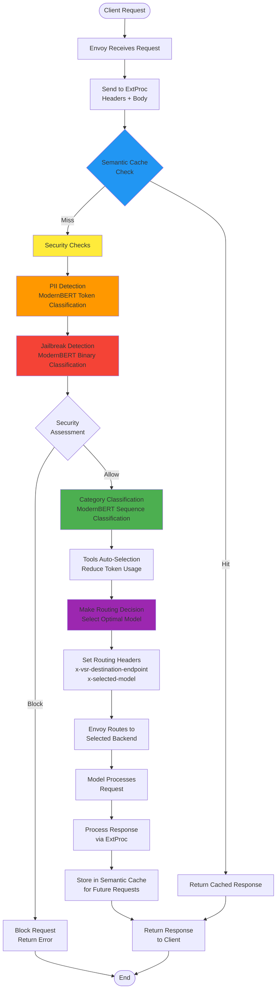

# System Architecture

The Semantic Router implements a sophisticated Mixture-of-Models (MoM) architecture using Envoy Proxy as the foundation, with an External Processor (ExtProc) service that provides intelligent routing capabilities. This design ensures high performance, scalability, and maintainability for production LLM deployments.

## High-Level Architecture Overview

import ZoomableMermaid from '@site/src/components/ZoomableMermaid';

<ZoomableMermaid title="System Architecture Overview" defaultZoom={5.5}>
{`graph TB
    subgraph "Client Layer"
        Client1[Web Application]
        Client2[Mobile App]
        Client3[API Client]
        Client4[Third-party Integration]
    end
    
    subgraph "Proxy Layer"
        Envoy[Envoy Proxy<br/>:8801]
    end
    
    subgraph "Processing Layer"
        ExtProc[Semantic Router<br/>ExtProc Server<br/>:50051]
        
        subgraph "Router Components"
            Classifier[BERT Classifier<br/>ModernBERT]
            PIIDetector[PII Detector<br/>Privacy Protection]
            JailbreakGuard[Jailbreak Guard<br/>Security]
            Cache[Semantic Cache<br/>Performance]
            ToolsSelector[Tools Selector<br/>Optimization]
        end
    end
    
    subgraph "Model Layer"
        Model1[Math Specialist<br/>Endpoint 1]
        Model2[Creative Model<br/>Endpoint 2] 
        Model3[Code Generator<br/>Endpoint 3]
        ModelN[General Purpose<br/>Endpoint N]
    end
    
    subgraph "Monitoring Layer"
        Prometheus[Prometheus<br/>Metrics]
        Grafana[Grafana<br/>Dashboard]
        Logs[Structured Logging]
    end
    
    Client1 --> Envoy
    Client2 --> Envoy
    Client3 --> Envoy
    Client4 --> Envoy
    
    Envoy <--> ExtProc
    
    ExtProc --> Classifier
    ExtProc --> PIIDetector
    ExtProc --> JailbreakGuard
    ExtProc --> Cache
    ExtProc --> ToolsSelector
    
    Envoy --> Model1
    Envoy --> Model2
    Envoy --> Model3
    Envoy --> ModelN
    
    ExtProc --> Prometheus
    Prometheus --> Grafana
    ExtProc --> Logs`}
</ZoomableMermaid>

## Core Components

### 1. Envoy Proxy - Traffic Management Layer

**Role**: Acts as the entry point and traffic director for all LLM requests.

**Key Responsibilities**:

- **Load Balancing**: Distributes requests across backend model endpoints
- **Health Checking**: Monitors backend model availability and health
- **Request/Response Processing**: Handles HTTP protocol management
- **Header Management**: Manages routing headers set by the ExtProc service
- **Timeout Management**: Configures appropriate timeouts for different model types

**Configuration Highlights**:

```yaml
# Envoy listener configuration
listeners:
- name: listener_0
  address:
    socket_address:
      address: 0.0.0.0
      port_value: 8801  # Main entry point

http_filters:
- name: envoy.filters.http.ext_proc
  typed_config:
    grpc_service:
      envoy_grpc:
        cluster_name: extproc_service
    processing_mode:
      request_header_mode: "SEND"      # Send headers for routing decisions
      response_header_mode: "SEND"     # Process response headers  
      request_body_mode: "BUFFERED"    # Analyze request content
      response_body_mode: "BUFFERED"   # Process response content
```

### 2. Semantic Router ExtProc Service - Intelligence Layer

**Role**: The brain of the system that makes intelligent routing decisions.

**Architecture**:

```go
type OpenAIRouter struct {
    Config               *config.RouterConfig
    CategoryDescriptions []string
    Classifier           *classification.Classifier   // ModernBERT-based
    PIIChecker           *pii.PolicyChecker           // Privacy protection
    Cache                *cache.SemanticCache         // Performance optimization
    ToolsDatabase        *tools.ToolsDatabase         // Tool selection
    
    pendingRequests     map[string][]byte             // Request tracking
    pendingRequestsLock sync.Mutex                    // Thread safety
}
```

**Processing Pipeline**:

<ZoomableMermaid title="Processing Pipeline" defaultZoom={3.5}>
{`sequenceDiagram
    participant E as Envoy
    participant R as Router
    participant C as Classifier
    participant P as PII Detector
    participant G as Guard
    participant Ca as Cache
    
    E->>R: Request Headers + Body
    R->>Ca: Check semantic cache
    
    alt Cache Hit
        Ca->>R: Cached response
        R->>E: Return cached result
    else Cache Miss
        R->>P: Scan for PII
        P->>R: PII status
        R->>G: Check for jailbreak
        G->>R: Safety status
        R->>C: Classify intent
        C->>R: Routing decision
        R->>E: Set routing headers
        Note over E: Route to selected model
        E->>R: Response from model
        R->>Ca: Cache semantic representation
        R->>E: Final response
    end`}
</ZoomableMermaid>

### 3. Classification System - Decision Engine

The classification system uses ModernBERT models for multiple classification tasks:

#### Category Classification

<ZoomableMermaid title="Category Classification System" defaultZoom={4.5}>
{`graph LR
    Query[User Query] --> Tokenizer[ModernBERT Tokenizer]
    Tokenizer --> Encoder[ModernBERT Encoder<br/>768-dim embeddings]
    Encoder --> ClassifierHead[Classification Head<br/>Category Prediction]
    ClassifierHead --> Decision[Routing Decision]
    
    subgraph "Categories"
        Math[Mathematics]
        Creative[Creative Writing]
        Code[Code Generation]  
        General[General Purpose]
        Science[Science]
        Business[Business]
    end
    
    Decision --> Math
    Decision --> Creative  
    Decision --> Code
    Decision --> General
    Decision --> Science
    Decision --> Business`}
</ZoomableMermaid>

#### Multi-Task Architecture

```python
# Conceptual model architecture
class SemanticRouter:
    def __init__(self):
        self.category_classifier = ModernBERTForSequenceClassification(
            num_labels=10  # Math, Creative, Code, etc.
        )
        self.pii_detector = ModernBERTForTokenClassification(
            num_labels=6   # PERSON, EMAIL, PHONE, SSN, LOCATION, NO_PII
        )
        self.jailbreak_guard = ModernBERTForSequenceClassification(
            num_labels=2   # Benign, Jailbreak
        )
        
    def route_request(self, query):
        # Multi-task inference
        category = self.category_classifier(query)
        pii_entities = self.pii_detector(query)  
        safety_score = self.jailbreak_guard(query)
        
        return self.make_routing_decision(category, pii_entities, safety_score)
```

## Data Flow Architecture

### Request Processing Flow



### Response Processing Flow

<ZoomableMermaid title="Response Processing Flow" defaultZoom={4.5}>
{`sequenceDiagram
    participant C as Client
    participant E as Envoy
    participant R as Router
    participant M as Selected Model
    participant Ca as Cache
    participant Me as Metrics
    
    C->>E: HTTP Request
    E->>R: ExtProc Request (Headers + Body)
    
    Note over R: Process request (PII, Security, Classification)
    
    R->>E: ExtProc Response (Routing Headers)
    E->>M: Route to Selected Model
    M->>E: Model Response
    E->>R: ExtProc Response Processing
    
    R->>Ca: Store semantic representation
    R->>Me: Record routing metrics
    
    R->>E: Processed Response
    E->>C: Final Response to Client`}
</ZoomableMermaid>

## Threading and Concurrency Model

### Go ExtProc Server Concurrency

```go
// Server handles multiple concurrent connections
func (s *Server) Start() error {
    lis, err := net.Listen("tcp", fmt.Sprintf(":%d", s.port))
    if err != nil {
        return fmt.Errorf("failed to listen on port %d: %w", s.port, err)
    }

    s.server = grpc.NewServer()
    ext_proc.RegisterExternalProcessorServer(s.server, s.router)
    
    // gRPC handles concurrency automatically
    // Each request gets its own goroutine
    return s.server.Serve(lis)
}

// Process handles individual request streams
func (r *OpenAIRouter) Process(stream ext_proc.ExternalProcessor_ProcessServer) error {
    // Each stream runs in its own goroutine
    ctx := &RequestContext{
        Headers: make(map[string]string),
    }
    
    for {
        req, err := stream.Recv()
        // Process request with thread-safe operations
        switch v := req.Request.(type) {
        case *ext_proc.ProcessingRequest_RequestHeaders:
            // Handle request headers
        case *ext_proc.ProcessingRequest_RequestBody:
            // Handle request body - where classification happens
        case *ext_proc.ProcessingRequest_ResponseHeaders:
            // Handle response headers
        }
    }
}
```

### Thread Safety Considerations

```go
type OpenAIRouter struct {
    // Thread-safe components
    Classifier           *classification.Classifier    // Read-only after init
    PIIChecker           *pii.PolicyChecker           // Read-only after init
    Cache                *cache.SemanticCache         // Internally synchronized
    
    // Mutable state with protection
    pendingRequests     map[string][]byte
    pendingRequestsLock sync.Mutex                    // Protects pendingRequests
}

// Thread-safe request tracking
func (r *OpenAIRouter) trackRequest(id string, body []byte) {
    r.pendingRequestsLock.Lock()
    defer r.pendingRequestsLock.Unlock()
    r.pendingRequests[id] = body
}
```

## Performance Characteristics

### Latency Analysis

| Component | Typical Latency | Optimization |
|-----------|----------------|--------------|
| **Envoy Routing** | 0.5-2ms | Optimized configuration |
| **ExtProc gRPC** | 1-3ms | Local network communication |
| **PII Detection** | 5-15ms | ModernBERT token classification |
| **Jailbreak Guard** | 3-8ms | ModernBERT binary classification |
| **Category Classification** | 8-20ms | ModernBERT sequence classification |
| **Cache Lookup** | 0.1-0.5ms | Redis/in-memory cache |
| **Total Overhead** | 15-50ms | Acceptable for most use cases |

### Throughput Optimization

```go
// Batch processing for efficiency
type BatchProcessor struct {
    batchSize    int
    batchTimeout time.Duration
    classifier   *classification.Classifier
}

func (bp *BatchProcessor) processBatch(queries []string) []Classification {
    // Process multiple queries together for better GPU utilization
    return bp.classifier.ClassifyBatch(queries)
}
```

### Memory Usage

| Component | Memory Usage | Notes |
|-----------|-------------|--------|
| **ModernBERT Models** | ~400MB each | Loaded once, shared across requests |
| **Envoy Process** | ~100-200MB | Depends on configuration |
| **Go ExtProc Server** | ~50-100MB | Scales with concurrent requests |
| **Semantic Cache** | ~500MB-2GB | Configurable, depends on cache size |
| **Total System** | ~1.5-3GB | Reasonable for production deployment |

## Configuration Management

### Router Configuration Structure

```yaml
# config/config.yaml
router:
  # Model endpoints configuration
  endpoints:
    endpoint1:
      url: "http://127.0.0.1:11434"
      model_type: "math"
      cost_per_token: 0.002
      max_tokens: 4096
      
    endpoint2:
      url: "http://127.0.0.1:11434" 
      model_type: "creative"
      cost_per_token: 0.003
      max_tokens: 8192
      
    endpoint3:
      url: "http://127.0.0.1:11434"
      model_type: "general"
      cost_per_token: 0.01
      max_tokens: 4096

  # Classification thresholds
  classification:
    confidence_threshold: 0.7
    fallback_model: "general"
    
  # Security settings
  security:
    enable_pii_detection: true
    enable_jailbreak_guard: true
    pii_action: "block"  # block, mask, or allow
    
  # Caching configuration
  cache:
    enabled: true
    similarity_threshold: 0.85
    ttl_seconds: 3600
    max_entries: 10000

  # Tools configuration
  tools:
    auto_selection: true
    max_tools: 5
    relevance_threshold: 0.6
```

### Dynamic Configuration Updates

```go
// Configuration hot-reloading
type ConfigManager struct {
    config     *RouterConfig
    configLock sync.RWMutex
    watchers   []ConfigWatcher
}

func (cm *ConfigManager) UpdateConfig(newConfig *RouterConfig) error {
    cm.configLock.Lock()
    defer cm.configLock.Unlock()
    
    // Validate new configuration
    if err := newConfig.Validate(); err != nil {
        return err
    }
    
    // Apply configuration
    cm.config = newConfig
    
    // Notify all watchers
    for _, watcher := range cm.watchers {
        watcher.OnConfigUpdate(newConfig)
    }
    
    return nil
}
```

## Error Handling and Resilience

### Circuit Breaker Pattern

```go
type CircuitBreaker struct {
    maxFailures   int
    resetTimeout  time.Duration
    state         CircuitState
    failures      int
    lastFailTime  time.Time
    mutex         sync.Mutex
}

func (cb *CircuitBreaker) Call(operation func() error) error {
    cb.mutex.Lock()
    defer cb.mutex.Unlock()
    
    if cb.state == StateOpen {
        if time.Since(cb.lastFailTime) > cb.resetTimeout {
            cb.state = StateHalfOpen
        } else {
            return errors.New("circuit breaker is open")
        }
    }
    
    err := operation()
    if err != nil {
        cb.onFailure()
    } else {
        cb.onSuccess()
    }
    
    return err
}
```

### Fallback Strategies

<ZoomableMermaid title="Fallback Strategies" defaultZoom={2.5}>
{`graph TB
    Request[Incoming Request] --> PrimaryRoute[Primary Routing Decision]
    
    PrimaryRoute --> ModelA{Model A<br/>Available?}
    ModelA -->|Yes| ProcessA[Process with Model A]
    ModelA -->|No| FallbackB{Try Model B<br/>Fallback}
    
    FallbackB -->|Available| ProcessB[Process with Model B]
    FallbackB -->|Unavailable| FallbackGeneral{Try General<br/>Model}
    
    FallbackGeneral -->|Available| ProcessGeneral[Process with General Model]
    FallbackGeneral -->|Unavailable| CachedResponse{Check Cache<br/>for Similar}
    
    CachedResponse -->|Found| ReturnCached[Return Cached Response]
    CachedResponse -->|Not Found| ErrorResponse[Return Error<br/>Service Unavailable]
    
    ProcessA --> Success[Successful Response]
    ProcessB --> Success
    ProcessGeneral --> Success
    ReturnCached --> Success`}
</ZoomableMermaid>

## Monitoring and Observability

### Metrics Collection

```go
// Prometheus metrics
var (
    requestsTotal = prometheus.NewCounterVec(
        prometheus.CounterOpts{
            Name: "semantic_router_requests_total",
            Help: "Total number of requests processed",
        },
        []string{"endpoint", "category", "status"},
    )
    
    routingLatency = prometheus.NewHistogramVec(
        prometheus.HistogramOpts{
            Name: "semantic_router_routing_duration_seconds", 
            Help: "Time spent on routing decisions",
            Buckets: prometheus.DefBuckets,
        },
        []string{"component"},
    )
    
    cacheHitRatio = prometheus.NewGaugeVec(
        prometheus.GaugeOpts{
            Name: "semantic_router_cache_hit_ratio",
            Help: "Cache hit ratio for semantic cache",
        },
        []string{"cache_type"},
    )
)
```

### Structured Logging

```go
type RequestLogger struct {
    logger *logrus.Logger
}

func (rl *RequestLogger) LogRouting(ctx context.Context, decision *RoutingDecision) {
    rl.logger.WithFields(logrus.Fields{
        "request_id":         ctx.Value("request_id"),
        "category":          decision.Category,
        "confidence":        decision.Confidence,
        "selected_model":    decision.SelectedModel,
        "routing_time_ms":   decision.ProcessingTime.Milliseconds(),
        "pii_detected":      decision.PIIDetected,
        "jailbreak_risk":    decision.JailbreakRisk,
        "cache_hit":         decision.CacheHit,
        "tools_selected":    len(decision.SelectedTools),
    }).Info("Request routed")
}
```

This architecture provides a robust, scalable, and maintainable foundation for intelligent LLM routing. The next section covers the [Envoy ExtProc Integration](envoy-extproc.md) in detail, explaining how the ExtProc protocol works and how our router implements it.
