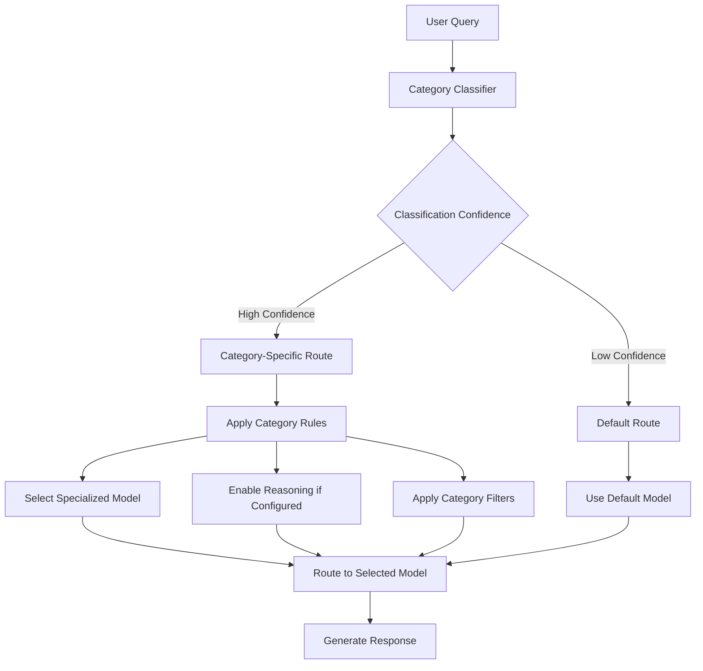

# Overview

The Category system is the intelligence core of vLLM Semantic Router, enabling intelligent query classification and routing decisions based on semantic understanding of user inputs.

## What is the Category System?

The Category system automatically analyzes incoming queries to determine their **semantic intent** and **domain classification**. This classification drives intelligent routing decisions, ensuring that each query is handled by the most appropriate model and configuration.

### Key Concepts

- **Category Classification**: Automatic identification of query domains (e.g., "math", "computer science", "business")
- **Semantic Understanding**: Deep analysis of query meaning beyond simple keyword matching
- **Routing Intelligence**: Dynamic model selection based on category-specific configurations
- **Reasoning Control**: Category-aware activation of reasoning capabilities

## How Categories Work in Semantic Routing



### Classification Process

1. **Input Analysis**: The ModernBERT-based classifier analyzes the semantic content of the query
2. **Category Prediction**: The system predicts the most likely category with a confidence score
3. **Threshold Evaluation**: If confidence exceeds the configured threshold, category-specific routing is applied
4. **Fallback Handling**: Low-confidence classifications fall back to default routing behavior

## Category-Driven Features

### 1. Model Selection

Categories enable intelligent model selection based on domain expertise:

```yaml
categories:
- name: math
  model_scores:
  - model: specialized-math-model
    score: 1.0
  - model: general-model
    score: 0.6
```

### 2. Reasoning Control

Categories can automatically enable reasoning for complex domains:

```yaml
categories:
- name: computer science
  use_reasoning: true
  reasoning_effort: high
  reasoning_description: "Programming problems require step-by-step analysis"
```

### 3. Filter Application

Different categories can trigger specific processing filters:

- **PII Detection**: Enhanced privacy protection for sensitive domains
- **Tool Selection**: Domain-specific tool availability
- **Semantic Caching**: Category-aware cache optimization

## Integration with System Components

### Classifier Integration

- **ModernBERT Architecture**: State-of-the-art transformer-based classification
- **Entropy-Based Decisions**: Advanced confidence measurement for reasoning activation
- **Batch Processing**: Efficient handling of multiple queries

### Router Integration

- **Real-time Classification**: Sub-millisecond category determination
- **Dynamic Routing**: Instant model selection based on category rules
- **Fallback Mechanisms**: Graceful handling of classification failures

### Monitoring Integration

- **Classification Metrics**: Accuracy, latency, and confidence tracking
- **Routing Decisions**: Category-based routing success rates
- **Performance Analytics**: Category-specific model performance

## Benefits of Category-Based Routing

### 🎯 **Precision**

Route queries to models specifically optimized for their domain

### ⚡ **Performance**

Reduce latency by avoiding over-powered models for simple queries

### 💰 **Cost Optimization**

Use expensive reasoning models only when necessary

### 🔧 **Flexibility**

Easy configuration of domain-specific behaviors and rules

### 📊 **Observability**

Detailed insights into query patterns and routing decisions

## Next Steps

- [**Supported Categories**](supported-categories.md) - Explore all available category types
- [**Configuration Guide**](configuration.md) - Learn how to configure category-based routing
- [**Technical Details**](technical-details.md) - Deep dive into implementation details
