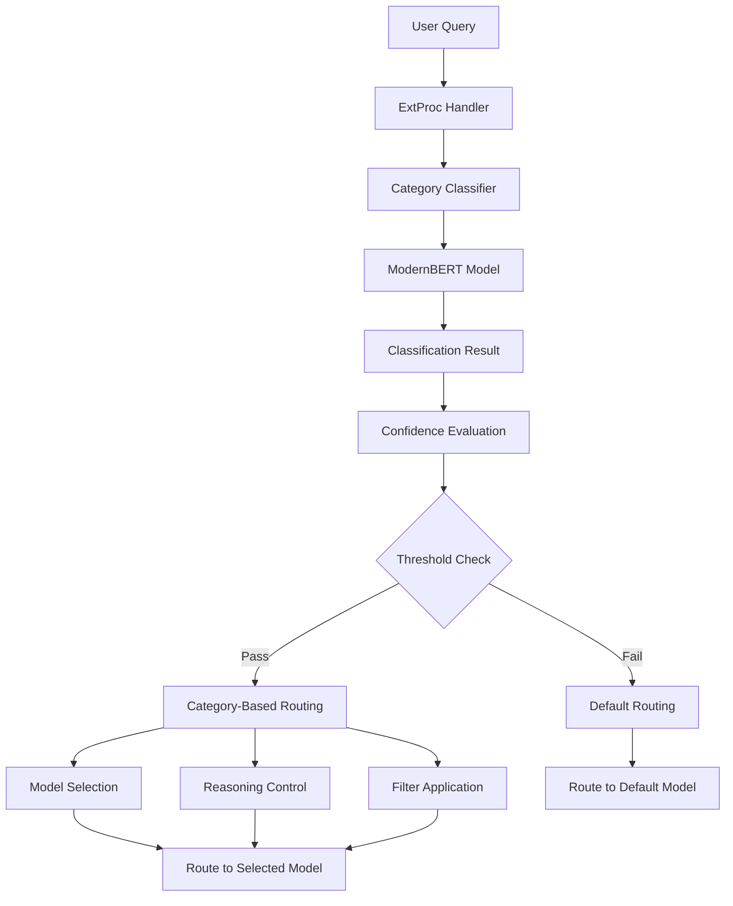

# Technical Details

This document provides in-depth technical information about the Category classification system, including architecture details, API interfaces, performance metrics, and extension guidelines.

## Architecture Overview

The Category system is built on a multi-layered architecture that combines modern transformer models with efficient routing logic.



## Classifier Architecture

### ModernBERT-Based Classification

The category classifier uses ModernBERT, a state-of-the-art transformer model optimized for classification tasks.

**Model Specifications**:

- **Architecture**: ModernBERT-base
- **Parameters**: ~110M parameters
- **Input Length**: Up to 512 tokens
- **Output**: 14-class probability distribution
- **Inference Time**: &lt;50ms average

### Classification Pipeline

```go
type Classifier struct {
    categoryInference CategoryInference
    categoryMapping   *CategoryMapping
    config           *config.RouterConfig
}

func (c *Classifier) ClassifyCategory(text string) (string, float64, error) {
    // 1. Tokenize and encode input
    result, err := c.categoryInference.Classify(text)
    if err != nil {
        return "", 0.0, err
    }

    // 2. Apply confidence threshold
    if result.Confidence < c.config.Classifier.CategoryModel.Threshold {
        return "", result.Confidence, nil
    }

    // 3. Map index to category name
    category := c.categoryMapping.IdxToCategory[strconv.Itoa(result.ClassIndex)]
    return category, result.Confidence, nil
}
```

### Entropy-Based Reasoning Decision

Advanced entropy calculation determines when to enable reasoning:

```go
func (c *Classifier) ClassifyCategoryWithEntropy(text string) (string, float64, entropy.ReasoningDecision, error) {
    // Get full probability distribution
    result, err := c.categoryInference.ClassifyWithProbabilities(text)
    if err != nil {
        return "", 0.0, entropy.ReasoningDecision{}, err
    }

    // Calculate entropy for reasoning decision
    reasoningDecision := entropy.ShouldUseReasoning(result.Probabilities, c.config)

    return result.Category, result.Confidence, reasoningDecision, nil
}
```

## API Interfaces

### Classification API

#### Intent Classification Endpoint

**Endpoint**: `POST /classify/intent`

**Request Format**:

```json
{
  "text": "Solve the quadratic equation x² + 5x + 6 = 0",
  "options": {
    "return_probabilities": true,
    "confidence_threshold": 0.6
  }
}
```

**Response Format**:

```json
{
  "classification": {
    "category": "math",
    "confidence": 0.95,
    "processing_time_ms": 42
  },
  "probabilities": {
    "math": 0.95,
    "physics": 0.03,
    "computer science": 0.01,
    "other": 0.01
  }
}
```

#### Batch Classification Endpoint

**Endpoint**: `POST /classify/batch`

**Request Format**:

```json
{
  "texts": [
    "Calculate the derivative of x²",
    "Implement a sorting algorithm",
    "What is photosynthesis?"
  ],
  "options": {
    "return_probabilities": false
  }
}
```

**Response Format**:

```json
{
  "results": [
    {
      "text": "Calculate the derivative of x²",
      "classification": {
        "category": "math",
        "confidence": 0.92,
        "processing_time_ms": 38
      }
    },
    {
      "text": "Implement a sorting algorithm",
      "classification": {
        "category": "computer science",
        "confidence": 0.89,
        "processing_time_ms": 41
      }
    },
    {
      "text": "What is photosynthesis?",
      "classification": {
        "category": "biology",
        "confidence": 0.87,
        "processing_time_ms": 39
      }
    }
  ],
  "batch_processing_time_ms": 125
}
```

### Model Information API

**Endpoint**: `GET /api/v1/models`

**Response Format**:

```json
{
  "models": [
    {
      "name": "category_classifier",
      "type": "intent_classification",
      "loaded": true,
      "model_path": "models/category_classifier_modernbert-base_model",
      "categories": [
        "business", "law", "psychology", "biology", "chemistry",
        "history", "other", "health", "economics", "math",
        "physics", "computer science", "philosophy", "engineering"
      ],
      "metadata": {
        "mapping_path": "models/category_classifier_modernbert-base_model/category_mapping.json",
        "model_type": "modernbert",
        "threshold": "0.60"
      }
    }
  ]
}
```

## Performance Metrics

### Classification Performance

| Metric | Value | Notes |
|--------|-------|-------|
| **Average Latency** | 45ms | Single query classification |
| **Batch Latency** | 35ms/query | Batch processing efficiency |
| **Throughput** | 200 QPS | Queries per second |
| **Memory Usage** | 2.1GB | Model + runtime overhead |
| **CPU Usage** | 15-25% | Single core utilization |

### Accuracy Metrics

| Category | Precision | Recall | F1-Score |
|----------|-----------|--------|----------|
| Math | 0.94 | 0.92 | 0.93 |
| Computer Science | 0.89 | 0.87 | 0.88 |
| Physics | 0.85 | 0.83 | 0.84 |
| Chemistry | 0.88 | 0.86 | 0.87 |
| Biology | 0.86 | 0.84 | 0.85 |
| Business | 0.82 | 0.80 | 0.81 |
| Law | 0.84 | 0.82 | 0.83 |
| Economics | 0.81 | 0.79 | 0.80 |
| Health | 0.83 | 0.81 | 0.82 |
| Psychology | 0.80 | 0.78 | 0.79 |
| Philosophy | 0.78 | 0.76 | 0.77 |
| History | 0.82 | 0.80 | 0.81 |
| Engineering | 0.87 | 0.85 | 0.86 |
| Other | 0.75 | 0.73 | 0.74 |

### Confidence Distribution

```
Confidence Range | Percentage | Accuracy
0.9 - 1.0       | 35%        | 97%
0.8 - 0.9       | 28%        | 92%
0.7 - 0.8       | 22%        | 87%
0.6 - 0.7       | 12%        | 81%
0.5 - 0.6       | 3%         | 74%
```

## Implementation Details

### Category Mapping

The system uses JSON mapping files to convert between model outputs and category names:

```json
{
  "category_to_idx": {
    "business": 0,
    "law": 1,
    "psychology": 2,
    "biology": 3,
    "chemistry": 4,
    "history": 5,
    "other": 6,
    "health": 7,
    "economics": 8,
    "math": 9,
    "physics": 10,
    "computer science": 11,
    "philosophy": 12,
    "engineering": 13
  },
  "idx_to_category": {
    "0": "business",
    "1": "law",
    "2": "psychology",
    "3": "biology",
    "4": "chemistry",
    "5": "history",
    "6": "other",
    "7": "health",
    "8": "economics",
    "9": "math",
    "10": "physics",
    "11": "computer science",
    "12": "philosophy",
    "13": "engineering"
  }
}
```

### Routing Integration

The classifier integrates with the routing system through the ExtProc handler:

```go
func (r *OpenAIRouter) handleRequestBody(ctx *RequestContext, body []byte) error {
    // Extract user content from request
    userContent := extractUserContent(body)

    // Classify the query
    category, confidence, reasoningDecision, err := r.Classifier.ClassifyCategoryWithEntropy(userContent)
    if err != nil {
        return fmt.Errorf("classification failed: %w", err)
    }

    // Select model based on category
    selectedModel := r.selectModelForCategory(category, confidence)

    // Apply reasoning if needed
    if reasoningDecision.ShouldUseReasoning {
        body = r.applyReasoningMode(body, category, reasoningDecision.Effort)
    }

    // Route to selected model
    return r.routeToModel(selectedModel, body)
}
```

### Caching Integration

Categories work with semantic caching for performance optimization:

```go
type SemanticCache struct {
    backend         CacheBackend
    threshold       float64
    categoryWeights map[string]float64
}

func (c *SemanticCache) Get(query string, category string) (*CacheEntry, bool) {
    // Use category-specific similarity thresholds
    threshold := c.getCategoryThreshold(category)

    // Search for similar queries in the same category
    return c.backend.FindSimilar(query, threshold, category)
}

func (c *SemanticCache) getCategoryThreshold(category string) float64 {
    if weight, exists := c.categoryWeights[category]; exists {
        return c.threshold * weight
    }
    return c.threshold
}
```

## Monitoring and Observability

### Metrics Collection

The system collects comprehensive metrics for monitoring:

```go
// Classification metrics
metrics.RecordClassifierLatency("category", latency)
metrics.RecordClassificationAccuracy(category, confidence)
metrics.RecordCategoryDistribution(category)

// Routing metrics
metrics.RecordRoutingDecision(category, selectedModel, confidence)
metrics.RecordReasoningDecision(category, useReasoning, effort)

// Performance metrics
metrics.RecordThroughput("classification", qps)
metrics.RecordMemoryUsage("classifier", memoryMB)
```

### Logging

Structured logging provides detailed insights:

```go
observability.Infof("Category classification: query='%s' category='%s' confidence=%.3f latency=%dms",
    query, category, confidence, latencyMs)

observability.Infof("Routing decision: category='%s' model='%s' reasoning=%v effort='%s'",
    category, selectedModel, useReasoning, reasoningEffort)
```

### Health Checks

```go
func (c *Classifier) HealthCheck() error {
    // Test classification with known input
    testQuery := "What is 2 + 2?"
    category, confidence, err := c.ClassifyCategory(testQuery)

    if err != nil {
        return fmt.Errorf("classification health check failed: %w", err)
    }

    if category != "math" || confidence < 0.8 {
        return fmt.Errorf("unexpected classification result: category=%s confidence=%.3f",
            category, confidence)
    }

    return nil
}
```

## Extension and Customization

### Adding New Categories

1. **Update Model Training Data**:

   ```python
   # Add training examples for new category
   training_data = [
       {"text": "Example query", "label": "new_category"},
       # ... more examples
   ]
   ```

2. **Update Category Mapping**:

   ```json
   {
     "category_to_idx": {
       "new_category": 14
     },
     "idx_to_category": {
       "14": "new_category"
     }
   }
   ```

3. **Update Configuration**:

   ```yaml
   categories:
     - name: "new_category"
       use_reasoning: false
       model_scores:
         - model: "best-model-for-category"
           score: 1.0
   ```

### Custom Classification Models

Replace the default ModernBERT classifier:

```go
type CustomClassifier struct {
    model CustomModel
}

func (c *CustomClassifier) Classify(text string) (candle_binding.ClassResult, error) {
    // Custom classification logic
    result := c.model.Predict(text)
    return candle_binding.ClassResult{
        ClassIndex: result.ClassIndex,
        Confidence: result.Confidence,
    }, nil
}

// Register custom classifier
classifier := &classification.Classifier{
    categoryInference: &CustomClassifier{model: loadCustomModel()},
}
```

### Performance Optimization

#### Model Quantization

```go
// Enable model quantization for faster inference
config := &classification.Config{
    UseQuantization: true,
    QuantizationBits: 8,  // 8-bit quantization
}
```

#### Batch Processing

```go
// Process multiple queries in batches
func (c *Classifier) ClassifyBatch(texts []string) ([]ClassResult, error) {
    // Batch tokenization and inference
    results := make([]ClassResult, len(texts))

    // Process in batches of 32
    batchSize := 32
    for i := 0; i < len(texts); i += batchSize {
        end := min(i+batchSize, len(texts))
        batch := texts[i:end]

        batchResults, err := c.processBatch(batch)
        if err != nil {
            return nil, err
        }

        copy(results[i:end], batchResults)
    }

    return results, nil
}
```

## Troubleshooting

### Common Issues

#### Low Classification Accuracy

**Symptoms**: Queries consistently misclassified

**Diagnosis**:

```bash
# Check model health
curl -X GET http://localhost:8080/health

# Test specific queries
curl -X POST http://localhost:8080/classify/intent \
  -d '{"text": "test query", "options": {"return_probabilities": true}}'
```

**Solutions**:

- Increase confidence threshold
- Retrain model with more data
- Update category mapping

#### High Latency

**Symptoms**: Slow classification responses

**Diagnosis**:

```bash
# Monitor classification metrics
curl -X GET http://localhost:8080/metrics | grep classifier_latency
```

**Solutions**:

- Enable model quantization
- Use batch processing
- Optimize hardware (GPU acceleration)

#### Memory Issues

**Symptoms**: High memory usage or OOM errors

**Solutions**:

```yaml
# Reduce model size
classifier:
  category_model:
    use_cpu: true
    model_id: "smaller-model"
```

## Next Steps

- [**Category Overview**](overview.md) - Understanding the category system
- [**Supported Categories**](supported-categories.md) - Available category types
- [**Configuration Guide**](configuration.md) - How to configure categories
