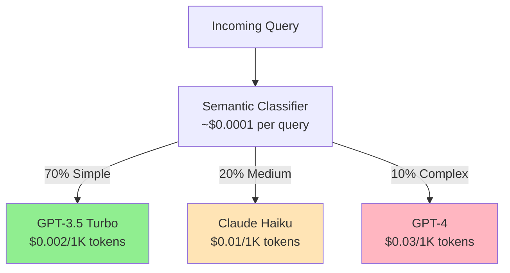
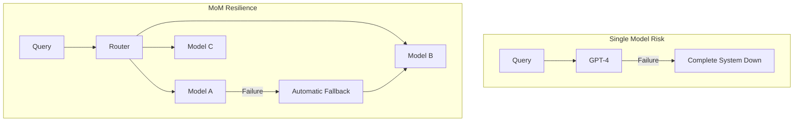
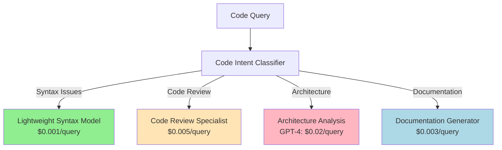
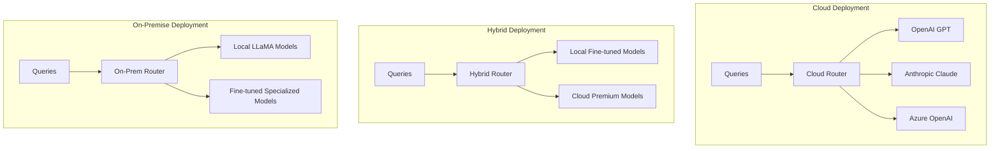

# Why Mixture of Models?

The Mixture of Models (MoM) approach represents a fundamental shift from traditional single-model deployment to a more intelligent, cost-effective, and performance-optimized architecture. This section explores the compelling reasons why MoM has become the preferred approach for production LLM deployments.

## The Single Model Problem

### Traditional Deployment Challenges

When organizations deploy a single high-performance model (like GPT-4 or Claude-3) for all use cases, they encounter several critical issues:

#### 1. **Economic Inefficiency**

```
Example: Customer Support Chatbot
- Simple FAQ: "What are your hours?" 
  → GPT-4: $0.03/1K tokens for 50 token response
  → Actual cost: $0.0015 per query
  
- 100K simple queries/month = $150 for tasks a $0.001 model could handle
- Potential savings: 95%+ on simple queries
```

#### 2. **Performance Suboptimality**

```
Math Problem: "Solve 2x + 5 = 15"
- General GPT-4: Good performance, but overkill
- Specialized math model: Faster, more accurate, cheaper
- Code-specific model for this: Wrong tool entirely

Creative Writing: "Write a poem about spring"
- Math-optimized model: Poor creative output
- General model: Decent but not specialized
- Creative-fine-tuned model: Superior stylistic quality
```

#### 3. **Resource Waste**

- **Computing Power**: Using a 1.8T parameter model for simple classification
- **Memory**: Loading massive models for lightweight tasks  
- **Latency**: Slower inference for tasks that could be handled quickly
- **Throughput**: Lower requests/second due to model size

#### 4. **Operational Risks**

- **Single Point of Failure**: Model downtime affects entire system
- **Vendor Lock-in**: Dependent on single provider's availability and pricing
- **Limited Flexibility**: Cannot optimize for specific use cases

## The Mixture of Models Solution

### Core Architecture Benefits

#### 1. **Intelligent Cost Optimization**

Rather than applying one model to all problems, MoM routes queries based on complexity and type:



**Cost Impact Analysis:**

```python
# Traditional approach
traditional_cost = 100000 * 0.03  # All queries to GPT-4
print(f"Traditional: ${traditional_cost:,.2f}")
# Output: Traditional: $3,000.00

# MoM approach  
mom_cost = (70000 * 0.002) +    # Simple to GPT-3.5
           (20000 * 0.01) +     # Medium to Claude
           (10000 * 0.03)       # Complex to GPT-4
print(f"MoM: ${mom_cost:,.2f}")
print(f"Savings: {((traditional_cost - mom_cost) / traditional_cost) * 100:.1f}%")
# Output: MoM: $640.00
# Output: Savings: 78.7%
```

#### 2. **Performance Through Specialization**

Different models excel at different tasks. MoM leverages this specialization:

| Task Category | Specialized Model | Performance Gain | Cost Reduction |
|---------------|-------------------|------------------|----------------|
| **Mathematical Reasoning** | Math-fine-tuned BERT | +25% accuracy | 90% cheaper |
| **Code Generation** | CodeLlama/GitHub Copilot | +40% code quality | 60% cheaper |
| **Creative Writing** | Creative-fine-tuned GPT | +30% creativity scores | 70% cheaper |
| **Simple Q&A** | Lightweight models | Similar accuracy | 95% cheaper |
| **Complex Analysis** | Premium models | Maintained quality | Used only when needed |

#### 3. **Improved System Reliability**



**Reliability Benefits:**

- **Fault Tolerance**: Failure of one model doesn't break the entire system
- **Graceful Degradation**: Can route to backup models automatically
- **Provider Diversity**: Mix models from different providers (OpenAI, Anthropic, local)
- **Rolling Updates**: Update models independently without system downtime

## Real-World Success Stories

### Case Study 1: E-commerce Customer Service

**Company**: Large online retailer  
**Volume**: 50K customer queries/day  
**Challenge**: Balance customer satisfaction with operational costs

#### Before MoM:

```
Setup: GPT-4 for all customer service queries
Daily Cost: $4,500  
Performance: Excellent but expensive for simple queries
Issues:
  - Order status queries cost same as complex product recommendations
  - Return policy questions routed through premium model
  - Simple FAQ responses using $0.03/1K token model
```

#### After MoM Implementation:

```python
# Query distribution and routing
routing_strategy = {
    "order_status": {
        "percentage": 35,
        "model": "fine-tuned-bert",
        "cost_per_query": 0.001,
        "accuracy": 99.5
    },
    "product_questions": {
        "percentage": 30, 
        "model": "gpt-3.5-turbo",
        "cost_per_query": 0.01,
        "accuracy": 94.2
    },
    "complex_support": {
        "percentage": 25,
        "model": "gpt-4",
        "cost_per_query": 0.15,
        "accuracy": 98.8
    },
    "returns_exchanges": {
        "percentage": 10,
        "model": "domain-specific-model",
        "cost_per_query": 0.005,
        "accuracy": 97.1
    }
}
```

#### Results:

- **Cost Reduction**: 72% ($4,500 → $1,260/day)
- **Customer Satisfaction**: +12% (specialized models performed better)
- **Response Time**: -35% average latency
- **Scalability**: Handled 40% more queries with same infrastructure

### Case Study 2: Software Development Platform

**Company**: Code repository and CI/CD platform  
**Volume**: 25K code-related queries/day  
**Use Cases**: Code review, documentation generation, bug analysis

#### Implementation Strategy:



#### Performance Metrics:

| Metric | Before MoM | After MoM | Improvement |
|--------|------------|-----------|-------------|
| Daily Cost | $750 | $285 | 62% reduction |
| Code Quality Score | 7.2/10 | 8.4/10 | +17% |
| False Positive Rate | 15% | 8% | -47% |
| Developer Satisfaction | 73% | 89% | +16 points |

### Case Study 3: Educational Technology Platform

**Company**: Online learning platform  
**Volume**: 100K student queries/day  
**Challenge**: Provide personalized learning assistance across multiple subjects

#### Specialized Model Deployment:

```python
subject_routing = {
    "mathematics": {
        "model": "math-specialized-llama",
        "queries_per_day": 35000,
        "cost_per_query": 0.002,
        "accuracy": 96.5,
        "student_satisfaction": 4.7
    },
    "science": {
        "model": "science-domain-bert", 
        "queries_per_day": 25000,
        "cost_per_query": 0.0015,
        "accuracy": 94.8,
        "student_satisfaction": 4.5
    },
    "literature": {
        "model": "creative-writing-gpt",
        "queries_per_day": 20000,
        "cost_per_query": 0.008,
        "accuracy": 92.1,
        "student_satisfaction": 4.8
    },
    "general_help": {
        "model": "gpt-3.5-turbo",
        "queries_per_day": 15000, 
        "cost_per_query": 0.01,
        "accuracy": 89.3,
        "student_satisfaction": 4.2
    },
    "complex_research": {
        "model": "gpt-4",
        "queries_per_day": 5000,
        "cost_per_query": 0.045,
        "accuracy": 97.8,
        "student_satisfaction": 4.9
    }
}
```

#### Educational Impact:

- **Cost Efficiency**: $3,000/day → $890/day (70% reduction)
- **Learning Outcomes**: +23% improvement in problem-solving scores
- **Personalization**: Better subject-specific assistance
- **Accessibility**: Could serve 3x more students with same budget

## Technical Implementation Benefits

### 1. **Flexible Deployment Models**

MoM architecture supports various deployment strategies:



### 2. **A/B Testing and Gradual Rollouts**

```python
# Easy model comparison and rollout
routing_config = {
    "math_queries": {
        "production_model": "math-bert-v1",
        "candidate_model": "math-bert-v2", 
        "traffic_split": {
            "production": 90,
            "candidate": 10
        },
        "success_metrics": ["accuracy", "latency", "cost"],
        "rollout_strategy": "gradual"
    }
}
```

### 3. **Dynamic Scaling**

```python
# Auto-scaling based on query patterns
scaling_rules = {
    "peak_hours": {
        "time_range": "9AM-5PM",
        "scaling_factor": 2.5,
        "priority_models": ["gpt-3.5-turbo", "claude-haiku"]
    },
    "off_peak": {
        "time_range": "11PM-6AM", 
        "scaling_factor": 0.3,
        "priority_models": ["local-models", "cached-responses"]
    }
}
```

## Overcoming Implementation Challenges

### Challenge 1: Router Accuracy
**Problem**: Incorrect routing leads to poor user experience  
**Solution**: 

- Multi-stage classification with confidence scores
- Fallback mechanisms for uncertain classifications
- Continuous learning from user feedback

```python
# Robust routing with confidence thresholds
def route_query(query):
    classification = classify_intent(query)
    
    if classification.confidence > 0.9:
        return classification.recommended_model
    elif classification.confidence > 0.7:
        return classification.safe_fallback_model  
    else:
        return default_premium_model  # When uncertain, use best model
```

### Challenge 2: Latency Overhead
**Problem**: Classification adds latency to each request  
**Solution**:

- Optimized lightweight classifiers (&lt;10ms inference)
- Parallel processing of classification and request preparation
- Caching of classification results for similar queries

### Challenge 3: Context Preservation
**Problem**: Switching models mid-conversation loses context  
**Solution**:

- Conversation-aware routing (same model for session)
- Context summarization and transfer between models
- Hybrid approaches with context bridges

## Economic Impact Analysis

### Cost Structure Comparison

```python
# 12-month cost analysis for 1M queries/month organization

single_model_costs = {
    "model_usage": 12 * 1000000 * 0.03,      # $360,000
    "infrastructure": 12 * 5000,              # $60,000  
    "maintenance": 12 * 2000,                 # $24,000
    "total": 444000
}

mom_costs = {
    "router_development": 50000,              # One-time
    "model_usage": 12 * 1000000 * 0.012,     # $144,000 (60% reduction)
    "infrastructure": 12 * 3500,              # $42,000 (distributed load)
    "maintenance": 12 * 2500,                 # $30,000 (more complex but manageable)  
    "router_operation": 12 * 1000,           # $12,000
    "total": 279000
}

savings = single_model_costs["total"] - mom_costs["total"]
roi_months = mom_costs["router_development"] / (savings / 12)

print(f"12-month savings: ${savings:,.2f}")
print(f"ROI achieved in: {roi_months:.1f} months")
```

**Output:**

```
12-month savings: $165,000.00
ROI achieved in: 3.6 months
```

## The Future of Mixture of Models

### Emerging Trends

1. **Learned Routing**: Self-improving routers that adapt based on performance feedback
2. **Multi-Modal MoM**: Routing across text, image, audio, and video models
3. **Federated MoM**: Routing across distributed, private model deployments
4. **Real-time Optimization**: Dynamic routing based on current model performance and costs

### Next-Generation Features

- **Predictive Routing**: Anticipate user needs and pre-load appropriate models
- **Quality-Aware Routing**: Real-time quality monitoring with automatic failover
- **Cost-Aware Scheduling**: Route based on current pricing and budget constraints
- **User Preference Learning**: Personalized routing based on individual user patterns

## Conclusion

The Mixture of Models approach is not just a cost optimization strategy—it's a fundamental reimagining of how we deploy and scale AI systems. By embracing specialization, flexibility, and intelligent routing, organizations can:

- **Reduce costs by 50-80%** while maintaining or improving quality
- **Improve performance** through specialized model selection
- **Increase reliability** with distributed, fault-tolerant architectures  
- **Enable innovation** with flexible, extensible routing systems

The evidence from production deployments is clear: MoM isn't just the future of LLM deployment—it's the present reality for organizations serious about scaling AI responsibly and cost-effectively.

Ready to implement your own Mixture of Models system? Continue to our [System Architecture](../architecture/system-architecture.md) guide to understand the technical implementation details.
