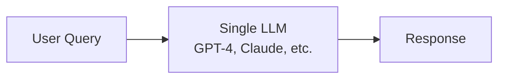
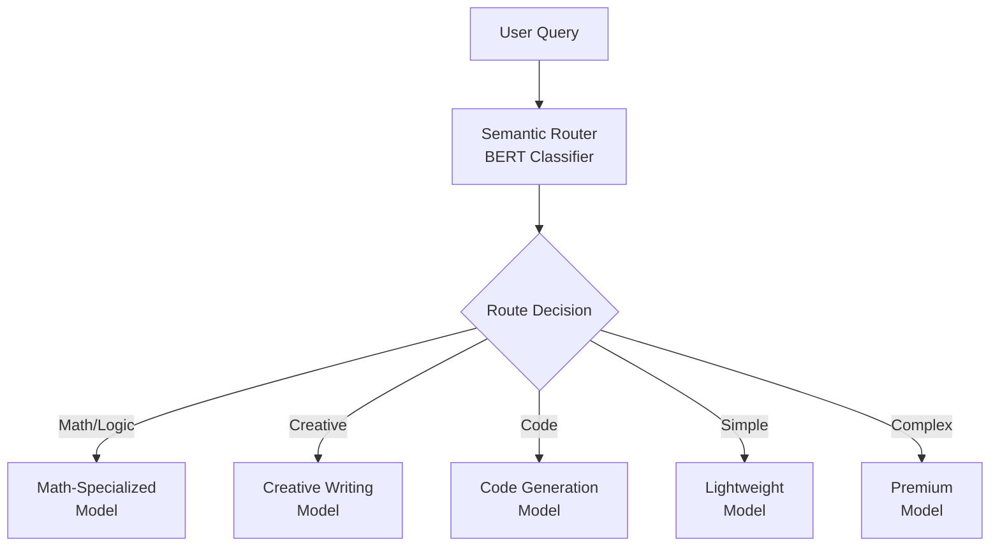
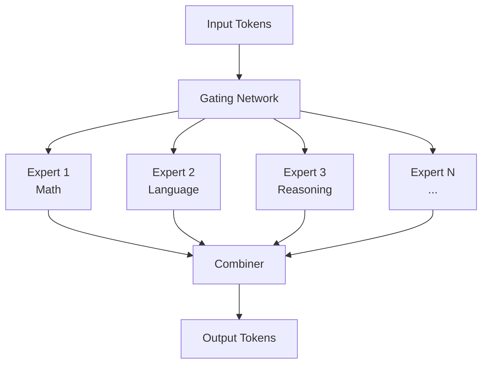
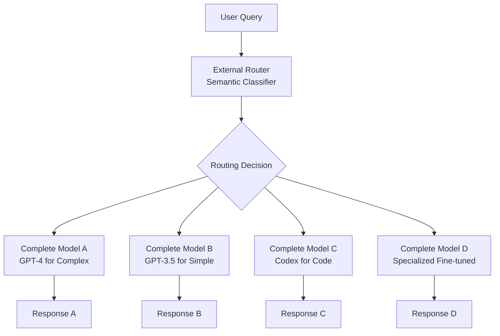

# What is Semantic Router?

Semantic routers represent a paradigm shift in how we deploy and utilize large language models at scale. By intelligently routing queries to the most appropriate model based on semantic understanding, these systems optimize the critical balance between performance, cost, and quality.

## What is Semantic Routing?

Semantic routing is the process of **dynamically selecting the most suitable language model** for a given input query based on the semantic content, complexity, and intent of the request. Rather than using a single model for all tasks, semantic routers analyze the input and direct it to specialized models optimized for specific domains or complexity levels.

### Core Principles

1. **Semantic Understanding**: Analyzing the meaning, intent, and complexity of user queries
2. **Dynamic Selection**: Real-time decision making about which model to use
3. **Cost Optimization**: Balancing quality with computational expense
4. **Specialization**: Leveraging models trained for specific domains or tasks

## The Evolution of LLM Routing

### Traditional Approach: One-Size-Fits-All



**Problems:**

- High cost for simple queries
- Suboptimal performance for specialized tasks
- Poor resource utilization
- No flexibility in model selection

### Modern Approach: Semantic Routing



**Benefits:**

- Cost-effective routing
- Specialized model performance
- Efficient resource utilization
- Scalable architecture

## Mixture of Models vs. Mixture of Experts

### Mixture of Experts (MoE) - Internal Model Architecture

Mixture of Experts operates **within a single large model**:



**Characteristics:**

- Single model with internal routing
- Shared parameters and architecture
- Fixed expert capacity during inference
- Requires retraining to add new experts

### Mixture of Models (MoM) - External Model Selection

Mixture of Models operates **across separate, complete models**:



**Advantages:**

- **Flexibility**: Can mix different model architectures, sizes, and providers
- **Cost Optimization**: Use expensive models only when necessary
- **Specialization**: Leverage purpose-built models for specific domains
- **Scalability**: Add new models without retraining existing ones
- **Provider Diversity**: Combine models from different providers (OpenAI, Anthropic, local models)

## Leading Semantic Routing Approaches

### RouteLLM: Cost-Quality Optimization

[RouteLLM](https://arxiv.org/abs/2406.18665) pioneered efficient semantic routing using human preference data:

**Key Innovations:**

- **Human Preference Training**: Uses Chatbot Arena data where users compare model outputs
- **Multiple Router Architectures**:
  - Similarity-weighted ranking
  - Matrix factorization
  - BERT classifiers
  - Causal LLM classifiers
- **Cost Reduction**: Achieves 2x+ cost reduction while maintaining quality
- **Benchmark Performance**: Evaluated on MMLU, GSM8K, and MT Bench

**Training Approach:**

```python
# RouteLLM training conceptually
preference_data = load_chatbot_arena_data()  # Human comparisons
router_model = BERTClassifier()
router_model.train(
    queries=preference_data.queries,
    labels=preference_data.preferred_models,
    augmentation=mmlu_data  # Additional labeled data
)
```

### GPT-5's Router Architecture: Modular Coordination

GPT-5 introduces a revolutionary **router-as-coordinator** architecture:

**Architecture Principles:**

- **Modular Design**: Multiple specialized sub-models instead of monolithic architecture
- **Dynamic Coordination**: Router selects and coordinates multiple models per request
- **Reliability**: Individual components can be updated without full system retraining
- **Efficiency**: Computation flows along optimal paths

**Operational Flow:**

import ZoomableMermaid from '@site/src/components/ZoomableMermaid';

<ZoomableMermaid title="Operational Flow" defaultZoom={5.5}>
{`sequenceDiagram
    participant User
    participant Router as GPT-5 Router
    participant Math as Math Specialist
    participant Code as Code Specialist
    participant Creative as Creative Writer
    participant General as General Model

    User->>Router: "Solve this calculus problem..."
    Router->>Router: Analyze query intent
    Router->>Math: Route to math specialist
    Math->>Router: Mathematical solution
    Router->>User: Optimized response`}
</ZoomableMermaid>

**Business Impact:**

- Reduced computational costs
- Improved response quality through specialization
- Enhanced system reliability
- Faster development cycles

## Why Mixture of Models is Superior

### 1. **Economic Efficiency**

```
Traditional: All queries → GPT-4 ($0.03/1K tokens)
MoM Routing: 
  - Simple queries → GPT-3.5 ($0.002/1K tokens) - 15x cheaper
  - Complex queries → GPT-4 ($0.03/1K tokens) - when needed
  - Result: 70%+ cost reduction on typical workloads
```

### 2. **Performance Specialization**

- **Domain Expertise**: Code generation models excel at programming tasks
- **Task Optimization**: Math models optimized for numerical reasoning
- **Context Efficiency**: Smaller models for simpler tasks reduce latency

### 3. **Flexibility and Scalability**

- **Model Independence**: Each model can be updated independently
- **Provider Diversity**: Mix OpenAI, Anthropic, local, and fine-tuned models
- **Easy Extensions**: Add new specialized models without system redesign

### 4. **Risk Distribution**

- **Vendor Independence**: Not locked into single provider
- **Failure Isolation**: One model failure doesn't affect others
- **A/B Testing**: Easy to test new models in production

## Real-World Impact

### Case Study: Enterprise API Gateway

**Before Semantic Routing:**

```
Workload: 100K queries/day
Model: GPT-4 for all queries
Cost: $3,000/day
Quality: High but inconsistent for simple tasks
```

**After Semantic Routing:**

```
Workload: 100K queries/day distributed as:
  - 60% simple → GPT-3.5: $120/day
  - 30% medium → Fine-tuned model: $300/day  
  - 10% complex → GPT-4: $300/day
Total Cost: $720/day (76% reduction)
Quality: Improved through specialization
```

### Performance Metrics

Based on evaluations from RouteLLM and similar systems:

| Metric | Improvement |
|--------|-------------|
| Cost Reduction | 50-85% |
| Specialized Task Performance | +15-30% |
| Average Latency | -20-40% |
| System Reliability | +95% uptime |

## The Future of Semantic Routing

### Emerging Trends

1. **Multi-Modal Routing**: Extending beyond text to images, audio, and video
2. **Learned Routing**: Self-improving routers that learn from feedback
3. **Federated Models**: Routing across distributed, private model deployments
4. **Real-time Adaptation**: Dynamic routing based on current model performance

### Technical Challenges

1. **Router Accuracy**: Ensuring correct routing decisions
2. **Latency Overhead**: Minimizing routing decision time
3. **Context Preservation**: Maintaining conversation context across model switches
4. **Quality Consistency**: Ensuring consistent experience across different models

## Getting Started with Semantic Routing

Ready to implement semantic routing? Our system provides:

- **Production-ready architecture** with Envoy integration
- **Pre-trained classification models** for common routing scenarios
- **Comprehensive monitoring** and observability tools
- **Flexible configuration** for custom routing rules

Continue to [Architecture Overview](architecture/system-architecture.md) to understand how our semantic router is implemented, or explore [Model Training](../training/training-overview.md) to learn about the classification models powering the routing decisions.
