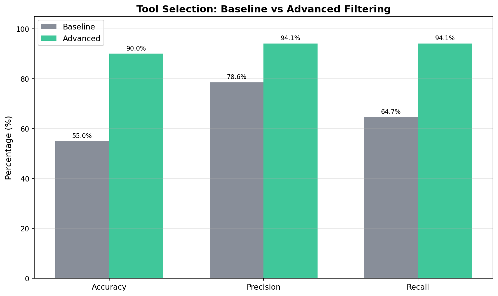
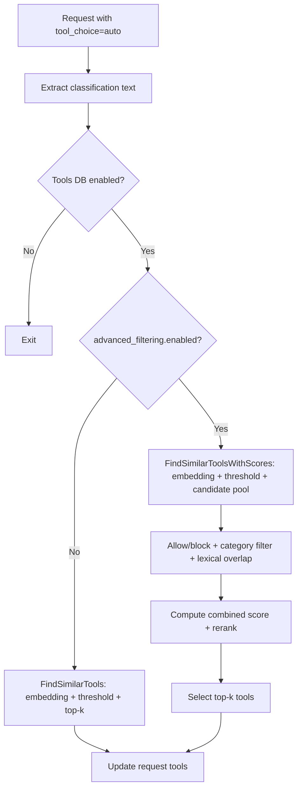

# Advanced Tool Filtering for Tool Selection

Issue: [#1002](https://github.com/vllm-project/semantic-router/issues/1002)

---

## Current

Currently tool selection only uses embedding similarity, similarity threshold, and top-k. When embeddings are similar but intent is inconsistent, tools from incorrect domains may be selected.

[#1002](https://github.com/vllm-project/semantic-router/issues/1002) proposes the need to introduce advanced tool filtering capabilities to reduce these misselections through sophisticated relevance filtering, while maintaining default behavior unchanged.

## Solution

After embedding candidate set retrieval, add an **optional advanced filtering stage**. This stage applies deterministic filtering (allow/block lists, optional category gating, lexical overlap thresholds) and a **combined score reranker** that fuses embedding similarity with lexical, tag, name, and category signals. If `advanced_filtering.enabled=false`, existing behavior remains unchanged.

Solution advantages: maintains controllable latency, introduces no new model dependencies, and is fully explainable through configuration.

## Comparative Test Results

Test configuration:

- Query set: 20 queries (17 positive examples, 3 negative examples), covering weather, email, search, calculation, calendar, and other scenarios
- Tool library: 5 tools (get_weather, search_web, calculate, send_email, create_calendar_event)
- Iterations: 10
- Advanced filtering configuration: `min_lexical_overlap=1`, `min_combined_score=0.35`, `weights={embed:0.7, lexical:0.2, tag:0.05, name:0.05}`

Evaluation results:



| Metric | Baseline | Advanced | Delta |
|--------|----------|----------|-------|
| **Accuracy** | 55.00% | 90.00% | **+35.00%** |
| **Precision** | 78.57% | 94.12% | **+15.55%** |
| **Recall** | 64.71% | 94.12% | **+29.41%** |
| **False Positive Rate** | 100.00% | 33.33% | **-66.67%** |
| Avg Latency | 0.0162 ms | 0.0197 ms | +0.0036 ms |
| P95 Latency | 0.0256 ms | 0.0288 ms | +0.0032 ms |

## Data Flow



## Configuration Changes

Advanced filtering is disabled by default. When enabled, the following fields take effect.

| Field | Type | Default | Range / Description |
|-------|------|---------|---------------------|
| `enabled` | bool | `false` | Enable advanced filtering. |
| `candidate_pool_size` | int | `max(top_k*5, 20)` | If set and >0, use directly. |
| `min_lexical_overlap` | int | `0` | Minimum unique token overlap between query and tool vocabulary. |
| `min_combined_score` | float | `0.0` | Combined score threshold, range [0.0, 1.0]. |
| `weights.embed` | float | `1.0` | If no weights are set, embed defaults to 1.0. |
| `weights.lexical` | float | `0.0` | Optional weight, range [0.0, 1.0]. |
| `weights.tag` | float | `0.0` | Optional weight, range [0.0, 1.0]. |
| `weights.name` | float | `0.0` | Optional weight, range [0.0, 1.0]. |
| `weights.category` | float | `0.0` | Optional weight, range [0.0, 1.0]. |
| `use_category_filter` | bool | `false` | If true, filter by category when confidence is sufficient. |
| `category_confidence_threshold` | float | `nil` | If set, category filtering only applies when decision confidence ≥ threshold. |
| `allow_tools` | []string | `[]` | Tool name whitelist; when non-empty, only these tools are retained. |
| `block_tools` | []string | `[]` | Tool name blacklist. |

## Scoring and Filtering Implementation

### Tokenization

Tokenization rules: convert to lowercase and split at non-alphanumeric characters. Only Unicode letters and numbers are counted as tokens. 
Implementation: [src/semantic-router/pkg/tools/relevance.go#L240](https://github.com/samzong/semantic-router/blob/feat/advanced-tool-filtering/src/semantic-router/pkg/tools/relevance.go#L240).

### Lexical Overlap

Lexical overlap counts the intersection of the following **unique tokens**:

- Tool name
- Tool description
- Tool category

Tags are not included. Tags are a separate signal.

### Combined Score Formula

For each candidate tool:

```
combined = (w_embed * embed + w_lexical * lexical + w_tag * tag + w_name * name + w_category * category) / (w_embed + w_lexical + w_tag + w_name + w_category)
```

- `embed` is the similarity score, clamped to [0,1].
- `lexical` and `tag` are overlap scores, normalized by query token count / tag token count.
- `name` and `category` are binary scores (0 or 1).
- If no weights are set, embed defaults to 1.0.
- If all weights are explicitly set to 0, the combined score is 0; when `min_combined_score > 0`, all candidates will be filtered.

### Category Confidence Gating

Category filtering only takes effect when all of the following conditions are met:

- `use_category_filter` is true,
- A category exists, and
- Decision confidence ≥ `category_confidence_threshold` (if set).

## Error Handling and Fallback

- When tool selection fails and `tools.fallback_to_empty=true`: the request continues with **no tools** and a warning is logged.
- If `fallback_to_empty=false`: the request returns a classification error.
- Invalid advanced configuration values are rejected during configuration loading (range validation in `validator.go`).

## API Changes

New or modified APIs and signatures:

```go
// src/semantic-router/pkg/tools/tools.go
func (db *ToolsDatabase) FindSimilarToolsWithScores(query string, topK int) ([]ToolSimilarity, error)

// src/semantic-router/pkg/tools/relevance.go
func FilterAndRankTools(query string, candidates []ToolSimilarity, topK int, advanced *config.AdvancedToolFilteringConfig, selectedCategory string) []openai.ChatCompletionToolParam
```
