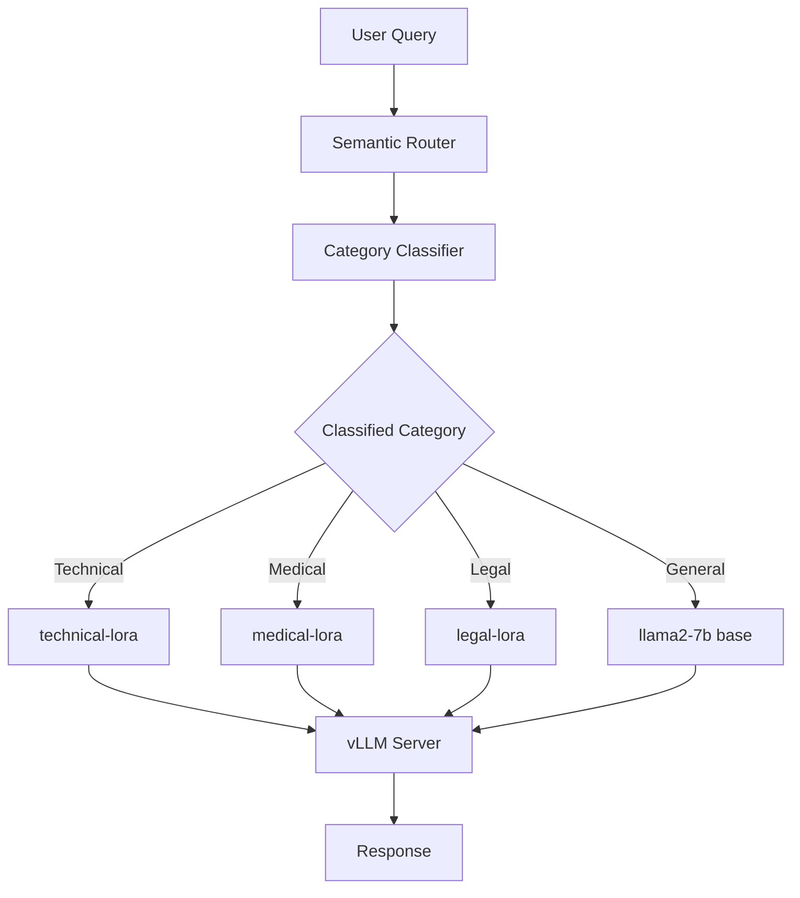

# LoRA Routing

This guide shows how to enable intent-aware LoRA (Low-Rank Adaptation) routing in the Semantic Router:

- Minimal configuration for LoRA routing
- vLLM server setup with LoRA adapters
- Example request/response showing automatic LoRA selection
- Verification steps

## Prerequisites

- A running vLLM server with LoRA support enabled
- LoRA adapter files (fine-tuned for specific domains)
- Envoy + the router (see [Installation](../../installation/installation.md) guide)

## 1. Start vLLM with LoRA Adapters

First, start your vLLM server with LoRA support enabled:

```bash
vllm serve meta-llama/Llama-2-7b-hf \
  --enable-lora \
  --lora-modules \
    technical-lora=/path/to/technical-adapter \
    medical-lora=/path/to/medical-adapter \
    legal-lora=/path/to/legal-adapter \
  --host 0.0.0.0 \
  --port 8000
```

**Key flags**:

- `--enable-lora`: Enables LoRA adapter support
- `--lora-modules`: Registers LoRA adapters with their names and paths
- Format: `adapter-name=/path/to/adapter`

## 2. Minimal Configuration

Put this in `config/config.yaml` (or merge into your existing config):

```yaml
# Category classifier (required for intent detection)
classifier:
  category_model:
    model_id: "models/category_classifier_modernbert-base_model"
    use_modernbert: true
    threshold: 0.6
    use_cpu: true
    category_mapping_path: "models/category_classifier_modernbert-base_model/category_mapping.json"

# vLLM endpoint hosting your base model + LoRA adapters
vllm_endpoints:
  - name: "vllm-primary"
    address: "127.0.0.1"
    port: 8000
    weight: 1

# Define base model and available LoRA adapters
model_config:
  "llama2-7b":
    reasoning_family: "llama2"
    preferred_endpoints: ["vllm-primary"]
    # IMPORTANT: Define all available LoRA adapters here
    loras:
      - name: "technical-lora"
        description: "Optimized for programming and technical questions"
      - name: "medical-lora"
        description: "Specialized for medical and healthcare domain"
      - name: "legal-lora"
        description: "Fine-tuned for legal questions"

# Default model for fallback
default_model: "llama2-7b"

# Categories with LoRA routing
categories:
  - name: "technical"
    description: "Programming, software engineering, and technical questions"
    system_prompt: "You are an expert software engineer."
    model_scores:
      - model: "llama2-7b"           # Base model name
        lora_name: "technical-lora"  # LoRA adapter to use
        score: 1.0
        use_reasoning: true
        reasoning_effort: "medium"

  - name: "medical"
    description: "Medical and healthcare questions"
    system_prompt: "You are a medical expert."
    model_scores:
      - model: "llama2-7b"
        lora_name: "medical-lora"    # Different LoRA for medical
        score: 1.0
        use_reasoning: true
        reasoning_effort: "high"

  - name: "legal"
    description: "Legal questions and law-related topics"
    system_prompt: "You are a legal expert."
    model_scores:
      - model: "llama2-7b"
        lora_name: "legal-lora"      # Different LoRA for legal
        score: 1.0
        use_reasoning: true
        reasoning_effort: "high"

  - name: "general"
    description: "General questions"
    system_prompt: "You are a helpful assistant."
    model_scores:
      - model: "llama2-7b"           # No lora_name = uses base model
        score: 0.8
        use_reasoning: false
```

## 3. How It Works



**Flow**:

1. User sends a query to the router
2. Category classifier detects the intent (e.g., "technical")
3. Router looks up the best `ModelScore` for that category
4. If `lora_name` is specified, it becomes the final model name
5. Request is sent to vLLM with `model="technical-lora"`
6. vLLM routes to the appropriate LoRA adapter
7. Response is returned to the user

### Test Domain Aware LoRA Routing

Send test queries and verify they're classified correctly:

```bash
# Technical query
curl -X POST http://localhost:8080/v1/chat/completions \
  -H "Content-Type: application/json" \
  -d '{"model": "MoM", "messages": [{"role": "user", "content": "Explain async/await in JavaScript"}]}'

# Medical query
curl -X POST http://localhost:8080/v1/chat/completions \
  -H "Content-Type: application/json" \
  -d '{"model": "MoM", "messages": [{"role": "user", "content": "What causes high blood pressure?"}]}'
```

Check the router logs to confirm the correct LoRA adapter is selected for each query.

## Benefits

- **Domain Expertise**: Each LoRA adapter is fine-tuned for specific domains
- **Cost Efficiency**: Share base model weights across adapters (lower memory usage)
- **Easy A/B Testing**: Compare adapter versions by adjusting scores
- **Flexible Deployment**: Add/remove adapters without restarting the router
- **Automatic Selection**: Users don't need to know which adapter to use

## Next Steps

- See [complete LoRA routing example](https://github.com/vllm-project/semantic-router/blob/main/config/intelligent-routing/in-tree/lora_routing.yaml)
- Learn about [category configuration](../../overview/categories/configuration.md#lora_name-optional)
- Explore [reasoning routing](./reasoning.md) to combine with LoRA adapters
