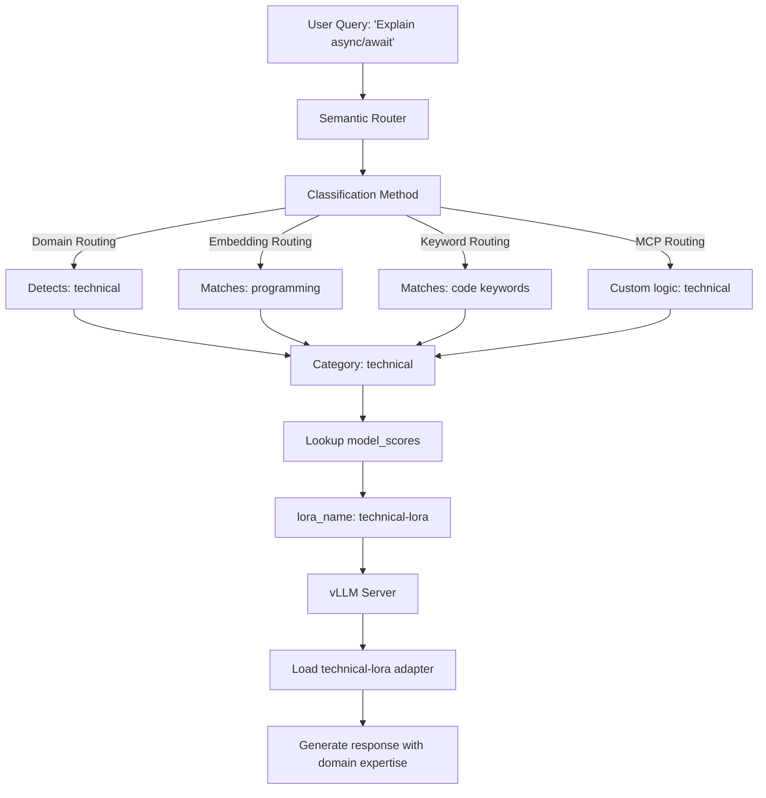

# Intelligent LoRA Routing

This guide shows you how to combine intelligent routing (domain/embedding/keyword/MCP) with LoRA adapters to route requests to domain-specific models. LoRA routing uses the classification methods from previous guides to detect intent, then automatically selects the appropriate LoRA adapter on the vLLM backend.

## Key Advantages

- **Intent-aware adapter selection**: Combines any classification method (domain/embedding/keyword/MCP) with LoRA adapters
- **Memory efficient**: Share base model weights across multiple domain adapters (&lt;1% parameters per adapter)
- **Transparent to users**: Users send requests to one endpoint, router handles adapter selection
- **Flexible classification**: Choose the best routing method for your use case (domain for accuracy, keyword for compliance, etc.)

## What Problem Does It Solve?

vLLM supports multiple LoRA adapters, but users must manually specify which adapter to use. LoRA routing automates this:

- **Manual adapter selection**: Users don't know which adapter to use → Router classifies intent and selects adapter automatically
- **Memory efficiency**: Multiple full models don't fit in GPU → LoRA adapters share base weights (~1% overhead per adapter)
- **Deployment simplicity**: Managing multiple model endpoints is complex → Single vLLM instance serves all adapters
- **Intent detection**: Generic base model lacks domain expertise → Router routes to specialized adapters based on query content

## When to Use

- **Multi-domain vLLM deployments** with LoRA adapters for different domains (technical, medical, legal, etc.)
- **Automatic adapter selection** where you want users to send requests without knowing adapter names
- **Combining classification + LoRA**: Use domain routing for accuracy, keyword routing for compliance, or MCP for custom logic
- **Memory-constrained scenarios** where multiple full models don't fit but LoRA adapters do
- **A/B testing** different adapter versions by adjusting category scores

## Configuration

### Prerequisites

- A running vLLM server with LoRA support enabled
- LoRA adapter files (fine-tuned for specific domains)
- Envoy + the router (see [Installation](../../installation/installation.md) guide)

### 1. Start vLLM with LoRA Adapters

First, start your vLLM server with LoRA support enabled:

```bash
vllm serve meta-llama/Llama-2-7b-hf \
  --enable-lora \
  --lora-modules \
    technical-lora=/path/to/technical-adapter \
    medical-lora=/path/to/medical-adapter \
    legal-lora=/path/to/legal-adapter \
  --host 0.0.0.0 \
  --port 8000
```

**Key flags**:

- `--enable-lora`: Enables LoRA adapter support
- `--lora-modules`: Registers LoRA adapters with their names and paths
- Format: `adapter-name=/path/to/adapter`

### 2. Router Configuration

Put this in `config/config.yaml` (or merge into your existing config):

```yaml
# Category classifier (required for intent detection)
classifier:
  category_model:
    model_id: "models/category_classifier_modernbert-base_model"
    use_modernbert: true
    threshold: 0.6
    use_cpu: true
    category_mapping_path: "models/category_classifier_modernbert-base_model/category_mapping.json"

# vLLM endpoint hosting your base model + LoRA adapters
vllm_endpoints:
  - name: "vllm-primary"
    address: "127.0.0.1"
    port: 8000
    weight: 1

# Define base model and available LoRA adapters
model_config:
  "llama2-7b":
    reasoning_family: "llama2"
    preferred_endpoints: ["vllm-primary"]
    # IMPORTANT: Define all available LoRA adapters here
    loras:
      - name: "technical-lora"
        description: "Optimized for programming and technical questions"
      - name: "medical-lora"
        description: "Specialized for medical and healthcare domain"
      - name: "legal-lora"
        description: "Fine-tuned for legal questions"

# Default model for fallback
default_model: "llama2-7b"

# Categories with LoRA routing
categories:
  - name: "technical"
    description: "Programming, software engineering, and technical questions"
    system_prompt: "You are an expert software engineer."
    model_scores:
      - model: "llama2-7b"           # Base model name
        lora_name: "technical-lora"  # LoRA adapter to use
        score: 1.0
        use_reasoning: true
        reasoning_effort: "medium"

  - name: "medical"
    description: "Medical and healthcare questions"
    system_prompt: "You are a medical expert."
    model_scores:
      - model: "llama2-7b"
        lora_name: "medical-lora"    # Different LoRA for medical
        score: 1.0
        use_reasoning: true
        reasoning_effort: "high"

  - name: "legal"
    description: "Legal questions and law-related topics"
    system_prompt: "You are a legal expert."
    model_scores:
      - model: "llama2-7b"
        lora_name: "legal-lora"      # Different LoRA for legal
        score: 1.0
        use_reasoning: true
        reasoning_effort: "high"

  - name: "general"
    description: "General questions"
    system_prompt: "You are a helpful assistant."
    model_scores:
      - model: "llama2-7b"           # No lora_name = uses base model
        score: 0.8
        use_reasoning: false
```

## How It Works

LoRA routing combines intelligent classification with vLLM's LoRA adapter support:



**Flow**:

1. **User sends query** to router (doesn't specify adapter)
2. **Classification** using any method (domain/embedding/keyword/MCP) detects intent
3. **Category matched** (e.g., "technical" category)
4. **Router looks up** `model_scores` for that category
5. **LoRA adapter selected** via `lora_name` field (e.g., "technical-lora")
6. **Request forwarded** to vLLM with `model="technical-lora"`
7. **vLLM loads adapter** and generates response with domain-specific knowledge

**Key insight**: The classification method (domain/embedding/keyword/MCP) determines the category, then the category's `lora_name` determines which adapter to use.

### Test Domain Aware LoRA Routing

Send test queries and verify they're classified correctly:

```bash
# Technical query
curl -X POST http://localhost:8080/v1/chat/completions \
  -H "Content-Type: application/json" \
  -d '{"model": "MoM", "messages": [{"role": "user", "content": "Explain async/await in JavaScript"}]}'

# Medical query
curl -X POST http://localhost:8080/v1/chat/completions \
  -H "Content-Type: application/json" \
  -d '{"model": "MoM", "messages": [{"role": "user", "content": "What causes high blood pressure?"}]}'
```

Check the router logs to confirm the correct LoRA adapter is selected for each query.

## Real-World Use Cases

### 1. Healthcare Platform (Domain Routing + LoRA)

**Problem**: Medical queries need specialized adapters, but users don't know which to use
**Solution**: Domain routing classifies into diagnosis/pharmacy/mental-health, routes to corresponding LoRA adapters
**Impact**: Automatic adapter selection, 70GB memory vs 210GB for 3 full models

### 2. Legal Tech (Keyword Routing + LoRA for Compliance)

**Problem**: Compliance requires auditable routing to jurisdiction-specific legal adapters
**Solution**: Keyword routing detects "US law"/"EU law"/"contract" keywords, routes to compliant LoRA adapters
**Impact**: 100% auditable routing decisions, 95% citation accuracy with specialized adapters

### 3. Customer Support (Embedding Routing + LoRA)

**Problem**: Support queries span IT/HR/finance, users phrase questions in many ways
**Solution**: Embedding routing matches semantic intent, routes to department-specific LoRA adapters
**Impact**: Handles paraphrases, single endpoint serves all departments with &lt;10ms adapter switching

### 4. EdTech Platform (Domain Routing + LoRA)

**Problem**: Students ask math/science/literature questions, need subject-specific tutors
**Solution**: Domain routing classifies academic subject, routes to subject-specific LoRA adapters
**Impact**: 4 specialized tutors for cost of 1.2 base models, 70% cost savings

### 5. Multi-Tenant SaaS (MCP Routing + LoRA)

**Problem**: Each tenant has custom LoRA adapters, need dynamic routing based on tenant ID
**Solution**: MCP routing queries tenant database, returns tenant-specific LoRA adapter name
**Impact**: 1000+ tenants with custom adapters, private routing logic, A/B testing support

## Next Steps

- See [complete LoRA routing example](https://github.com/vllm-project/semantic-router/blob/main/config/intelligent-routing/in-tree/lora_routing.yaml)
- Learn about [category configuration](../../overview/categories/configuration.md#lora_name-optional)
- Read [modular LoRA blog post](https://blog.vllm.ai/2025/10/27/semantic-router-modular.html) for architecture details
