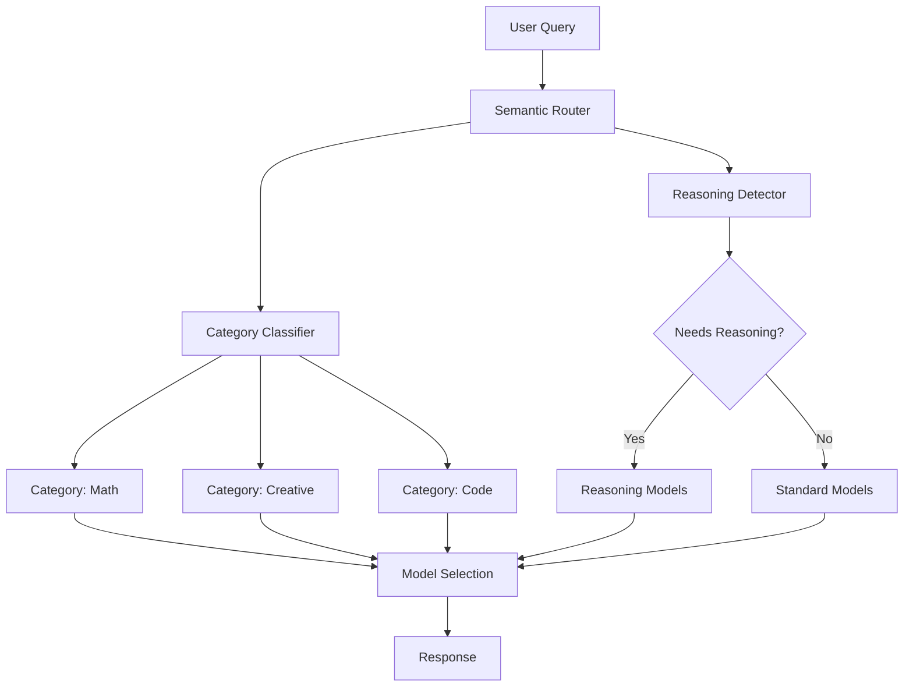

# Overview

Semantic Router provides intelligent routing capabilities that automatically direct user queries to the most appropriate LLM based on semantic understanding and reasoning requirements.

## Core Concepts

### Semantic Classification

Automatically classifies queries into predefined categories using semantic understanding rather than keyword matching.

### Reasoning-Aware Routing

Detects queries that benefit from step-by-step reasoning and routes them to appropriate reasoning-capable models.

### Performance Optimization

Balances cost, latency, and quality by selecting the most suitable model for each query type.

## Architecture



## Key Features

- **14+ Query Categories**: Math, creative writing, coding, analysis, and more
- **Reasoning Detection**: Identifies complex problems requiring step-by-step thinking
- **Model Optimization**: Routes to the most cost-effective and performant models
- **Fallback Handling**: Graceful degradation when classification is uncertain
    I --> K
    J --> K

    K --> L[Response]

```

## Key Features

- **14+ Query Categories**: Math, creative writing, coding, analysis, and more
- **Reasoning Detection**: Identifies complex problems requiring step-by-step thinking
- **Model Optimization**: Routes to the most cost-effective and performant models
- **Fallback Handling**: Graceful degradation when classification is uncertain
