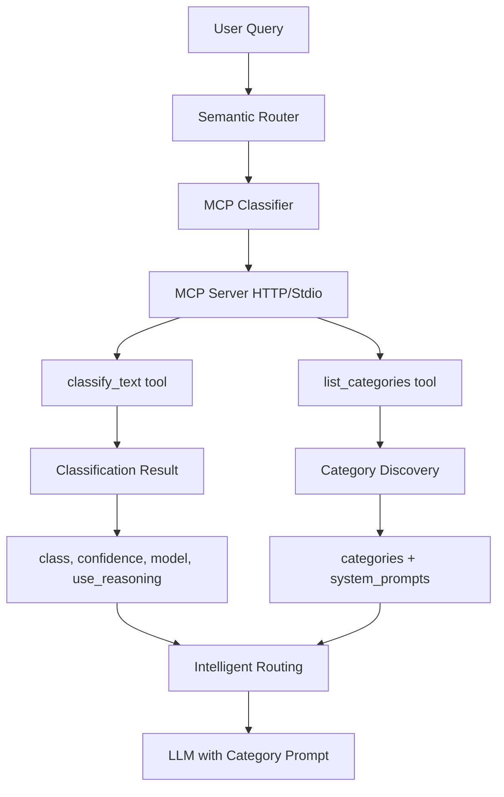

# MCP Classification Overview

The Model Context Protocol (MCP) classification server feature enables semantic router to dynamically discover categories and classification logic from external MCP servers, providing a flexible and extensible classification system.

## What is MCP Classification?

MCP classification allows you to:

- **Externalize classification logic** - Move category definitions and classification models outside the router
- **Dynamic category discovery** - Categories are discovered at runtime via the `list_categories` tool
- **Hot-reload capabilities** - Update categories without restarting the router
- **Custom implementations** - Use any classification approach (regex, ML models, embeddings, etc.)
- **Per-category system prompts** - Each category can have specialized LLM instructions

## Architecture



## Core Concepts

### MCP Tools

MCP classification servers must implement two tools:

#### 1. `list_categories`

Returns available categories with metadata:

```json
{
  "categories": ["math", "science", "technology", ...],
  "category_system_prompts": {
    "math": "You are a mathematics expert...",
    "science": "You are a science expert..."
  },
  "category_descriptions": {
    "math": "Mathematical and computational queries",
    "science": "Scientific concepts and queries"
  }
}
```

#### 2. `classify_text`

Classifies input text and returns routing information:

```json
{
  "class": 0,
  "confidence": 0.85,
  "model": "openai/gpt-oss-20b",
  "use_reasoning": true,
  "probabilities": [0.85, 0.10, 0.03, 0.02],
  "entropy": 0.65
}
```

### Routing Intelligence

MCP classifiers can return intelligent routing decisions:

- **`model`** - Recommended model for the query type
- **`use_reasoning`** - Whether to enable reasoning/chain-of-thought
- **`confidence`** - Classification certainty (for fallback decisions)
- **`entropy`** - Distribution uncertainty (for monitoring)

### Per-Category System Prompts

Each category can have a specialized system prompt that the router injects into LLM requests, providing domain-specific instructions:

```
Category: math → "You are a mathematics expert. Show step-by-step solutions..."
Category: code → "You are a coding expert. Follow best practices..."
```

## Benefits

### Flexibility

- **Multiple implementations** - Regex, ML models, embeddings, hybrid approaches
- **Language agnostic** - MCP servers can be written in any language
- **Easy experimentation** - Swap classification logic without router changes

### Scalability

- **Distributed classification** - Run classifiers on separate servers
- **Load balancing** - Multiple classifier instances
- **Caching** - Classification results can be cached

### Maintainability

- **Separation of concerns** - Classification logic separate from routing logic
- **Independent updates** - Update categories without router downtime
- **Testing** - Test classification independently

## Implementation Options

### 1. Regex-Based (Simple)

**Best for:** Prototyping, simple rules, low-latency requirements

- Pattern matching with regular expressions
- ~1-5ms classification time
- Minimal resource usage (~10MB memory)
- Easy to understand and modify

### 2. Embedding-Based (Recommended)

**Best for:** Production use, high accuracy requirements

- Semantic understanding with embedding models
- ~50-100ms classification time (CPU)
- Higher accuracy, handles variations
- RAG-style with vector database

### 3. ML Model-Based

**Best for:** Custom classification needs

- Fine-tuned classification models (BERT, etc.)
- Domain-specific training
- Balanced accuracy and speed

### 4. Hybrid Approaches

Combine multiple methods for optimal results:

- Fast regex for obvious cases
- ML/embeddings for ambiguous queries
- Fallback chains for robustness

## Configuration

Enable MCP classification in your `config.yaml`:

```yaml
# Classifier configuration
classifier:
  # Disable in-tree category classifier (leave model_id empty)
  category_model:
    model_id: ""  # Empty = disabled

  # Enable MCP-based category classifier (HTTP transport only)
  mcp_category_model:
    enabled: true                    # Enable MCP classifier
    transport_type: "http"           # HTTP transport
    url: "http://localhost:8090/mcp" # MCP server endpoint    
    threshold: 0.6                   # Confidence threshold
    timeout_seconds: 30              # Request timeout
```

## When to Use MCP Classification

### ✅ Use MCP Classification When:

- You need flexible, updateable category definitions
- You want to experiment with different classification approaches
- You need per-category system prompts
- You have custom classification logic
- You want distributed classification
- You need hot-reload capabilities

### ⚠️ Consider Alternatives When:

- You need absolute minimum latency (under 5ms)
- You have static categories that never change
- You want the simplest possible setup
- You don't need external classification logic

## Next Steps

- [Protocol Specification](./protocol.md) - Detailed MCP protocol for classification
- [Example Servers](https://github.com/vllm-project/semantic-router/tree/main/examples/mcp-classifier-server) - Reference implementations

## Example Servers

The repository includes two reference implementations in `examples/mcp-classifier-server/`:

### 1. Regex-Based (`server.py`)

- Simple pattern matching
- Fast prototyping (less than 5ms classification)
- Easy to understand and modify
- No ML dependencies required

### 2. Embedding-Based (`server_embedding.py`)

- Qwen3-Embedding-0.6B model
- FAISS vector search for semantic similarity
- High accuracy semantic classification
- Production-ready with device selection (CPU/GPU)
- Includes 95 training examples

Both servers implement the same MCP protocol and can be used interchangeably.
