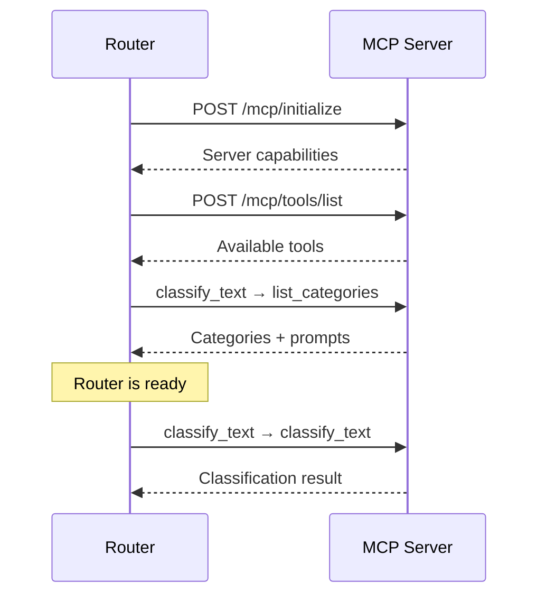

# MCP Classification Protocol Specification

This document defines the protocol specification for MCP classification servers compatible with semantic router.

## Protocol Overview

MCP classification servers communicate using the Model Context Protocol (MCP) and must implement two required tools: `list_categories` and `classify_text`.

## Transport Modes

MCP servers can operate in two modes:

### 1. HTTP Mode

RESTful HTTP/JSON-RPC endpoint:

```bash
POST http://localhost:8090/mcp/tools/call
Content-Type: application/json

{
  "name": "classify_text",
  "arguments": {
    "text": "What is 2 + 2?"
  }
}
```

**Best for:** Production deployments, distributed systems, multiple router instances

### 2. Stdio Mode

Standard input/output communication:

```bash
python server.py  # Reads from stdin, writes to stdout
```

**Best for:** Local development, MCP Inspector testing, embedded scenarios

## Required Tools

### Tool 1: `list_categories`

Discovers available categories and their metadata.

#### Request

```json
{
  "name": "list_categories",
  "arguments": {}
}
```

#### Response

```json
{
  "content": [{
    "type": "text",
    "text": "{
      \"categories\": [\"math\", \"science\", \"technology\", \"history\", \"general\"],
      \"category_system_prompts\": {
        \"math\": \"You are a mathematics expert. When answering math questions:\\n- Show step-by-step solutions with clear explanations\\n- Use proper mathematical notation and terminology\\n- Verify calculations and provide intermediate steps\\n- Explain the underlying concepts and principles\\n- Offer alternative approaches when applicable\",
        \"science\": \"You are a science expert. When answering science questions:\\n- Provide evidence-based answers grounded in scientific research\\n- Explain relevant scientific concepts and principles\\n- Use appropriate scientific terminology\\n- Cite the scientific method and experimental evidence when relevant\\n- Distinguish between established facts and current theories\"
      },
      \"category_descriptions\": {
        \"math\": \"Mathematical and computational queries\",
        \"science\": \"Scientific concepts and queries\",
        \"technology\": \"Technology and computing topics\",
        \"history\": \"Historical events and topics\",
        \"general\": \"General questions and topics\"
      }
    }"
  }],
  "isError": false
}
```

#### Field Specifications

| Field | Type | Required | Description |
|-------|------|----------|-------------|
| `categories` | array[string] | **Yes** | List of category names (order determines indices) |
| `category_system_prompts` | object | Optional | Per-category system prompts for LLM context |
| `category_descriptions` | object | Optional | Human-readable category descriptions |

**Notes:**

- Category order defines the class indices (first = 0, second = 1, etc.)
- `category_system_prompts` should be provided for best routing results
- System prompts are injected by the router when making LLM requests

### Tool 2: `classify_text`

Classifies input text and returns routing recommendations.

#### Request

```json
{
  "name": "classify_text",
  "arguments": {
    "text": "What is the derivative of x squared?",
    "with_probabilities": true
  }
}
```

#### Request Parameters

| Parameter | Type | Required | Description |
|-----------|------|----------|-------------|
| `text` | string | **Yes** | The text to classify |
| `with_probabilities` | boolean | Optional | Whether to return full probability distribution (default: false) |

#### Response

```json
{
  "content": [{
    "type": "text",
    "text": "{
      \"class\": 0,
      \"confidence\": 0.92,
      \"model\": \"openai/gpt-oss-20b\",
      \"use_reasoning\": false,
      \"probabilities\": [0.92, 0.03, 0.02, 0.02, 0.01],
      \"entropy\": 0.45
    }"
  }],
  "isError": false
}
```

#### Response Fields

| Field | Type | Required | Description |
|-------|------|----------|-------------|
| `class` | integer | **Yes** | Category index (0-based, matches `list_categories` order) |
| `confidence` | float | **Yes** | Classification confidence score (0.0 to 1.0) |
| `model` | string | **Yes** | Recommended model for this query type |
| `use_reasoning` | boolean | **Yes** | Whether to enable reasoning/chain-of-thought |
| `probabilities` | array[float] | Optional | Probability distribution across all categories |
| `entropy` | float | Optional | Shannon entropy of the distribution |

**Notes:**

- `class` must be a valid index into the `categories` array from `list_categories`
- `confidence` should represent the certainty of the classification
- `model` should use the format expected by your LLM backend (e.g., "openai/gpt-4")
- `use_reasoning` guides the router's reasoning parameter selection
- `probabilities` length must match the number of categories
- `entropy` can be used for uncertainty monitoring

## Routing Intelligence

### Model Selection

The `model` field allows classifiers to recommend different models based on query characteristics:

```python
# Examples of routing logic
if category == "math" and is_simple_calculation:
    return "openai/gpt-oss-20b", False  # Fast model, no reasoning

elif category == "code" and is_complex_task:
    return "deepseek/deepseek-coder", True  # Specialized model with reasoning

elif confidence < 0.6:
    return "openai/gpt-4", True  # High-quality model for uncertain cases
```

### Reasoning Control

The `use_reasoning` field enables/disables chain-of-thought reasoning:

```python
# Reasoning decision logic
if word_count > 20 and has_complex_words:
    use_reasoning = True  # Long complex queries benefit from reasoning

elif category == "math" and is_simple:
    use_reasoning = False  # Simple math doesn't need reasoning overhead

elif confidence < 0.6:
    use_reasoning = True  # Low confidence → use reasoning for safety
```

## HTTP API Details

### Endpoint Structure

MCP servers should support both styles:

#### Style 1: Single Endpoint (JSON-RPC)

```
POST /mcp
Content-Type: application/json

{
  "method": "tools/call",
  "params": {
    "name": "classify_text",
    "arguments": { "text": "..." }
  },
  "id": 1
}
```

#### Style 2: REST-Style (Recommended)

```
POST /mcp/tools/call
Content-Type: application/json

{
  "name": "classify_text",
  "arguments": { "text": "..." }
}
```

### Health Check Endpoint

Optional but recommended:

```
GET /health

Response:
{
  "status": "ok",
  "categories": ["math", "science", ...],
  "model": "Qwen/Qwen3-Embedding-0.6B",
  "index_size": 95
}
```

### Error Handling

Return errors in the MCP format:

```json
{
  "content": [{
    "type": "text",
    "text": "{\"error\": \"Error message here\"}"
  }],
  "isError": false
}
```

Or as JSON-RPC error:

```json
{
  "jsonrpc": "2.0",
  "id": 1,
  "error": {
    "code": -32603,
    "message": "Internal error: ..."
  }
}
```

## Initialization Sequence

When the semantic router starts:



## Configuration in Semantic Router

### Basic Configuration

```yaml
classification:
  type: mcp
  mcp_server:
    url: "http://localhost:8090/mcp"
    tools:
      classify: "classify_text"
      list_categories: "list_categories"
```

### Advanced Configuration

```yaml
classification:
  type: mcp
  mcp_server:
    url: "http://localhost:8090/mcp"
    tools:
      classify: "classify_text"
      list_categories: "list_categories"
    timeout: 5s                    # Request timeout
    max_retries: 3                 # Retry failed requests
    cache_categories: true         # Cache list_categories result
    refresh_interval: 5m           # Re-fetch categories periodically
  num_categories: 5                # Expected number (validated against server)
  confidence_threshold: 0.6        # Minimum confidence for classification
  fallback_category: "general"    # Category when confidence too low
```

## Performance Considerations

### Latency

- Target classification latency: under 100ms for production
- Use caching for `list_categories` (changes infrequently)
- Consider async/concurrent classification for batch requests

### Caching

Router may cache:

- `list_categories` response (categories rarely change)
- Recent `classify_text` results (identical queries)

Implement cache-friendly behavior:

- Deterministic results for same input
- Reasonable confidence scores
- Stable category definitions

### Load Balancing

For high-volume deployments:

- Run multiple MCP server instances
- Use load balancer in front of servers
- Consider stateless design (no server-side sessions)

## Validation

### Category Index Validation

```python
# Server must ensure:
assert 0 <= class_index < len(categories)
assert class_index == category_to_index[category_name]
```

### Probability Validation

```python
# If returning probabilities:
assert len(probabilities) == len(categories)
assert 0.95 <= sum(probabilities) <= 1.05  # Allow rounding error
assert all(0 <= p <= 1 for p in probabilities)
```

### Confidence Validation

```python
# Confidence should be meaningful:
assert 0 <= confidence <= 1
assert confidence >= max(probabilities) * 0.9  # Roughly consistent
```

## Testing Your Implementation

### Using cURL

```bash
# Test list_categories
curl -X POST http://localhost:8090/mcp/tools/call \
  -H "Content-Type: application/json" \
  -d '{"name": "list_categories", "arguments": {}}'

# Test classify_text
curl -X POST http://localhost:8090/mcp/tools/call \
  -H "Content-Type: application/json" \
  -d '{"name": "classify_text", "arguments": {"text": "What is 2+2?"}}'
```

### Using MCP Inspector

```bash
npm install -g @modelcontextprotocol/inspector
mcp-inspector python server.py
```

### Integration Test

```bash
# Start your MCP server
python server.py --http --port 8090

# Configure semantic router to use it
# Send test queries through the router
# Verify correct classification and routing
```

## Security Considerations

### Input Validation

- Sanitize all text inputs
- Enforce maximum text length
- Rate limit classification requests

### Authentication

Consider adding authentication for production:

```yaml
classification:
  type: mcp
  mcp_server:
    url: "http://localhost:8090/mcp"
    headers:
      Authorization: "Bearer ${MCP_API_KEY}"
```

### Network Security

- Use HTTPS in production
- Implement proper TLS certificate validation
- Restrict network access to MCP server

## Versioning

Include version information in server responses:

```json
{
  "protocolVersion": "2024-11-05",
  "serverInfo": {
    "name": "embedding-classifier",
    "version": "1.0.0"
  }
}
```
