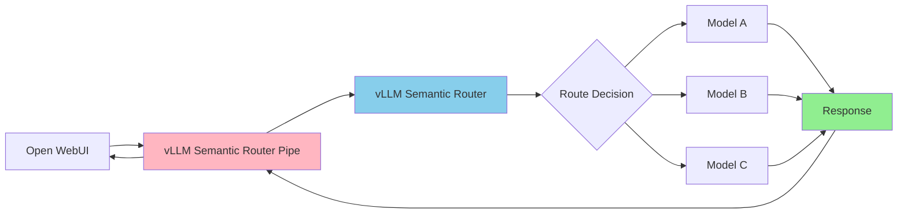

# Open WebUI Integration

This guide shows how to integrate vLLM Semantic Router with Open WebUI using the provided pipe.

## Architecture



## Prerequisites

- **vLLM Semantic Router** deployed and accessible (recommended: Kubernetes deployment via `kubectl apply -k deploy/kubernetes/`)
- **Open WebUI** installed and running

## Installation

### Step 1: Install the Pipe in Open WebUI

1. Open your Open WebUI instance and go to **Admin Panel** → **Settings** → **Pipelines**
2. Click **"+"** to add a new pipeline
3. Import the pipe from URL:

   ```text
   https://raw.githubusercontent.com/vllm-project/semantic-router/main/tools/openwebui-pipe/vllm_semantic_router_pipe.py
   ```

4. Toggle the pipeline to **"Enabled"** and click **"Save"**

### Step 2: Configure the Pipe

Click the **gear icon** next to the pipeline to configure settings:

| Setting | Description | Example |
|---------|-------------|---------|
| `vsr_base_url` | Semantic Router endpoint URL | `http://semantic-router.vllm-semantic-router-system.svc.cluster.local:8000` |
| `show_vsr_info` | Display routing decisions in chat | `true` |
| `timeout` | Request timeout in seconds | `300` |

**For Kubernetes deployments**, use the service DNS name:

```text
http://semantic-router.vllm-semantic-router-system.svc.cluster.local:8000
```

Click **"Save"** to apply the configuration.

### Step 3: Use the Model

1. Go to the **Chat** interface
2. Select **"vllm-semantic-router/auto"** from the model dropdown
3. Start chatting!

## Usage

The pipe will display routing information in the chat interface:

```text
🔀 vLLM Semantic Router Decision 🔀

📂 User Intent Category: general-qa
⚡ Chain-of-Thought: off
🥷 Hidden Model: qwen2.5-7b-instruct
🎯 System Prompt Optimized: true
🔥 Semantic Cache: Hit (Fast Response)
```

To hide this information, set `show_vsr_info` to `false` in the pipe configuration.

## Troubleshooting

### Connection Issues

If you see connection errors:

1. Verify the Semantic Router is running
2. Check the `vsr_base_url` is correct
3. For Kubernetes, ensure the service DNS name is accessible from Open WebUI pod

### Model Not Appearing

If the model doesn't appear in the selector:

1. Verify the pipe is **enabled** in Admin Panel → Pipelines
2. Refresh the Open WebUI page
3. Restart Open WebUI if needed
