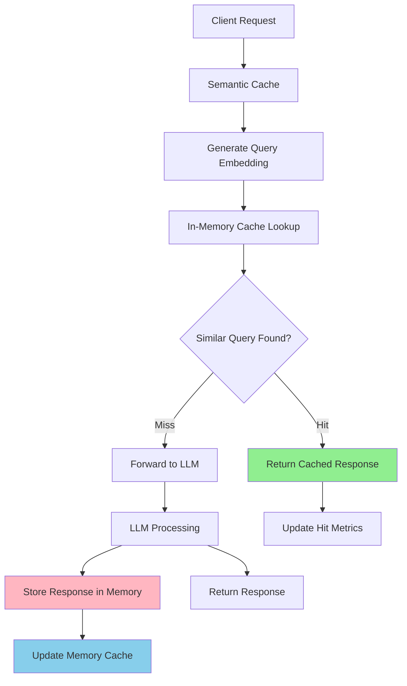

# In-Memory Semantic Cache

The in-memory cache backend stores semantic embeddings and cached responses directly in memory for fast local caching.

## Overview

The in-memory cache stores all cache data in the application's memory, providing low-latency access without external dependencies.

## Architecture



## How It Works

### Write Path

When caching a response:

1. Generate embedding for the query using the configured embedding model
2. Store the embedding and response in memory
3. Apply TTL if configured
4. Evict oldest/least-used entries if max_entries limit is reached

### Read Path

When searching for a cached response:

1. Generate embedding for the incoming query
2. Search in-memory cache for similar embeddings
3. If similarity exceeds threshold, return cached response (cache hit)
4. Otherwise, forward to LLM and cache the new response (cache miss)

### Search Methods

The cache supports two search methods:

- **Linear Search**: Compares query embedding against all cached embeddings
- **HNSW Index**: Uses hierarchical graph structure for faster approximate nearest neighbor search

## Configuration

### Basic Configuration

```yaml
# config/config.yaml
semantic_cache:
  enabled: true
  backend_type: "memory"
  similarity_threshold: 0.8       # Global default threshold
  max_entries: 1000
  ttl_seconds: 3600
  eviction_policy: "fifo"
```

### Configuration with HNSW

```yaml
semantic_cache:
  enabled: true
  backend_type: "memory"
  similarity_threshold: 0.8
  max_entries: 1000
  ttl_seconds: 3600
  eviction_policy: "fifo"
  # HNSW index for faster search
  use_hnsw: true
  hnsw_m: 16
  hnsw_ef_construction: 200
```

### Category-Level Configuration (New)

Configure cache settings per category for fine-grained control:

```yaml
semantic_cache:
  enabled: true
  backend_type: "memory"
  similarity_threshold: 0.8       # Global default
  max_entries: 1000
  ttl_seconds: 3600
  eviction_policy: "fifo"

categories:
  - name: health
    system_prompt: "You are a health expert..."
    semantic_cache_enabled: true
    semantic_cache_similarity_threshold: 0.95  # Very strict for medical accuracy
    model_scores:
      - model: your-model
        score: 0.5
        use_reasoning: false

  - name: general_chat
    system_prompt: "You are a helpful assistant..."
    semantic_cache_similarity_threshold: 0.75  # Relaxed for better hit rate
    model_scores:
      - model: your-model
        score: 0.7
        use_reasoning: false

  - name: troubleshooting
    # No cache settings - uses global default (0.8)
    model_scores:
      - model: your-model
        score: 0.7
        use_reasoning: false
```

### Configuration Options

| Parameter | Type | Default | Description |
|-----------|------|---------|-------------|
| `enabled` | boolean | `false` | Enable/disable semantic caching globally |
| `backend_type` | string | `"memory"` | Cache backend type (must be "memory") |
| `similarity_threshold` | float | `0.8` | Global minimum similarity for cache hits (0.0-1.0) |
| `max_entries` | integer | `1000` | Maximum number of cached entries |
| `ttl_seconds` | integer | `3600` | Time-to-live for cache entries (seconds, 0 = no expiration) |
| `eviction_policy` | string | `"fifo"` | Eviction policy: `"fifo"`, `"lru"`, `"lfu"` |
| `use_hnsw` | boolean | `false` | Enable HNSW index for similarity search |
| `hnsw_m` | integer | `16` | HNSW M parameter (bi-directional links per node) |
| `hnsw_ef_construction` | integer | `200` | HNSW efConstruction parameter (build quality) |

### HNSW Parameters

The in-memory cache supports HNSW (Hierarchical Navigable Small World) indexing for significantly faster similarity search, especially beneficial with large cache sizes.

#### When to Use HNSW

- **Large cache sizes** (>100 entries): HNSW provides logarithmic search time vs linear
- **High query throughput**: Reduces CPU usage for similarity search
- **Production deployments**: Better performance under load

#### HNSW Configuration

```yaml
semantic_cache:
  enabled: true
  backend_type: "memory"
  similarity_threshold: 0.8
  max_entries: 10000           # Large cache benefits from HNSW
  ttl_seconds: 3600
  eviction_policy: "lru"
  use_hnsw: true               # Enable HNSW index
  hnsw_m: 16                   # Default: 16 (higher = better recall, more memory)
  hnsw_ef_construction: 200    # Default: 200 (higher = better quality, slower build)
```

#### HNSW Parameters

- **`hnsw_m`**: Number of bi-directional links created for each node in the graph
  - Lower values (8-12): Faster build, less memory, lower recall
  - Default (16): Balanced performance
  - Higher values (32-64): Better recall, more memory, slower build

- **`hnsw_ef_construction`**: Size of dynamic candidate list during index construction
  - Lower values (100-150): Faster index building
  - Default (200): Good balance
  - Higher values (400-800): Better quality, slower build

#### Performance Comparison

| Cache Size | Linear Search | HNSW Search | Speedup |
|-----------|---------------|-------------|---------|
| 100 entries | ~0.5ms | ~0.4ms | 1.25x |
| 1,000 entries | ~5ms | ~0.8ms | 6.25x |
| 10,000 entries | ~50ms | ~1.2ms | 41.7x |
| 100,000 entries | ~500ms | ~1.5ms | 333x |

*Benchmarks on typical hardware with 384-dimensional embeddings*

### Category-Level Configuration Options

| Parameter | Type | Default | Description |
|-----------|------|---------|-------------|
| `semantic_cache_enabled` | boolean | (inherits global) | Enable/disable caching for this category |
| `semantic_cache_similarity_threshold` | float | (inherits global) | Category-specific similarity threshold (0.0-1.0) |

Category-level settings override global settings. If not specified, the category uses the global cache configuration.

### Environment Examples

#### Development Environment

```yaml
semantic_cache:
  enabled: true
  backend_type: "memory"
  similarity_threshold: 0.9     # Strict matching for testing
  max_entries: 500             # Small cache for development
  ttl_seconds: 1800            # 30 minutes
  eviction_policy: "fifo"
  use_hnsw: false              # Optional for small dev cache
```

#### Production Environment with HNSW

```yaml
semantic_cache:
  enabled: true
  backend_type: "memory"
  similarity_threshold: 0.85
  max_entries: 50000           # Large production cache
  ttl_seconds: 7200            # 2 hours
  eviction_policy: "lru"
  use_hnsw: true               # Enable for production
  hnsw_m: 16
  hnsw_ef_construction: 200
```

## Setup and Testing

### Enable In-Memory Cache

Update your configuration file:

```bash
# Edit config/config.yaml
cat >> config/config.yaml << EOF
semantic_cache:
  enabled: true
  backend_type: "memory"
  similarity_threshold: 0.85
  max_entries: 1000
  ttl_seconds: 3600
EOF
```

### Start the Router

```bash
# Start the semantic router
make run-router

# Or run directly
./bin/router --config config/config.yaml
```

### Test Cache Functionality

Send requests to verify cache behavior:

```bash
# First request (cache miss)
curl -X POST http://localhost:8080/v1/chat/completions \
  -H "Content-Type: application/json" \
  -d '{
    "model": "MoM",
    "messages": [{"role": "user", "content": "What is machine learning?"}]
  }'

# Second identical request (cache hit)
curl -X POST http://localhost:8080/v1/chat/completions \
  -H "Content-Type: application/json" \
  -d '{
    "model": "MoM",
    "messages": [{"role": "user", "content": "What is machine learning?"}]
  }'

# Similar request (semantic cache hit)
curl -X POST http://localhost:8080/v1/chat/completions \
  -H "Content-Type: application/json" \
  -d '{
    "model": "MoM",
    "messages": [{"role": "user", "content": "Explain machine learning concepts"}]
  }'
```

## Characteristics

### Storage

- Data is stored in application memory
- Cache is cleared when the application restarts
- Limited by available system memory

### Access Pattern

- Direct memory access without network overhead
- No external dependencies required

### Eviction Policies

- **FIFO**: First In, First Out - removes oldest entries
- **LRU**: Least Recently Used - removes least recently accessed entries
- **LFU**: Least Frequently Used - removes least frequently accessed entries

### TTL Management

- Entries can have a time-to-live (TTL)
- Expired entries are removed during cleanup operations

## Next Steps

- **[Hybrid Cache](./hybrid-cache.md)** - Learn about HNSW + Milvus hybrid caching
- **[Milvus Cache](./milvus-cache.md)** - Learn about persistent vector database caching
- **[Cache Overview](./overview.md)** - Learn about semantic caching concepts
- **[Observability](../observability/overview.md)** - Monitor cache performance
