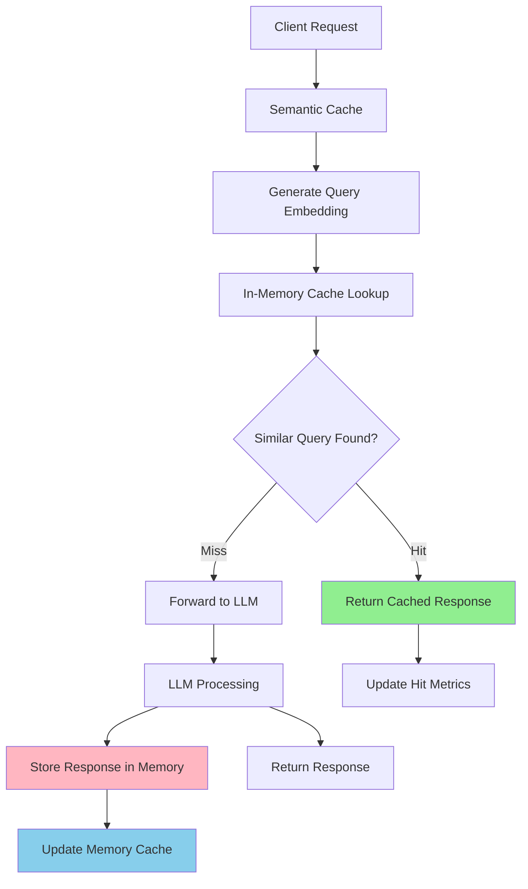

# In-Memory Semantic Cache

The in-memory cache backend provides fast, local caching for development environments and single-instance deployments. It stores semantic embeddings and cached responses directly in memory for maximum performance.

## Overview

The in-memory cache is ideal for:

- **Development and testing** environments
- **Single-instance** deployments
- **Quick prototyping** and experimentation
- **Low-latency** requirements where external dependencies should be minimized

## Architecture



## Configuration

### Basic Configuration

```yaml
# config/config.yaml
semantic_cache:
  enabled: true
  backend_type: "memory"
  similarity_threshold: 0.8
  max_entries: 1000
  ttl_seconds: 3600
  eviction_policy: "fifo"
```

### Configuration Options

| Parameter | Type | Default | Description |
|-----------|------|---------|-------------|
| `enabled` | boolean | `false` | Enable/disable semantic caching |
| `backend_type` | string | `"memory"` | Cache backend type (must be "memory") |
| `similarity_threshold` | float | `0.8` | Minimum similarity for cache hits (0.0-1.0) |
| `max_entries` | integer | `1000` | Maximum number of cached entries |
| `ttl_seconds` | integer | `3600` | Time-to-live for cache entries (seconds, 0 = no expiration) |
| `eviction_policy` | string | `"fifo"` | Eviction policy: `"fifo"`, `"lru"`, `"lfu"` |

### Environment Examples

#### Development Environment

```yaml
semantic_cache:
  enabled: true
  backend_type: "memory"
  similarity_threshold: 0.9     # Strict matching for testing
  max_entries: 500             # Small cache for development
  ttl_seconds: 1800            # 30 minutes
  eviction_policy: "fifo"
```

## Setup and Testing

### 1. Enable In-Memory Cache

Update your configuration file:

```bash
# Edit config/config.yaml
cat >> config/config.yaml << EOF
semantic_cache:
  enabled: true
  backend_type: "memory"
  similarity_threshold: 0.85
  max_entries: 1000
  ttl_seconds: 3600
EOF
```

### 2. Start the Router

```bash
# Start the semantic router
make run-router

# Or run directly
./bin/router --config config/config.yaml
```

### 3. Test Cache Functionality

Send identical requests to verify cache hits:

```bash
# First request (cache miss)
curl -X POST http://localhost:8080/v1/chat/completions \
  -H "Content-Type: application/json" \
  -d '{
    "model": "MoM",
    "messages": [{"role": "user", "content": "What is machine learning?"}]
  }'

# Second identical request (cache hit)
curl -X POST http://localhost:8080/v1/chat/completions \
  -H "Content-Type: application/json" \
  -d '{
    "model": "MoM",
    "messages": [{"role": "user", "content": "What is machine learning?"}]
  }'

# Similar request (semantic cache hit)
curl -X POST http://localhost:8080/v1/chat/completions \
  -H "Content-Type: application/json" \
  -d '{
    "model": "MoM",
    "messages": [{"role": "user", "content": "Explain machine learning concepts"}]
  }'
```

### Advantages

- **Ultra-low latency**: Direct memory access, no network overhead
- **Simple setup**: No external dependencies required
- **High throughput**: Can handle thousands of cache operations per second
- **Immediate availability**: Cache is ready as soon as the router starts

### Limitations

- **Volatile storage**: Cache is lost when the router restarts
- **Single instance**: Cannot be shared across multiple router instances
- **Memory constraints**: Limited by available system memory
- **No persistence**: No data recovery after crashes

## Memory Management

### Automatic Cleanup

The in-memory cache automatically manages memory through:

1. **TTL Expiration**: Entries are removed after `ttl_seconds`
2. **LRU Eviction**: Least recently used entries are removed when `max_entries` is reached
3. **Periodic Cleanup**: Expired entries are cleaned every `cleanup_interval_seconds`
4. **Memory Pressure**: Aggressive cleanup when approaching `memory_limit_mb`

## Next Steps

- **[Milvus Cache](./milvus-cache.md)** - Set up persistent, distributed caching
- **[Cache Overview](./overview.md)** - Learn about semantic caching concepts
- **[Observability](../observability/overview.md)** - Monitor cache performance
