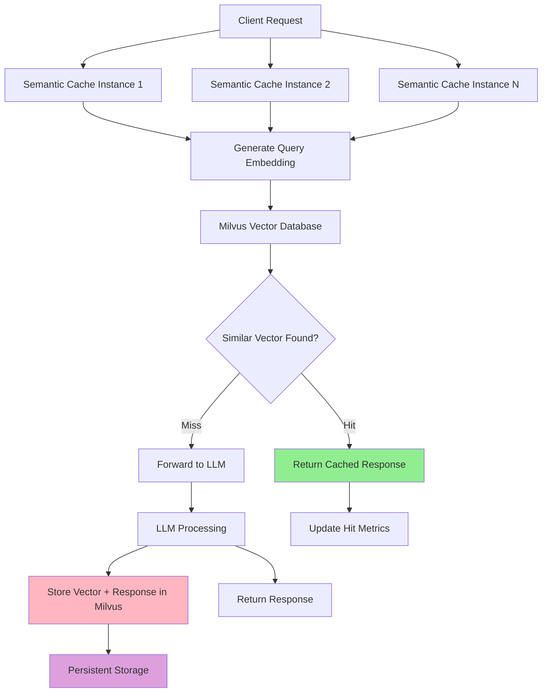

# Milvus Semantic Cache

The Milvus cache backend provides persistent, distributed semantic caching using the Milvus vector database. This is the recommended solution for production deployments requiring high availability, scalability, and data persistence.

## Overview

Milvus cache is ideal for:

- **Production environments** with high availability requirements
- **Distributed deployments** across multiple instances
- **Large-scale applications** with millions of cached queries
- **Persistent storage** requirements where cache survives restarts
- **Advanced vector operations** and similarity search optimization

## Architecture



## Configuration

### Milvus Backend Configuration

Configure in `config/cache/milvus.yaml`:

```yaml
# config/cache/milvus.yaml
connection:
  host: "localhost"
  port: 19530
  auth:
    enabled: false
    username: ""
    password: ""
  tls:
    enabled: false

collection:
  name: "semantic_cache"
  dimension: 384  # Must match embedding model dimension
  index_type: "IVF_FLAT"
  metric_type: "COSINE"
  nlist: 1024

performance:
  search_params:
    nprobe: 10
  insert_batch_size: 1000
  search_batch_size: 100

development:
  drop_collection_on_startup: false
  auto_create_collection: true
  log_level: "info"
```

## Setup and Deployment

Start Milvus Service:

```bash
# Using Docker
make start-milvus

# Verify Milvus is running
curl http://localhost:19530/health
```

### 2. Configure Semantic Router

Basic Milvus Configuration:

- Set `backend_type: "milvus"` in `config/config.yaml`
- Set `backend_config_path: "config/cache/milvus.yaml"` in `config/config.yaml`

```yaml
# config/config.yaml
semantic_cache:
  enabled: true
  backend_type: "milvus"
  backend_config_path: "config/cache/milvus.yaml"
  similarity_threshold: 0.8
  ttl_seconds: 7200
```

Run Semantic Router:

```bash
# Start router
make run-router
```

Run EnvoyProxy:

```bash
# Start Envoy proxy
make run-envoy
```

### 4. Test Milvus Cache

```bash
# Send identical requests to see cache hits
curl -X POST http://localhost:8080/v1/chat/completions \
  -H "Content-Type: application/json" \
  -d '{
    "model": "MoM",
    "messages": [{"role": "user", "content": "What is machine learning?"}]
  }'

# Send similar request (should hit cache due to semantic similarity)
curl -X POST http://localhost:8080/v1/chat/completions \
  -H "Content-Type: application/json" \
  -d '{
    "model": "MoM",
    "messages": [{"role": "user", "content": "Explain machine learning"}]
  }'
```

## Next Steps

- **[In-Memory Cache](./in-memory-cache.md)** - Compare with in-memory caching
- **[Cache Overview](./overview.md)** - Learn semantic caching concepts
- **[Observability](../observability/overview.md)** - Monitor Milvus performance
