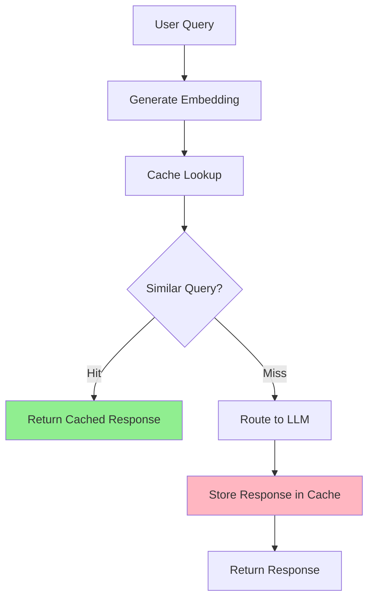

# Overview

Semantic Router's intelligent caching system understands the semantic meaning of queries, enabling cache hits for semantically similar requests and reducing LLM inference costs.

## Core Concepts

### Semantic Similarity

Uses embeddings and cosine similarity to match queries by meaning rather than exact text.

### Configurable Thresholds

Adjustable similarity thresholds balance cache hit rates with response quality. Thresholds can be set globally or per-category for fine-grained control.

### Category-Level Control

**NEW**: Configure cache settings at the category level for precise control over sensitive and general content:

- **Sensitive categories** (health, psychology, law): Use high thresholds (0.92-0.95) to prevent incorrect cache hits where word nuances matter
- **General categories** (chat, troubleshooting): Use lower thresholds (0.75-0.82) for better cache hit rates
- **Privacy categories**: Disable caching entirely for specific categories

### Multiple Backends

Support for in-memory, Redis, and Milvus backends for different scale requirements.

## How It Works

## Backend Options

### In-Memory Cache

Fast, local caching for development and single-instance deployments.

### Milvus Cache

Persistent, distributed caching using vector database for production environments.

## Key Benefits

- **Cost Reduction**: Avoid redundant LLM API calls for similar queries
- **Improved Latency**: Cache hits return responses in milliseconds
- **Better Throughput**: Handle more concurrent requests efficiently
- **Semantic Understanding**: Match queries by meaning, not just text
