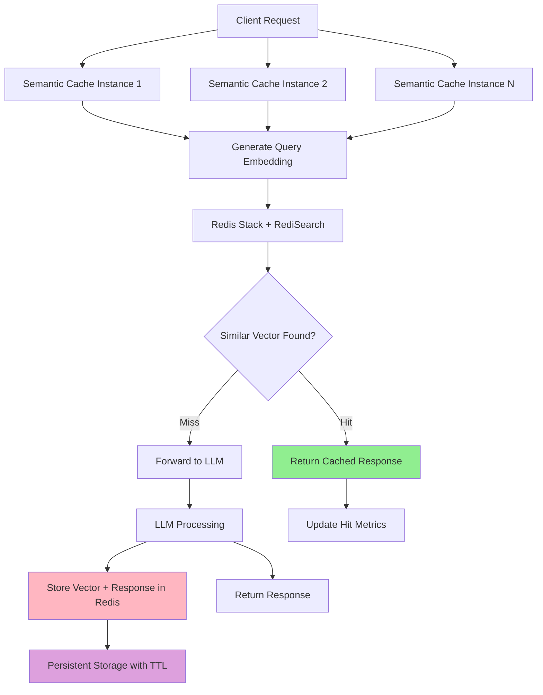

# Redis Semantic Cache

The Redis cache backend provides persistent, high-performance semantic caching using Redis Stack with RediSearch. This solution offers excellent performance with lower operational complexity compared to specialized vector databases.

## Overview

Redis cache is ideal for:

- **Production environments** requiring fast response times
- **Single-instance or clustered** Redis deployments
- **Medium to large-scale applications** with efficient memory usage
- **Persistent storage** with optional TTL expiration
- **Simplified operations** with familiar Redis tooling

## Architecture



## Configuration

### Redis Backend Configuration

Configure in `config/semantic-cache/redis.yaml`:

```yaml
# config/semantic-cache/redis.yaml
connection:
  address: "localhost:6379"
  password: ""
  db: 0
  pool_size: 10
  max_retries: 3
  dial_timeout_ms: 5000
  read_timeout_ms: 3000
  write_timeout_ms: 3000
  tls:
    enabled: false

index:
  name: "semantic_cache_idx"
  prefix: "doc:"
  vector_field:
    name: "embedding"
    dimension: 384  # Must match embedding model dimension
    algorithm: "HNSW"
    metric_type: "COSINE"
    hnsw:
      m: 16
      ef_construction: 200
      ef_runtime: 10

search:
  top_k: 5

development:
  drop_index_on_startup: false
  log_level: "info"
```

## Setup and Deployment

Start Redis Stack:

```bash
# Using Docker
make start-redis

# Verify Redis is running
docker exec redis-semantic-cache redis-cli PING
```

### 2. Configure Semantic Router

Basic Redis Configuration:

- Set `backend_type: "redis"` in `config/config.yaml`
- Set `backend_config_path: "config/semantic-cache/redis.yaml"` in `config/config.yaml`

```yaml
# config/config.yaml
semantic_cache:
  enabled: true
  backend_type: "redis"
  backend_config_path: "config/semantic-cache/redis.yaml"
  similarity_threshold: 0.8
  ttl_seconds: 3600
```

### Decision-Level Configuration (Plugin-Based)

You can also configure Redis cache at the decision level using plugins:

```yaml
signals:
  domains:
    - name: "math"
      description: "Mathematical queries"
      mmlu_categories: ["math"]

decisions:
  - name: math_route
    description: "Route math queries with strict caching"
    priority: 100
    rules:
      operator: "AND"
      conditions:
        - type: "domain"
          name: "math"
    modelRefs:
      - model: "openai/gpt-oss-120b"
        use_reasoning: true
    plugins:
      - type: "semantic-cache"
        configuration:
          enabled: true
          similarity_threshold: 0.95  # Very strict for math accuracy
```

Run Semantic Router:

```bash
# Start router
make run-router
```

Run EnvoyProxy:

```bash
# Start Envoy proxy
make run-envoy
```

### 4. Test Redis Cache

```bash
# Send identical requests to see cache hits
curl -X POST http://localhost:8080/v1/chat/completions \
  -H "Content-Type: application/json" \
  -d '{
    "model": "MoM",
    "messages": [{"role": "user", "content": "What is machine learning?"}]
  }'

# Send similar request (should hit cache due to semantic similarity)
curl -X POST http://localhost:8080/v1/chat/completions \
  -H "Content-Type: application/json" \
  -d '{
    "model": "MoM",
    "messages": [{"role": "user", "content": "Explain machine learning"}]
  }'
```

## Next Steps

- **[Milvus Cache](./milvus-cache.md)** - Compare with Milvus vector database
- **[In-Memory Cache](./in-memory-cache.md)** - Compare with in-memory caching
- **[Observability](../observability/metrics.md)** - Monitor Redis performance
