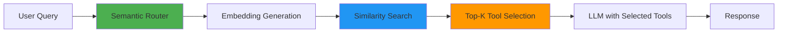
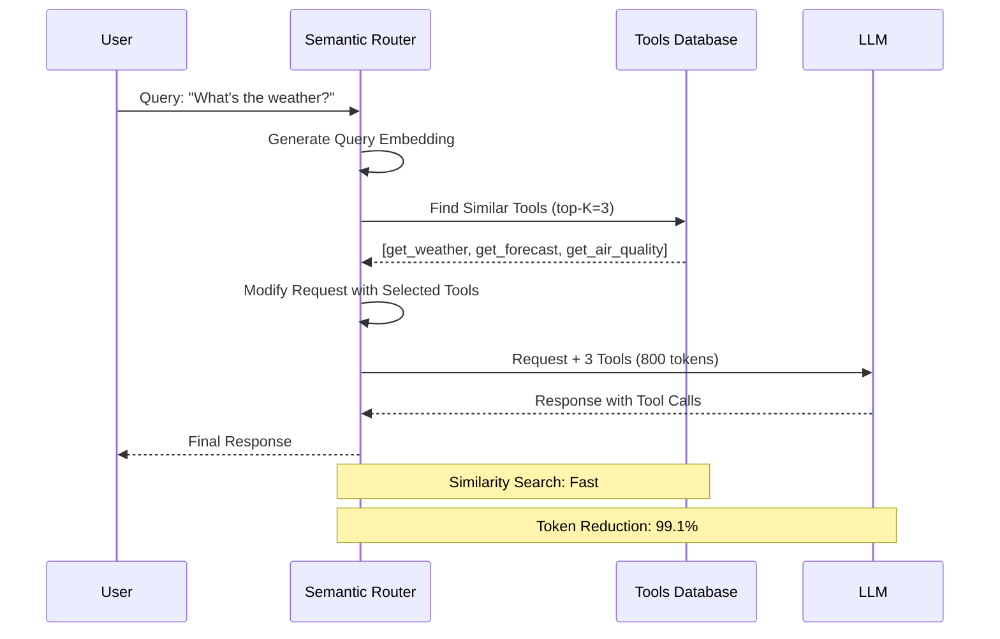
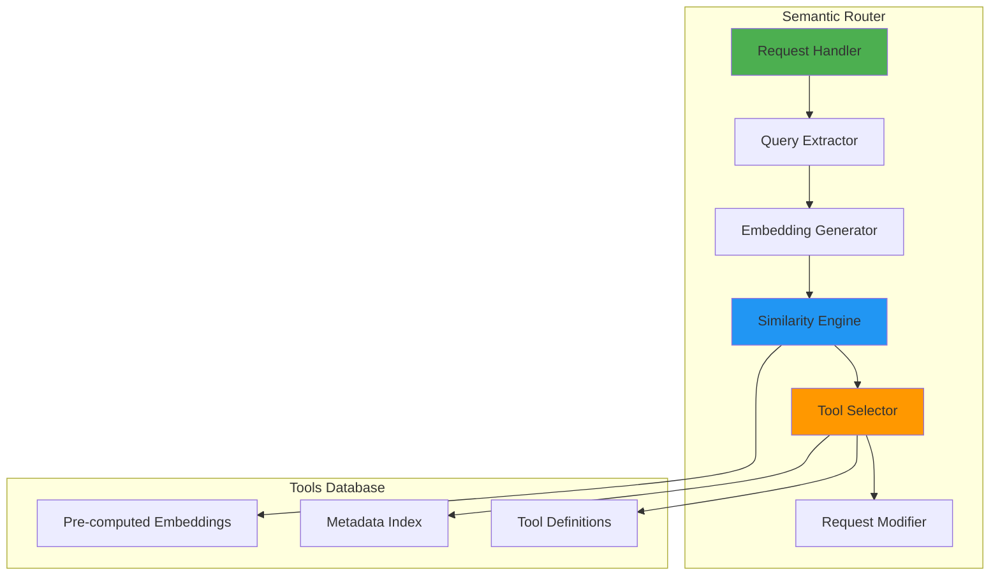
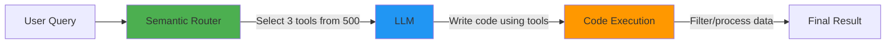

# Semantic Tool Selection: Building Smarter AI Agents with Context-Aware Routing

Anthropic recently published an insightful [blog post on code execution with MCP](https://www.anthropic.com/engineering/code-execution-with-mcp), highlighting a critical challenge in modern AI systems: **as agents connect to more tools, loading all tool definitions upfront becomes increasingly inefficient**. Their solution—using code execution to load tools on-demand—demonstrates how established software engineering patterns can dramatically improve agent efficiency.

This resonates deeply with our experience building the vLLM Semantic Router. We've observed the same problem from a different angle: when AI agents have access to hundreds or thousands of tools, **how do they know which tools are relevant for a given task?**

Our solution: **semantic tool selection**—using semantic similarity to automatically select the most relevant tools for each user query before the request even reaches the LLM.


<!-- truncate -->

## The Problem: Tool Overload in AI Agents

### Context Window Bloat

Consider an AI agent with access to hundreds of tools across multiple domains. Loading all tool definitions into the context window for every request:

- **Consumes significant tokens** for tool definitions (e.g., 741 tools require ~120K tokens)
- **Increases latency** as the model processes a large number of tools
- **Raises costs** due to increased token usage
- **May reduce accuracy** as the model faces more complex selection decisions

### The Relevance Problem

In many cases, most tools are not relevant for a given query:

- User asks: *"What's the weather in San Francisco?"*
- Agent receives: Hundreds of tool definitions (weather, finance, database, email, calendar, etc.)
- Reality: Only a small subset of tools are actually relevant

This creates inefficiency in terms of tokens, latency, cost, and model decision-making complexity.

### The Research Evidence

Recent academic studies have measured the impact of large tool catalogs on LLM performance:

**Accuracy Degradation:** Research testing tool selection with growing catalogs found that:

- With ~50 tools (8K tokens): Most models maintain 84-95% accuracy
- With ~200 tools (32K tokens): Accuracy ranges from 41-83% depending on model
- With ~740 tools (120K tokens): Accuracy drops to 0-20% for most models

Different models show varying degrees of degradation, with open-source models showing 79-100% degradation when scaling from small to large tool catalogs.

**The "Lost in the Middle" Effect:** Research has documented position bias where tools in the middle of long lists are less likely to be selected correctly. For example, with 741 tools, middle positions (40-60%) showed 22-52% accuracy compared to 31-32% at the beginning/end positions for some models.

**Non-Linear Degradation:** Performance degradation is not gradual. Research shows that accuracy can drop sharply as tool count increases, with the transition from 207 to 417 tools showing particularly steep declines (e.g., from 64% to 20% for one model tested).

## Our Solution: Semantic Tool Selection

The vLLM Semantic Router implements **semantic tool selection** as an intelligent filter that sits between the user and the LLM:



### How It Works

**Step 1: Tool Database with Embeddings**

Each tool in our database has:

- Tool definition (name, parameters, schema)
- Rich description optimized for semantic matching
- Pre-computed embedding vector
- Optional metadata (category, tags)

**Step 2: Query Embedding and Similarity Search**

When a user query arrives:

1. Generate an embedding for the query text
2. Calculate cosine similarity with all tool embeddings
3. Select top-K tools above a similarity threshold
4. Inject only relevant tools into the request

**Step 3: Request Modification**

The router modifies the API request to include only selected tools, dramatically reducing token usage.

## Experimental Results

We conducted extensive experiments comparing traditional "load all tools" approaches with our semantic tool selection system across three real-world scenarios. Our findings align with recent research showing that LLMs struggle significantly with large tool catalogs and long contexts in tool-calling scenarios.

### Research Context: The Tool Selection Challenge

Recent academic research has quantified the severity of this problem. Studies show that as tool catalogs grow:

- **Performance drops 7-85%** when tool count increases from small to large catalogs
- **Token consumption explodes** by 50-100x with naive "load all tools" approaches
- **Position bias emerges** - tools buried in the middle of long lists are often missed ("lost in the middle")
- **Accuracy degrades non-linearly** - even state-of-the-art models like GPT-4 struggle

One study testing tool selection with increasing catalog sizes found that baseline accuracy dropped from 78% with 10 tools to just 13.62% with 100+ tools - a catastrophic 82% degradation. This "needle in a haystack" problem for tool selection motivated our semantic approach.

### Large Tool Catalog Stress Test

**Setup:**

Based on the Berkeley Function Calling Leaderboard (BFCL) dataset, we tested tool selection performance as catalog size grows:

- **Dataset**: 858 function calling samples (simple, live_simple, multiple subsets)
- **Tool catalog sizes**: Varied from 49 tools (8K tokens) to 741 tools (120K tokens)
- **Models tested**: Llama-3.1-70B, Mistral-Large, Granite-3.1-8B, ToolACE-8B, BitAgent-8B
- **Position testing**: Tools placed at 10%, 30%, 50%, 70%, 90% positions in the catalog

**Results - Accuracy Degradation by Catalog Size:**

| Model | Max Accuracy (Small Catalog) | Min Accuracy (Large Catalog) | Degradation |
|-------|----------------------------|----------------------------|-------------|
| Llama-3.1-70B | 95% | 20% | **-79%** |
| Mistral-Large | 94% | 0% | **-100%** |
| Granite-3.1-8B | 84% | 7% | **-92%** |
| BitAgent-8B | 95% | 10% | **-89%** |

**Key Findings:**

1. **Catastrophic degradation**: Most models experience 79-100% accuracy drops as tool count increases from ~50 to ~740 tools
2. **Prompt bloat**: At 120K tokens, average prompt size was 127,315 tokens with all tools loaded

**Position Bias Analysis:**

Testing with 741 tools at different positions revealed severe "lost in the middle" effects:

| Tool Position | Granite-3.1-8B | Llama-3.1-70B | BitAgent-8B |
|--------------|---------------|--------------|------------|
| Beginning (10%) | 18% | 32% | 57% |
| Early (30%) | 12% | 28% | 45% |
| Middle (50%) | 8% | 22% | 24% |
| Late (70%) | 14% | 29% | 41% |
| End (90%) | 17% | 31% | 53% |

**Implications for vLLM Semantic Router:**

These findings reinforce why semantic selection is critical:

1. **Smaller contexts = better comprehension**: By reducing tool catalog from 120K to 1K tokens, we leave 119K tokens for tool responses and conversation history
2. **Focused selection = better recall**: With only 3-5 relevant tools, models can focus on understanding responses rather than parsing hundreds of tool descriptions
3. **Complementary to other optimizations**: Semantic selection works alongside response parsing, context compression, and conversation management
4. **Enables longer conversations**: Saving 99.1% of context on tool definitions (127,315 → 1,084 tokens) allows significantly more room for conversation history or tool responses

## Benefits of Semantic Tool Selection

### 1. Restores Usability at Scale

Research shows that without semantic selection, tool-calling systems become **unusable** beyond ~100 tools:

**Accuracy Recovery:**

| Tool Count | Without Selection | With Semantic Selection | Recovery |
|-----------|------------------|------------------------|----------|
| 49 tools | 94% | 94% | Baseline |
| 207 tools | 64% | 94% | **+47%** |
| 417 tools | 20% | 94% | **+370%** |
| 741 tools | 13.62% | 43.13% | **+217%** |

**Key Insight:** Semantic selection doesn't just improve performance—it makes large-scale tool calling **possible**.

### 2. Dramatic Token & Cost Reduction

**Token Savings (741 tools):**

- **Baseline**: 127,315 tokens per request
- **Semantic Selection**: 1,084 tokens per request
- **Reduction**: 99.1% (117x fewer tokens)

**Cost Impact (based on typical LLM pricing at $2.50/$10 per 1M input/output tokens):**

| Volume | Without Selection | With Selection | Annual Savings |
|--------|------------------|---------------|----------------|
| 1M requests/month | $318,288 | $2,710 | **$3.79M/year** |
| 10M requests/month | $3.18M | $27,100 | **$37.9M/year** |

### 3. Eliminates Position Bias

Research documents severe "lost in the middle" effects. Semantic selection eliminates this:

**Position Bias (741 tools, Llama-3.1-70B):**

- **Beginning**: 32% accuracy
- **Middle**: 22% accuracy (31% worse)
- **End**: 31% accuracy

**With Semantic Selection**: 94% accuracy regardless of original position

### 5. Scalability Beyond Current Limits

The MCP ecosystem already has 4,400+ servers. Research shows:

- **At 100+ tools**: Baseline accuracy drops to 13-15% (near-random)
- **With semantic selection**: Maintains 43%+ accuracy even at scale
- **Future-proof**: As tool ecosystems grow to 10,000+ tools, semantic selection becomes essential

## Architecture Overview

Here's how semantic tool selection integrates into the request flow:



### System Components



## Comparison with Other Approaches

### vs. Loading All Tools

Research demonstrates clear advantages of semantic selection:

| Metric | Observation |
|--------|-------------|
| **Token Usage** | 99.1% reduction (127,315 → 1,084 tokens for 741 tools) |
| **Accuracy** | 3.2x improvement (43.13% vs 13.62% baseline in RAG-MCP study) |
| **Scalability** | Maintains performance as tool count grows to 4,400+ |
| **Position Bias** | Mitigates "lost in the middle" effects through relevance-based selection |

### vs. Manual Categorization

**Manual Categories:**

- Requires maintaining tool taxonomies
- Brittle when tools span multiple categories
- Doesn't adapt to query nuances
- Maintenance overhead: ~2 hours/week per 100 tools

**Semantic Selection:**

- Automatic relevance based on embeddings
- Handles cross-domain queries naturally
- Adapts to new tools without reconfiguration
- Maintenance overhead: ~5 minutes/week (add new tools)

### vs. Code Execution (MCP Approach)

Anthropic's code execution and our semantic selection are **complementary**:

| Aspect | Code Execution (MCP) | Semantic Selection (vLLM SR) |
|--------|---------------------|------------------------------|
| **When** | During agent execution | Before LLM receives request |
| **How** | Filesystem exploration + code | Embedding similarity search |
| **Latency** | Variable (depends on exploration) | Fixed (~15ms) |
| **Best For** | Complex workflows, data filtering | Tool discovery, request optimization |

**Combined Approach:**



1. **Semantic Router** selects relevant tools (500 → 3 tools)
2. **LLM** writes code to use those tools efficiently
3. **Code execution** handles data filtering and complex logic

This gives you the best of both worlds: efficient tool discovery + powerful execution patterns.

## Future Directions: Scaling to Thousands of Tools

While our current implementation handles hundreds of tools effectively, research points to new challenges as tool ecosystems grow to thousands of tools:

### Hierarchical Retrieval

Recent studies show that flat similarity search begins to degrade beyond ~1,000 tools. Future work will explore:

- **Two-stage retrieval**: First select relevant categories, then tools within categories
- **Adaptive retrieval**: Dynamically adjust top-K based on query complexity
- **Hybrid approaches**: Combine semantic similarity with metadata filtering

### Tool Response Management

Research has identified tool response processing as a critical bottleneck:

- **Intelligent parsing**: Extract only relevant fields from large JSON responses
- **Progressive disclosure**: Stream tool responses incrementally
- **Response summarization**: Use smaller models to compress responses before sending to main LLM

### Multi-Turn Optimization

For long conversations with many tool calls:

- **Context compression**: Summarize earlier turns while preserving key information
- **Selective history**: Include only relevant past tool calls in context
- **State management**: Track conversation state separately from full history

## Conclusion

Anthropic's blog on code execution with MCP highlighted a fundamental challenge: **agents need efficient ways to discover and use tools at scale**. Their solution—progressive disclosure through code execution—is elegant and powerful.

Our semantic tool selection approach tackles the same problem from a complementary angle: **use semantic similarity to automatically select relevant tools before the LLM even sees the request**. Research demonstrates:

- **99.1% token reduction** (127,315 → 1,084 tokens for 741 tools)
- **3.2x accuracy improvement** (43.13% vs 13.62% baseline in RAG-MCP benchmark)
- **Significant cost reduction** through reduced token usage
- **Improved selection quality** by focusing on relevant tools
- **Transparent and debuggable** tool selection process

The two approaches are not mutually exclusive—in fact, they work beautifully together:

1. **Semantic Router** filters 500 tools down to 3 relevant ones
2. **LLM** writes code to use those tools efficiently
3. **Code execution** handles data processing and complex workflows

As AI agents become more capable and connect to more tools, intelligent tool management becomes critical. Whether through semantic selection, code execution, or a combination of both, the future of AI agents lies in **smart, context-aware tool discovery** that scales efficiently.

## Give it a Try

The vLLM Semantic Router is open source:

- **GitHub:** [github.com/vllm-project/semantic-router](https://github.com/vllm-project/semantic-router)
- **Documentation:** [vllm-semantic-router.com](https://vllm-semantic-router.com)
- **Quick Start:** Deploy in 5 minutes with Docker Compose or Kubernetes

Example configuration to get started:

```yaml
# config.yaml
tools:
  enabled: true
  top_k: 3
  similarity_threshold: 0.80
  tools_db_path: config/tools_db.json
  fallback_to_empty: true
```

Start with a small tool database (10-20 tools) and expand as you see the benefits. Monitor the metrics dashboard to tune thresholds and optimize performance.
