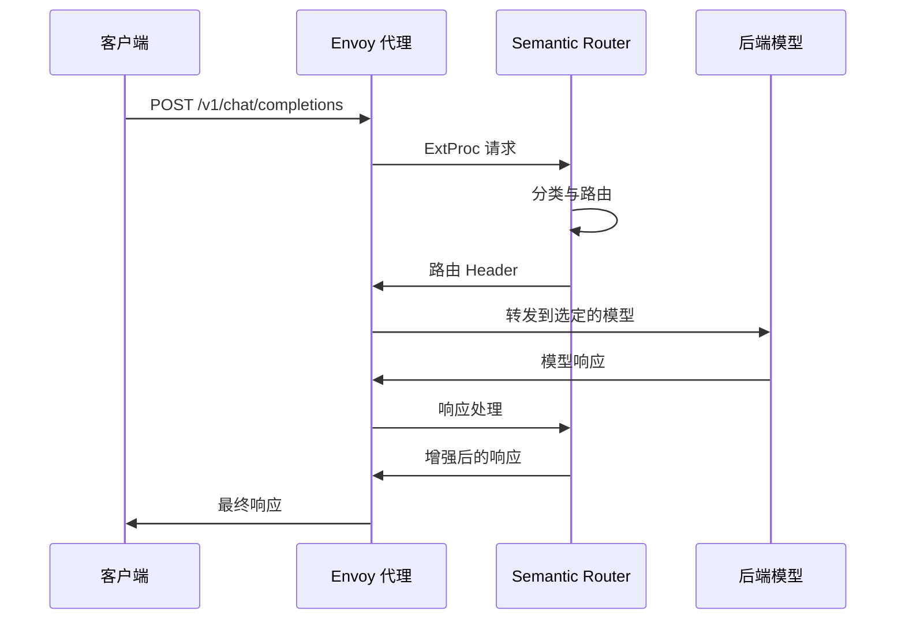

---
translation:
  source_commit: "bac2743"
  source_file: "docs/api/router.md"
  outdated: false
---

# Router API 参考

Semantic Router 提供了一个基于 gRPC 的 API，可与 Envoy 的外部处理 (ExtProc) 协议无缝集成。本文档涵盖了 API endpoint、请求/响应格式和集成模式。

## API 概览

Semantic Router 作为一个 ExtProc 服务器运行，通过 Envoy 代理处理 HTTP 请求。它不直接公开 REST endpoint，而是处理通过 Envoy 路由的 OpenAI 兼容的 API 请求。

> 注意：除了 ExtProc 路径外，该项目还在 8080 端口启动了一个轻量级的 HTTP Classification API，用于健康/信息和分类工具。OpenAI 兼容的 `/v1/models` 端点由该 HTTP API (8080) 提供，并可以通过路由规则在 Envoy (8801) 上有选择地公开。

### 端口和端点映射

- 8801 (HTTP, Envoy 公共入口)
  - 典型的客户端入口，用于 OpenAI 兼容的请求，如 `POST /v1/chat/completions`。
  - 如果添加了 Envoy 路由，可以将 `GET /v1/models` 代理到 Router 8080；否则 8801 的 `/v1/models` 可能会返回 "no healthy upstream"。

- 8080 (HTTP, Classification API)
  - `GET /v1/models` → OpenAI 兼容的模型列表（包含合成的 `MoM`）
  - `GET /health` → Classification API 健康状况
  - `GET /info/models` → 已加载的分类器模型 + 系统信息
  - `GET /info/classifier` → 分类器配置详情
  - `POST /api/v1/classify/intent|pii|security|batch` → 直接分类工具

- 50051 (gRPC, ExtProc)
  - Envoy 外部处理 (ExtProc)，用于 `/v1/chat/completions` 的路径内分类/路由。
  - 不是 HTTP 端口；无法直接通过 curl 访问。

- 9190 (HTTP, Prometheus 指标)
  - `GET /metrics` → Prometheus 抓取端点（全局进程指标）。

### 请求流程



## OpenAI API 兼容性

路由处理标准的 OpenAI API 请求：

### 模型端点 (Models Endpoint)

列出可用模型，并包含一个合成的 "MoM" (Mixture of Models) 模型，该模型使用 Router 的 intent classification 来为每个请求选择最佳的基础模型。

- 端点：`GET /v1/models`
- 响应：

```json
{
  "object": "list",
  "data": [
    { "id": "MoM", "object": "model", "created": 1726890000, "owned_by": "semantic-router" },
    { "id": "gpt-4o-mini", "object": "model", "created": 1726890000, "owned_by": "upstream-endpoint" },
    { "id": "llama-3.1-8b-instruct", "object": "model", "created": 1726890000, "owned_by": "upstream-endpoint" }
  ]
}
```

注意：

- 具体的模型列表来源于您在 `config.yaml` 中配置的 vLLM 端点（见 `vllm_endpoints[].models`）。
- 特殊的 `MoM` (Mixture of Models) 模型始终存在，并指示 Router 自动分类并路由到最佳后端模型。为了向后兼容，模型名称 `auto` 也被接受为别名。

### 聊天补全端点 (Chat Completions Endpoint)

**端点：** `POST /v1/chat/completions`

#### 请求格式

```json
{
  "model": "gpt-3.5-turbo",
  "messages": [
    {
      "role": "user", 
      "content": "x^2 的导数是多少？"
    }
  ],
  "max_tokens": 150,
  "temperature": 0.7,
  "tools": [
    {
      "type": "function",
      "function": {
        "name": "calculator",
        "description": "执行数学计算"
      }
    }
  ]
}
```

#### 响应格式

```json
{
  "id": "chatcmpl-abc123",
  "object": "chat.completion", 
  "created": 1677858242,
  "model": "gpt-3.5-turbo",
  "choices": [
    {
      "index": 0,
      "message": {
        "role": "assistant",
        "content": "x^2 的导数是 2x。"
      },
      "finish_reason": "stop"
    }
  ],
  "usage": {
    "prompt_tokens": 12,
    "completion_tokens": 8,
    "total_tokens": 20
  },
  "routing_metadata": {
    "selected_model": "mathematics",
    "confidence": 0.96,
    "processing_time_ms": 15,
    "cache_hit": false,
    "security_checks": {
      "pii_detected": false,
      "jailbreak_detected": false
    }
  }
}
```

## 路由 Header

路由在请求和响应中都会添加元数据 Header：

### 请求 Header（由路由添加）

| Header | 描述 | 示例 |
|--------|-------------|---------|
| `x-vsr-destination-endpoint` | 选定的后端端点 | `endpoint1` |
| `x-selected-model` | 确定的模型类别 | `mathematics` |
| `x-routing-confidence` | 分类置信度 | `0.956` |
| `x-request-id` | 唯一请求标识符 | `req-abc123` |
| `x-cache-status` | 缓存命中/未命中状态 | `miss` |

### 响应 Header（由路由添加）

| Header | 描述 | 示例 |
|--------|-------------|---------|
| `x-processing-time` | 总处理时间 (ms) | `45` |
| `x-classification-time` | 分类时间 (ms) | `12` |
| `x-security-checks` | 安全检查结果 | `pii:false,jailbreak:false` |
| `x-tools-selected` | 选定的工具数量 | `2` |

## 健康检查 API

Router 提供用于监控的健康检查 endpoint：

### Router 健康状况

**端点：** `GET http://localhost:8080/health`

```json
{
  "status": "healthy",
  "version": "1.0.0",
  "uptime": 3600,
  "models": {
    "category_classifier": "loaded",
    "pii_detector": "loaded", 
    "jailbreak_guard": "loaded"
  },
  "cache": {
    "status": "healthy",
    "entries": 1247,
    "hit_rate": 0.73
  },
  "endpoints": {
    "endpoint1": "healthy",
    "endpoint2": "healthy", 
    "endpoint3": "degraded"
  }
}
```

## 指标 API (Metrics API)

提供兼容 Prometheus 的指标：

**端点：** `GET http://localhost:9190/metrics`

### 关键指标

```prometheus
# 请求指标
semantic_router_requests_total{endpoint="endpoint1",category="mathematics",status="success"} 1247
semantic_router_request_duration_seconds{endpoint="endpoint1"} 0.045

# 分类指标
semantic_router_classification_accuracy{category="mathematics"} 0.94
semantic_router_classification_duration_seconds 0.012

# 缓存指标  
semantic_router_cache_hit_ratio 0.73
semantic_router_cache_size 1247

# 安全指标
semantic_router_pii_detections_total{action="block"} 23
semantic_router_jailbreak_attempts_total{action="block"} 5

# 错误指标
llm_request_errors_total{model="gpt-4",reason="timeout"} 12
llm_request_errors_total{model="claude-3",reason="upstream_5xx"} 3
llm_request_errors_total{model="phi4",reason="upstream_4xx"} 5
llm_request_errors_total{model="phi4",reason="pii_policy_denied"} 8
```

### 推理模式指标 (Reasoning Mode Metrics)

Router 公开了专用的 Prometheus 计数器，以监控跨模型家族的 reasoning mode 决策和 template 使用情况。这些指标由 Router 发送，可以由您的 Prometheus 服务器抓取。

- `llm_reasoning_decisions_total{category, model, enabled, effort}`
  - 描述：按类别和所选模型记录的推理决策计数，包括是否启用推理以及应用的努力等级 (effort level)。
  - 标签：
    - category: 路由期间确定的类别名称
    - model: 请求最终选择的模型
    - enabled: 根据决策结果为 "true" 或 "false"
    - effort: 启用时的努力等级（例如 low|medium|high）

- `llm_reasoning_template_usage_total{family, param}`
  - 描述：特定模型家族模板参数应用于请求的次数统计。
  - 标签：
    - family: 规范化的模型家族（例如 qwen3, deepseek, gpt-oss, gpt）
    - param: 应用的模板参数名称（例如 enable_thinking, thinking, reasoning_effort）

- `llm_reasoning_effort_usage_total{family, effort}`
  - 描述：为给定模型家族设置推理努力等级的次数统计。
  - 标签：
    - family: 规范化的模型家族
    - effort: 努力等级（例如 low|medium|high）

PromQL 示例：

```prometheus
# 按类别和模型划分的推理决策（最近 5 分钟）
sum by (category, model, enabled, effort) (
  rate(llm_reasoning_decisions_total[5m])
)

# 按模型家族和参数划分的模板使用情况（最近 5 分钟）
sum by (family, param) (
  rate(llm_reasoning_template_usage_total[5m])
)

# 按模型家族划分的努力等级分布（最近 5 分钟）
sum by (family, effort) (
  rate(llm_reasoning_effort_usage_total[5m])
)
```

### 成本和路由指标

Router 为成本核算和路由决策公开了额外的指标。

- `llm_model_cost_total{model, currency}`
  - 描述：归属于每个模型的总累计成本（根据 token 使用情况和每 1M 定价计算），按货币标记。
  - 标签：
    - model: 用于请求的模型名称
    - currency: 货币代码（例如 "USD"）

- `llm_routing_reason_codes_total{reason_code, model}`
  - 描述：按原因代码和所选模型划分的路由决策计数。
  - 标签：
    - reason_code: 发生路由决策的原因（例如 auto_routing, model_specified, pii_policy_alternative_selected）
    - model: 最终选择的模型

PromQL 示例：

```prometheus
# 过去一小时内按模型和货币划分的成本
sum by (model, currency) (increase(llm_model_cost_total[1h]))

# 或者，如果您只使用 USD，常见的查询是：
sum by (model) (increase(llm_model_cost_total{currency="USD"}[1h]))

# 过去 15 分钟内按原因代码划分的路由决策
sum by (reason_code) (increase(llm_routing_reason_codes_total[15m]))
```

### 请求错误指标

Router 按模型和原因跟踪请求级失败，因此您可以监控绝对错误吞吐量和失败请求的比例。

- `llm_request_errors_total{model, reason}`
  - 描述：按失败原因分类的请求错误总数
  - 标签：
    - model: 失败请求的目标模型名称
    - reason: 错误类别 (timeout, upstream_4xx, upstream_5xx, pii_policy_denied, jailbreak_block, parse_error, serialization_error, cancellation, classification_failed, unknown)

PromQL 查询示例：

```prometheus
# 过去一小时内按原因划分的总错误数
sum by (reason) (increase(llm_request_errors_total[1h]))

# 过去 15 分钟内按模型划分的错误吞吐量（错误数/秒）。
# 这对于事件响应很有帮助，因为它显示了有多少失败请求正在影响用户。
sum by (model) (rate(llm_request_errors_total[15m]))

# 过去 15 分钟内按模型划分的错误率（失败请求的百分比）。
# 使用 increase() 使分子和分母在相同的回溯窗口内对齐。
100 * sum by (model) (increase(llm_request_errors_total[15m])) /
    sum by (model) (increase(llm_model_requests_total[15m]))

# 过去 24 小时内 PII 策略拦截的数量
sum(increase(llm_request_errors_total{reason="pii_policy_denied"}[24h]))
```

### TTFT 和 TPOT 指标

TTFT (Time To First Token) 和 TPOT (Time Per Output Token) 以 Prometheus histogram 的形式导出，并可以使用 `histogram_quantile` 在 p95 处进行可视化。

- `llm_model_ttft_seconds{model}`
  - 直方图：公开 `_bucket`, `_sum`, `_count`
  - 描述：自 Router 开始处理请求以来的 Time To First Token
  - 按模型划分的 p95 示例（最近 5 分钟）：

```prometheus
histogram_quantile(0.95, sum(rate(llm_model_ttft_seconds_bucket[5m])) by (le, model))
```

- `llm_model_tpot_seconds{model}`
  - 直方图：公开 `_bucket`, `_sum`, `_count`
  - 描述：每输出 token 的秒数（completion 延迟 / completion token 数）
  - 按模型划分的 p95 示例（最近 5 分钟）：

```prometheus
histogram_quantile(0.95, sum(rate(llm_model_tpot_seconds_bucket[5m])) by (le, model))
```

这些指标已包含在 `deploy/llm-router-dashboard.json` 提供的 Grafana 仪表板中，分别为 "TTFT (p95) by Model" 和 "TPOT (p95) by Model (sec/token)"。

#### 流式传输 (SSE) 注意事项

- 对于服务器发送事件 (SSE) 响应，路由测量第一个流式正文块（即第一个 token）的 TTFT，而不是响应 Header。
- 无需手动更改 Envoy 配置：ExtProc 处理程序会自动为 SSE 响应设置带有 `response_body_mode: STREAMED` 的 `ModeOverride`，以便第一个块立即到达 ExtProc。
- 前提条件：Envoy 的 `ext_proc` 过滤器必须具有 `allow_mode_override: true`（`config/envoy.yaml` 和 `config/envoy-docker.yaml` 中的默认配置已经包含此项）。在静态处理模式中保持 `response_body_mode: BUFFERED` 是可以的；路由将在运行时为 SSE 将其翻转为 STREAMED。

### 定价配置

为您的模型提供每 1M token 的 pricing，以便 Router 可以计算请求成本并发出 metrics/log。

```yaml
model_config:
  phi4:
    pricing:
      currency: USD
      prompt_per_1m: 0.07
      completion_per_1m: 0.35
  "mistral-small3.1":
    pricing:
      currency: USD
      prompt_per_1m: 0.1
      completion_per_1m: 0.3
  gemma3:27b:
    pricing:
      currency: USD
      prompt_per_1m: 0.067
      completion_per_1m: 0.267
```

注意：

- 定价是可选的；如果省略，成本视为 0，且仅发出 token 指标。
- 成本计算公式为：(prompt_tokens *prompt_per_1m + completion_tokens* completion_per_1m) / 1,000,000（以配置的货币计算）。

## gRPC ExtProc API

用于与 ExtProc 协议直接集成：

### 服务定义

```protobuf
syntax = "proto3";

package envoy.service.ext_proc.v3;

service ExternalProcessor {
  rpc Process(stream ProcessingRequest) returns (stream ProcessingResponse);
}

message ProcessingRequest {
  oneof request {
    RequestHeaders request_headers = 1;
    RequestBody request_body = 2;
    ResponseHeaders response_headers = 3;
    ResponseBody response_body = 4;
  }
}

message ProcessingResponse {
  oneof response {
    RequestHeadersResponse request_headers = 1;
    RequestBodyResponse request_body = 2;
    ResponseHeadersResponse response_headers = 3;
    ResponseBodyResponse response_body = 4;
  }
}
```

### 处理方法

#### 请求 Header 处理

```go
func (r *Router) handleRequestHeaders(headers *ProcessingRequest_RequestHeaders) *ProcessingResponse {
    // 提取请求元数据
    // 设置请求上下文
    // 返回 continue 响应
}
```

#### 请求正文处理

```go
func (r *Router) handleRequestBody(body *ProcessingRequest_RequestBody) *ProcessingResponse {
    // 解析 OpenAI 请求
    // 分类查询意图
    // 运行安全检查
    // 选择最优模型
    // 返回路由 Header
}
```

## 错误处理

### 错误响应格式

```json
{
  "error": {
    "message": "在请求中检测到 PII",
    "type": "security_violation",
    "code": "pii_detected",
    "details": {
      "entities_found": ["EMAIL", "PERSON"],
      "action_taken": "block"
    }
  }
}
```

### HTTP 状态码

| 状态码 | 描述 |
|--------|-------------|
| 200 | 成功 |
| 400 | Bad Request (格式错误的输入) |
| 403 | Forbidden (违反安全规定) |
| 429 | Too Many Requests (频率限制) |
| 500 | Internal Server Error (内部服务器错误) |
| 503 | Service Unavailable (后端掉线) |

## 配置 API

### 运行时配置更新

**端点：** `POST /admin/config/update`

```json
{
  "classification": {
    "confidence_threshold": 0.8
  },
  "security": {
    "enable_pii_detection": true
  },
  "cache": {
    "ttl_seconds": 7200
  }
}
```

## WebSocket API (可选)

用于实时流式响应：

**端点：** `ws://localhost:8801/v1/chat/stream`

```javascript
const ws = new WebSocket('ws://localhost:8801/v1/chat/stream');

ws.send(JSON.stringify({
  "model": "gpt-3.5-turbo",
  "messages": [{"role": "user", "content": "讲个故事"}],
  "stream": true
}));

ws.onmessage = function(event) {
  const chunk = JSON.parse(event.data);
  console.log(chunk.choices[0].delta.content);
};
```

## 客户端库示例

### Python 客户端

```python
import requests

class SemanticRouterClient:
    def __init__(self, base_url="http://localhost:8801"):
        self.base_url = base_url
        
    def chat_completion(self, messages, model="gpt-3.5-turbo", **kwargs):
        response = requests.post(
            f"{self.base_url}/v1/chat/completions",
            json={
                "model": model,
                "messages": messages,
                **kwargs
            }
        )
        return response.json()
        
    def get_health(self):
        response = requests.get(f"{self.base_url}/health")
        return response.json()

# 使用示例
client = SemanticRouterClient()
result = client.chat_completion([
    {"role": "user", "content": "2 + 2 等于多少？"}
])
```

### JavaScript 客户端

```javascript
class SemanticRouterClient {
    constructor(baseUrl = 'http://localhost:8801') {
        this.baseUrl = baseUrl;
    }
    
    async chatCompletion(messages, model = 'gpt-3.5-turbo', options = {}) {
        const response = await fetch(`${this.baseUrl}/v1/chat/completions`, {
            method: 'POST',
            headers: {
                'Content-Type': 'application/json'
            },
            body: JSON.stringify({
                model,
                messages,
                ...options
            })
        });
        
        return response.json();
    }
    
    async getHealth() {
        const response = await fetch(`${this.baseUrl}/health`);
        return response.json();
    }
}

// 使用示例
const client = new SemanticRouterClient();
const result = await client.chatCompletion([
    { role: 'user', content: '求解 x^2 + 5x + 6 = 0' }
]);
```

## 频率限制 (Rate Limiting)

路由使用以下 Header 实施频率限制：

### 频率限制 Header

```http
X-RateLimit-Limit: 1000
X-RateLimit-Remaining: 999
X-RateLimit-Reset: 1640995200
X-RateLimit-Retry-After: 60
```

### 频率限制响应

```json
{
  "error": {
    "message": "超出频率限制",
    "type": "rate_limit_error",
    "code": "too_many_requests",
    "details": {
      "limit": 1000,
      "window": "1h",
      "retry_after": 60
    }
  }
}
```

## 最佳实践

### 1. 请求优化

```python
# 包含相关的上下文
messages = [
    {
        "role": "system", 
        "content": "你是一位数学导师。"
    },
    {
        "role": "user",
        "content": "用简单的术语解释导数"
    }
]

# 使用合适的工具
tools = [
    {
        "type": "function",
        "function": {
            "name": "calculator",
            "description": "用于数学计算"
        }
    }
]
```

### 2. 错误处理

```python
try:
    response = client.chat_completion(messages)
    if 'error' in response:
        handle_router_error(response['error'])
    else:
        process_response(response)
        
except requests.exceptions.Timeout:
    handle_timeout_error()
except requests.exceptions.ConnectionError:
    handle_connection_error()
```

### 3. 监控集成

```python
import time

start_time = time.time()
response = client.chat_completion(messages)
duration = time.time() - start_time

# 记录路由元数据
routing_info = response.get('routing_metadata', {})
logger.info(f"请求被路由到 {routing_info.get('selected_model')} "
           f"置信度为 {routing_info.get('confidence')} "
           f"耗时 {duration:.2f}s")
```

## 下一步

- **[Classification API](classification.md)**：详细的分类端点
- **[快速入门指南](../installation/installation.md)**：真实世界的集成示例
- **[配置指南](../installation/configuration.md)**：生产环境配置

有关更高级的 API 用法和自定义集成，请参阅 examples 目录或加入我们的社区讨论。
