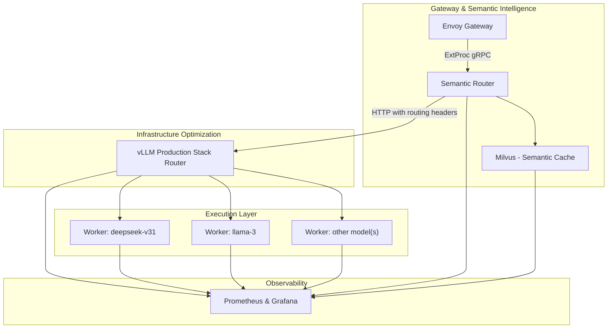
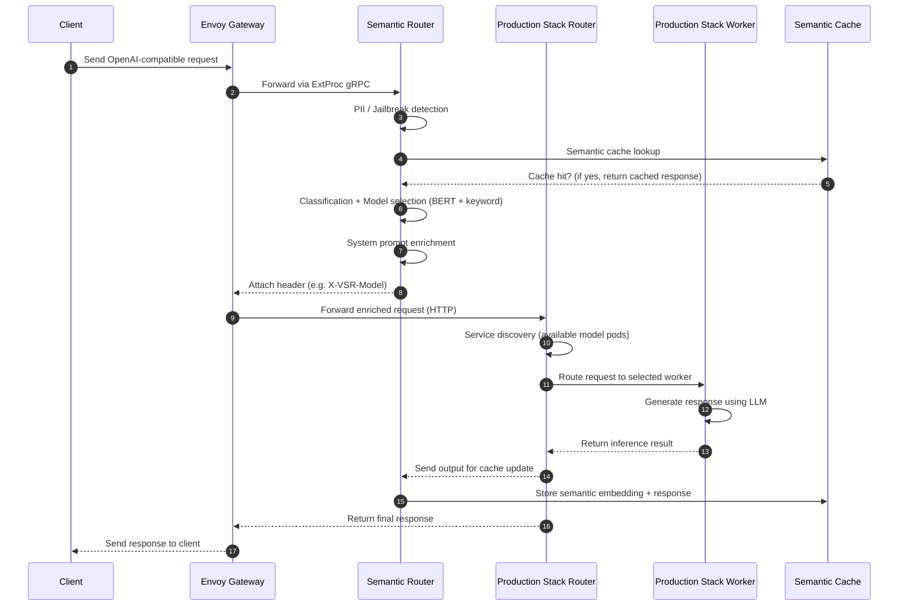

---
translation:
  source_commit: "8e37ee0"
  source_file: "docs/proposals/production-stack-integration.md"
  outdated: false
---

# Semantic Intelligence Layer for vLLM Production Stack

## 1. Overview

The goal of this document is to outline a comprehensive integration strategy between **vLLM Semantic Router** and the **vLLM Production Stack**.  The vLLM Production Stack is a cloud‑native reference system for deploying vLLM at scale.  It provides several deployment ways that spin up vLLM servers, a request router and an observability stack.  The request router can direct traffic to different models, perform service discovery and fault tolerance through the Kubernetes API, and support round‑robin, session‑based, prefix‑aware, KV-aware and disaggregated-prefill routing with LMCache native support.  The Semantic Router adds a **system‑intelligence layer** that classifies each user request, selects the most suitable model from a pool, injects domain‑specific system prompts, performs semantic caching and enforces enterprise‑grade security checks such as PII and jailbreak detection.

By combining these two systems we obtain a unified inference stack.  Semantic routing ensures that each request is answered by the best possible model. Production‑Stack routing maximizes infrastructure and inference efficiency, and exposes rich metrics.  Together they provide:

* **System‑level intelligence** — understand the user’s intent, choose the right model, inject appropriate system prompts and pre‑filter tools.
* **Infrastructure efficiency** — scale from a single instance to a distributed vLLM deployment without changing application code, routing traffic across multiple models with token‑level optimization and LMCache native support.
* **Security and compliance** — block PII and jailbreak prompts before they reach the model.
* **Observability** — monitor requests, latency and GPU usage through the Production‑Stack’s Grafana dashboard and trace semantic‑router decisions.

---

## 2. Motivation: Why Semantic Router for the Production Stack?

### 2.1 Production Stack capabilities (current state)

The vLLM Production Stack provides the building blocks for serving large language models at scale:

| Capability | Description |
| --- | --- |
| **Distributed deployment** | Deploy multiple vLLM instances with LMCache native support and scale from single‑instance to multi‑instance clusters without changing application code. |
| **Request router** | Routes requests to different models and instances, supports different kinds of routing logic including disaggregated-prefill, KVCache-aware, prefix-aware, session and round-robin based routing. |
| **Service discovery & fault tolerance** | Uses Kubernetes API for automatic discovery and removes failed nodes from the pool. |
| **Observability** | Provides a Grafana dashboard to display latency distributions, time‑to‑first‑token, number of running or pending requests and GPU KV‑cache usage. |
| **Deployment simplicity** | Helm charts/CRD/Inference-gateway to install the stack and expose an OpenAI‑compatible API. |

---

These features optimize infrastructure usage but operate at the level of routing tokens and requests, not the request’s meaning.  The router is unaware of the task complexity or domain and does not decide which model should handle a given prompt beyond simple user‑specified model IDs.

### 2.2 Semantic Router capabilities (system‑intelligence layer)

The Semantic Router adds system‑level intelligence on top of vLLM:

| Capability | Description |
| --- | --- |
| **Mixture‑of‑Models routing** | Classifies each incoming OpenAI API request and selects the most suitable model based on task complexity and domain.  This improves accuracy by routing tasks to specialized models rather than a single general model. |
| **Automatic tool selection** | Identifies which external tools are relevant to the prompt and reduces unnecessary tool calls. |
| **Category‑specific system prompts** | Injects specialized system prompts (math, coding, business, etc.) based on query classification to improve reasoning and token efficiency. |
| **Security filters** | Detects PII and blocks prompts containing sensitive data; identifies jailbreak prompts and prevents them from being sent to the LLM. |
| **Similarity caching** | Uses embeddings to cache the semantic representation of prompts; if a new prompt is similar to a previous one, the cached response can be returned instantly. |
| **Distributed tracing** | Emits OpenTelemetry traces covering classification, security checks, caching and routing decisions. |

---

These capabilities enable *task‑aware inference* that adapts reasoning depth and model choice on a per‑request basis.  However, the Semantic Router does not manage GPU resources or KV‑cache and operates best when coupled with a scalable serving stack.

### 2.3 Differentiation Analysis: Complementary Strengths

The two systems target different layers of the inference stack:

#### Semantic Router – Request Intelligence Layer

* Understands the user’s intent via multi‑signal classification, combining keyword matching, embedding similarity, and LLM-based classification.
* Selects the best‑performing model and optional tools based on domain‑specific scores.
* Enriches the request by injecting system prompts and adding routing metadata headers.
* Performs security filtering (PII and jailbreak detection) and semantic caching.

#### Production Stack – Infrastructure Optimization Layer

* Improve inference efficiency with LMCache native support using round‑robin, session‑based, prefix‑aware routing, KVCache-aware and disaggregated-prefill routing.
* Offloads KV‑cache to CPU memory and remote storage (via LMCache) and supports KV‑cache aware routing strategies.
* Scales horizontally via Kubernetes and exposes metrics and traces for monitoring.

The overlap between these layers is minimal.  Semantic Router makes decisions based on *what* the user is asking, while Production Stack optimizes *how* the request is executed.  Integration therefore combines semantic intelligence with GPU‑level efficiency.

### 2.4 Why Integration Matters: Achieving System‑Level Intelligence

Without semantic intelligence, the Production Stack treats all requests equally: simple prompts use the same large models and reasoning depth as complex tasks, leading to unnecessary cost and latency.  Without infrastructure‑level optimization, the Semantic Router cannot scale to high QPS workloads or manage KV‑cache efficiently.  By integrating them:

* Simple queries (e.g., factual questions) can be routed to smaller, cheaper models with minimal reasoning, while complex tasks use larger models and chain‑of‑thought reasoning.
* Semantic Router’s model selection filters the worker pool to only those serving the selected model; Production‑Stack’s router then chooses the worker with the highest KV‑cache overlap or least load.
* Dual‑layer caching (semantic cache + KV‑cache) allows the system to either serve responses instantly from the cache or reuse token‑level prefixes to reduce prefill cost.
* End‑to‑end traces provide visibility into both semantic and infrastructure decisions, enabling continuous optimization.

---

## 3 Goals and Non‑Goals

### 3.1 Goals

Primary goals of the integration are:

1. **Seamless integration** – The Semantic Router runs as a pre‑processing layer before the Production‑Stack router.  Requests flow from the gateway to the Semantic Router, then to the Production‑Stack router, and finally to the appropriate vLLM worker.
2. **Dual‑layer caching** – Combine semantic caching (request‑level) with KV‑cache reuse (token‑level) so that exact or similar prompts avoid full inference and partial overlaps minimize prefill cost.
3. **Model‑aware routing** – The Production‑Stack router filters workers by the model selected by the Semantic Router. Choose the optimal worker based on different routing logic to maximize cache hits.
4. **Security enforcement** – Block prompts containing PII or jailbreak patterns before they reach the model.
5. **Unified observability** – Trace semantic decisions and infrastructure routing in a single span using OpenTelemetry and monitor system metrics via Grafana.
6. **Zero‑downtime updates** – The Semantic Router’s routing rules and model scores can be hot‑reloaded without restarting the Production‑Stack.  Dynamic configuration of the production router allows live updates to service discovery and routing logic.

### 3.2 Non‑Goals

1. **Replacing the Production‑Stack router** – The Semantic Router augments the existing router; it does not take over infrastructure routing.  If the Semantic Router fails, the Production‑Stack router continues to operate using default model routing.
2. **Modifying vLLM or Production‑Stack core** – Integration uses standard APIs (ExtProc gRPC for Envoy or HTTP header injection) and does not require changes to vLLM internals.
3. **Unified configuration** – Keep configuration of semantic policies separate from infrastructure settings to allow independent evolution.
4. **Synchronous coupling** – Both systems can run independently if one is unavailable; fallback paths ensure graceful degradation.

---

## 4 Proposal Details

### 4.1 Design Principles

1. **Separation of concerns** – Keep semantic intelligence decoupled from infrastructure optimization.  The Semantic Router focuses on understanding and enriching requests, while the Production‑Stack router handles worker selection and scheduling.
2. **API‑driven integration** – Use Envoy’s external processing (ExtProc) gRPC API or HTTP header injection to integrate the Semantic Router with the Production‑Stack gateway and router.  This avoids modifying the internals of either system.
3. **Fail‑safe design** – If the Semantic Router is unavailable or returns an error, the gateway forwards the original request to the Production‑Stack router (bypassing semantic processing).  The Production‑Stack router defaults to the user‑specified model or round‑robin logic.
4. **Kubernetes‑native** – Leverage Helm charts/CRD for reproducible deployments.

### 4.2 System Architecture

The integrated system consists of four layers:

#### System Architecture

1. **Gateway & Semantic Intelligence**
   * **Envoy Gateway** — Receives OpenAI‑compatible API requests and forwards them via ExtProc gRPC to the Semantic Router.  Acts as the unified entry point.
   * **Semantic Router Service** — A stateless gRPC service running multiple replicas for high availability.  It performs classification, security filtering, semantic cache lookup, model and tool selection, and request enrichment.
   * **Milvus Service** — A vector database used for semantic caching; stores embeddings and responses with configurable TTL.
   * **ConfigMap & Model PVCs** — Hold routing rules, category definitions and downloaded model weights.

2. **Infrastructure Optimization (Production Stack)**
   * **vLLM‑router Service** — The existing Production‑Stack responsible for service discovery, load balancing and KV‑cache aware/disaggregated-prefill routing. It parses the `model` field injected by the Semantic Router and filters workers to those serving that model.
   * **LMCache / KV‑Cache Manager** — Optionally offloads KV‑cache to remote storage and exposes metrics for cache hits.
   * **Prometheus & Grafana** — Collect and visualize metrics such as request latency, TTFT and GPU KV‑cache usage.

3. **Execution (vLLM Workers)**
   * **Model Pools** — Separate StatefulSets per model (e.g., llama‑3 chat, deepseek‑v31, qwen3) with headless services. Each worker runs vLLM with prefix‑aware or KV‑aware caching and generates responses.
   * **Dynamic Scaling** — Horizontal Pod Autoscaler or KEDA scales worker replicas based on QPS and GPU utilization.

4. **Storage Layer**
   * **Semantic Cache Storage** — Milvus uses persistent volumes for embeddings and responses.
   * **KV‑cache Storage** — GPU memory for hot cache; system memory or NVMe for warm/cold cache. LMCache can offload and share KV‑cache across instances with multi-tier storage hierarchy.

### 4.3 Request Flow

#### 4.3.1 End‑to‑End Request Processing

1. **Client request** — A client sends an OpenAI‑compatible request (e.g., `/v1/chat/completions`) to the gateway specifying `model:"auto"`.
2. **Envoy intercepts request** — Envoy receives the HTTP request and calls the Semantic Router via ExtProc gRPC, passing the request body and headers.
3. **Semantic Router processing** — The Semantic Router executes the following pipeline:
   * **Security filtering** — Run PII and jailbreak detection; block or redact prompts if the probability exceeds thresholds.
   * **Semantic cache lookup** — Generate a MiniLM embedding and search Milvus for similar queries. On a hit, return the cached response immediately.
   * **Multi‑signal classification** — Apply keyword matching (fast path), embedding similarity (concept search) and ModernBERT classification. Choose the signal with highest confidence and assign a category.
   * **Model & tool selection** — Look up model scores for the category and choose the best model. Select relevant tools and reasoning mode (on/off) based on the query.
   * **Request enrichment** — Inject system prompts, update the `model` field to the selected model, add routing headers (e.g., `X‑VSR‑Category`, `X‑VSR‑Model`, `X‑VSR‑Reasoning`) and forward to Envoy.
4. **Envoy forwards enriched request** — Envoy forwards the enriched request to the Production‑Stack router (vllm‑router service).  The router is unaware of the semantic modifications and treats it as a normal request for the specified model.
5. **Production‑Stack routing** — The vLLM‑router performs service discovery and filters the worker pool to those serving the selected model.  It uses round‑robin, session‑based or prefix/KV‑aware algorithms to select the worker with highest cache overlap or lowest load.
6. **vLLM worker execution** — The chosen vLLM worker receives the request containing the injected system prompt and executes inference.  Prefix caching and KV‑cache reuse reduce prefill time.
7. **Semantic cache update** — When the worker returns the response, the Semantic Router stores the query embedding and response in Milvus with a configurable TTL.
8. **Client response** — Envoy returns the response to the client, optionally adding observability headers (selected model, category, reasoning mode, cache hit/miss).

#### 4.3.2 Dual‑Layer Caching Strategy

The integration leverages two complementary caching layers:

* **Layer 1: Semantic Cache (request‑level)** — Stores complete request/response pairs in Milvus. When the cosine similarity between the new query and a cached query exceeds a threshold (e.g., 0.85), the cached response is returned without any inference. This eliminates unnecessary token generation.
* **Layer 2: KV Cache (token‑level)** — Managed by the Production‑Stack router and LMCache. Prefix‑aware or KV‑aware routing ensures that requests with overlapping prefixes are routed to the same worker where the KV‑cache resides. Even when the semantic cache misses, reusing KV‑cache reduces prefill time and improves throughput.

Combined, these caches provide three scenarios:

| Scenario | Semantic Cache | KV Cache | Outcome |
| --- | --- | --- | --- |
| **Exact semantic match** | Hit | N/A | Return cached response instantly (no inference)|
| **Partial match / overlap** | Miss | Hit | Perform inference but reuse KV‑cache; reduces latency|
| **Novel query** | Miss | Miss | Full inference; classification and worker routing occur normally|

### 4.4 Integration in Kubernetes

#### 4.4.1 Deployment Architecture

The integration follows a layered service architecture in Kubernetes (see diagram below for conceptual layout):

1. **Envoy Gateway & Semantic Router**
   * `gateway-svc` — Exposes the `/v1/*` API on port 8080.  Configured with an ExtProc filter that streams requests to the `semantic-router-svc`.
   * `semantic-router-svc` — A ClusterIP service exposing gRPC on port 50051.  It deploys multiple pods for high availability and mounts model weights via PersistentVolumeClaims.  It depends on a `milvus-svc` for semantic caching and a ConfigMap for routing rules.
   * `milvus-svc` — Runs the Milvus vector database on port 19530 and stores embeddings and responses.

2. **Production‑Stack Router & Observability**
   * `vllm-router-svc` — Exposes the Production‑Stack router’s HTTP endpoint (default port 80).  It receives enriched requests from Envoy and performs service discovery and worker selection.
   * `prometheus-svc` & `grafana-svc` — Collect and visualize metrics for latency, TTFT and KV‑cache usage.

3. **vLLM Worker Pools**
   * `vllm-{model}-svc` — Headless services for each model (e.g., `llama3-chat`, `deepseek-v31`) exposing worker pods.  Workers run vLLM.
   * Horizontal Pod Autoscalers scale worker replicas based on CPU/GPU usage and QPS.

4. **Storage**
   * Persistent volumes for Milvus, model weights and LMCache (if enabled).

#### 4.4.2 Service Communication Flow

The following sequence illustrates the end‑to‑end flow for a chat completion request:

1. **Client Request** – Client sends `POST /v1/chat/completions` with `model: "auto"`.
2. **Gateway** – The gateway (`gateway-svc`) receives the request and forwards it to `semantic-router-svc` via ExtProc gRPC, including request body and headers.
3. **Semantic Router** – Performs fusion routing: keyword matching, similarity search and ModernBERT classification, selects a category (e.g., *math*), chooses the best model (e.g., `deepseek-v31`), injects a math system prompt and sets `X‑VSR‑Model: deepseek-v31`, `X‑VSR‑Category: math` headers.  It also runs PII/jailbreak detection and semantic cache lookup; on a cache hit it returns the cached response.
4. **Gateway** – Receives the enriched request.  If a cached response was returned, it skips subsequent steps and replies to the client directly.  Otherwise it forwards the request to `vllm-router-svc` on port 80.
5. **Production‑Stack Router** – Parses the `model` field (`deepseek-v31`), filters the worker pool accordingly and uses different routing to select the worker with the highest cache overlap.  It forwards the request to the chosen worker’s pod.
6. **vLLM Worker** – Processes the request with the injected system prompt, reusing KV‑cache blocks when available.  The worker streams or returns the generated response.
7. **Semantic Cache Update** – Upon receiving the response, the Semantic Router stores the query embedding and response in Milvus with TTL for future cache hits.
8. **Response to Client** – The gateway returns the response to the client, optionally including observability headers (`X‑VSR‑Model‑Used`, `X‑VSR‑Cache‑Hit`, etc.).

### 4.5 Implementation Plan (Adapted from [Dynamo Proposal](https://vllm-semantic-router.com/docs/proposals/nvidia-dynamo-integration))

The integration will be delivered in four phases:

#### Phase 1: Foundation

**Objectives:**

* Establish basic integration between Semantic Router and Production Stack
* Implement transparent model override in request body
* Validate end-to-end request flow

**Tasks:**

1. **Semantic Router Enhancements**:
   * Implement request body modification: model: "auto" → "selected-model"
   * Add system prompt injection to messages array
   * Add optional observability headers:
      * x-vsr-selected-category: Classification result
      * x-vsr-selected-reasoning: Reasoning mode ("on" or "off")
      * x-vsr-selected-model: Selected model name
      * x-vsr-injected-system-prompt: System prompt injection status ("true" or "false")
      * x-vsr-cache-hit: Cache hit status (only when cache hit)
      * Ensure OpenAI API compatibility maintained

2. **Production Stack**:
   * PS receives standard OpenAI API requests
   * Model field already contains the selected model name
   * No awareness of VSR's involvement needed
   * Existing routing logic works as-is

3. **Testing**:
   * Unit tests for model override logic
   * Integration tests for system prompt injection
   * Verify PS routes to correct model pools
   * Load tests with 1K RPS

**Success Criteria**:

* ✅ Requests routed to correct model pools based on overridden model name
* ✅ System prompts correctly injected into messages
* ✅ PS operates transparently without modifications
* ✅ Latency overhead < 10ms
* ✅ No breaking changes to existing deployments

#### Phase 2: Observability & Monitoring

**Objectives:**

* Full-stack distributed tracing across VSR → PS → Workers
* Comprehensive metrics and dashboards
* Alerting and SLO monitoring

**Tasks:**

1. **Distributed Tracing (OpenTelemetry):**

   * Trace context propagation from VSR through PS to workers
   * Span hierarchy:
      * Root span: Envoy Gateway
      * Child span: Semantic Router (fusion routing, cache, security)
         * Sub-span: BERT classification
         * Sub-span: Keyword matching
         * Sub-span: Similarity search
         * Sub-span: Signal fusion & decision
      * Child span: PS Frontend (routing, worker selection)
      * Child span: vLLM Worker (inference execution)
   * Automatic trace ID injection in headers
   * Support for Jaeger, Tempo, and other OTLP-compatible backends

2. **Metrics Collection:**
   * Semantic Router metrics:
     * Fusion routing performance:
       * BERT classification latency and accuracy
       * Keyword matching hit rate and latency
       * Similarity search latency
       * Signal fusion decision distribution
     * Semantic cache hit rate (Milvus)
     * PII/Jailbreak detection rate
     * Model selection distribution by category
   * PS metrics:
     * Worker utilization
     * TTFT, TPOT, ITL
     * KV cache hit rate
   * End-to-end latency breakdown by component

3. **Dashboards:**
   * Grafana dashboard for integrated stack
   * Request flow visualization with trace waterfall
   * Cost and performance analytics
   * Cache efficiency metrics (semantic + KV)

**Success Criteria:**

* ✅ Single distributed trace spans all layers (VSR → PS → Worker)
* ✅ Minimal trace sampling overhead
* ✅ Real-time dashboards operational
* ✅ Trace context properly propagated across service boundaries

#### Phase 4: Production Hardening

**Objectives:**

* Failure handling and resilience
* Performance optimization
* Production deployment

**Tasks:**

1. **Resilience:**
   * Semantic Router failure fallback to PS
   * Circuit breaker for cache backend
   * Graceful degradation strategies

2. **Performance:**
   * Latency optimization (target: < 50ms combined)
   * Throughput testing (target: 10K RPS)
   * Resource utilization tuning

3. **Documentation:**
   * Deployment guide
   * Configuration reference
   * Troubleshooting runbook

**Success Criteria:**

* ✅ High availability
* ✅ Low P99 latency (routing overhead)
* ✅ 10K+ RPS sustained throughput

---

## 5 Security and Privacy Considerations

### 5.1 PII Detection and Blocking

The PII detection model uses ModernBERT to identify sensitive tokens such as names, emails or social security numbers.  Prompts containing PII beyond a configurable threshold (default 0.7) are blocked or redacted before being sent to the model.  Operators can choose to either reject the request or mask detected tokens. The Semantic Router returns response headers indicating that PII was blocked for auditing.

### 5.2 Jailbreak Prevention (Prompt Guard)

Jailbreak detection protects against prompt injection attacks, instruction overrides and other adversarial patterns. A hierarchy of LoRA‑adapted classifiers running on BERT, RoBERTa or ModernBERT detects such prompts. Requests exceeding the configured threshold (0.7 by default) are blocked and the gateway responds with an error message. Response headers include the type and confidence of the detected attack. This mechanism protects vLLM models from malicious instructions and ensures that safe prompts reach the inference engine.

### 5.3 Data Residency and Compliance

Embeddings and cached responses stored in Milvus may constitute personal data.  Deployments should encrypt persistent volumes at rest and enforce appropriate data retention policies.  Milvus supports per‑collection time‑to‑live (TTL) settings; administrators should tune TTL values to balance cache effectiveness and data minimization (e.g., 2 hours by default).  Ensure that geographic placement of storage complies with organizational and regulatory requirements.

---

## 6 Operational Considerations

### 6.1 Monitoring and Alerting

Operators should monitor both semantic and infrastructure metrics:

* **Semantic metrics** – classification latency, PII/jailbreak detection rates, semantic cache hit rate, embedding queue length.  These can be exported as Prometheus metrics from the Semantic Router and visualized in Grafana.
* **Infrastructure metrics** – vLLM router throughput, worker CPU/GPU utilization, KV‑cache hit rate, request latency distribution and TTFT.
* **Alerts** – Set alerts for high classification latency, high rate of blocked prompts, low semantic cache hit rate, rising GPU memory usage and high worker queue lengths.

### 6.2 Maintenance and Updates

* **Model updates** – Periodically retrain classification, PII and jailbreak detection models and roll out updates by replacing model files mounted in the Semantic Router pods.  Use blue–green or canary deployments to minimize disruption.
* **Routing rules** – Maintain a ConfigMap specifying category→model mappings and tool policies.  The Semantic Router watches this ConfigMap for changes and reloads rules without a restart.
* **Scaling** – Tune Horizontal Pod Autoscaler and LMCache parameters based on observed load patterns.  Consider enabling sleep/wakeup mode in vLLM to reduce costs during low‑traffic periods.

### 6.3 Failure Modes and Recovery

Potential failure scenarios include:

1. **Semantic Router unavailable** – Requests bypass the Semantic Router and are forwarded directly to the Production‑Stack router.  The response may have lower accuracy or higher cost, but service remains operational.
2. **Milvus outage** – Semantic cache lookups and updates fail; classification and security checks still operate.  Cache hit rate drops temporarily.
3. **vLLM worker failures** – The Production‑Stack router’s health checks remove failed workers.  Autoscaling spawns new workers to maintain capacity.
4. **KV‑cache exhaustion** – When GPU memory is full, KV‑cache blocks may be evicted, reducing the benefit of prefix reuse.  LMCache can offload to system memory or NVMe and share caches across workers; monitor GPU KV usage and scale memory or reduce concurrent requests.

---

## 7 Future Enhancements

### 7.1 Advanced Routing Strategies

Integrating semantic signals into infrastructure routing is an exciting area for future research.  For example, classification confidence could influence worker selection: high‑entropy queries might prefer workers with more free memory or faster GPUs.  Research into consistent hashing and locality‑sensitive hashing may further improve KV‑cache hit rates.

### 7.2 Cross‑Layer Optimization

Integrating the semantic and infrastructure layers opens opportunities for joint optimizations:

* **Semantic‑aware KV‑cache management** – Use category information to schedule KV‑cache eviction and sharing.  Similar domains (e.g., math queries) could share KV‑cache blocks across workers to improve reuse.
* **Pluggable embedding and classification models** – Serve embedding and classification models via vLLM workers to unify model hosting.  This would allow GPU acceleration when CPU resources become a bottleneck and simplify model management.
* **Dynamic reasoning budgets** – Adjust reasoning depth and chain‑of‑thought activation based on user importance, cost constraints or service‑level objectives, inspired by research in task‑aware inference.

### 7.3 Multi‑Tenant Support

Enterprises often require isolated routing policies and model pools per tenant.  Future work includes adding tenant IDs to semantic cache keys and router headers, provisioning dedicated Milvus collections per tenant and supporting per‑tenant model catalogs.  Role‑based access controls will ensure that tenants cannot access each other’s caches or models.

---

## 8 References

1. [vLLM Production Stack](https://github.com/vllm-project/production-stack)
2. [vLLM Semantic Router](https://github.com/vllm-project/semantic-router)
3. [Semantic Intelligence Layer for NVIDIA Dynamo](https://vllm-semantic-router.com/docs/proposals/nvidia-dynamo-integration#46-implementation-plan)
