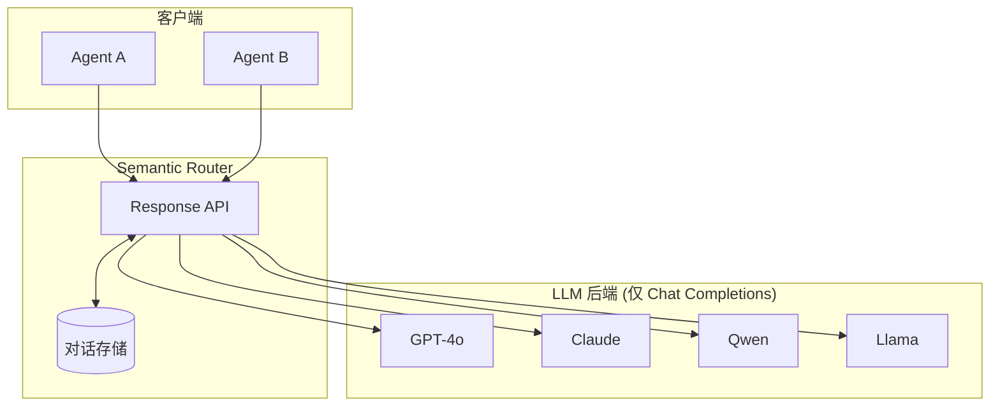
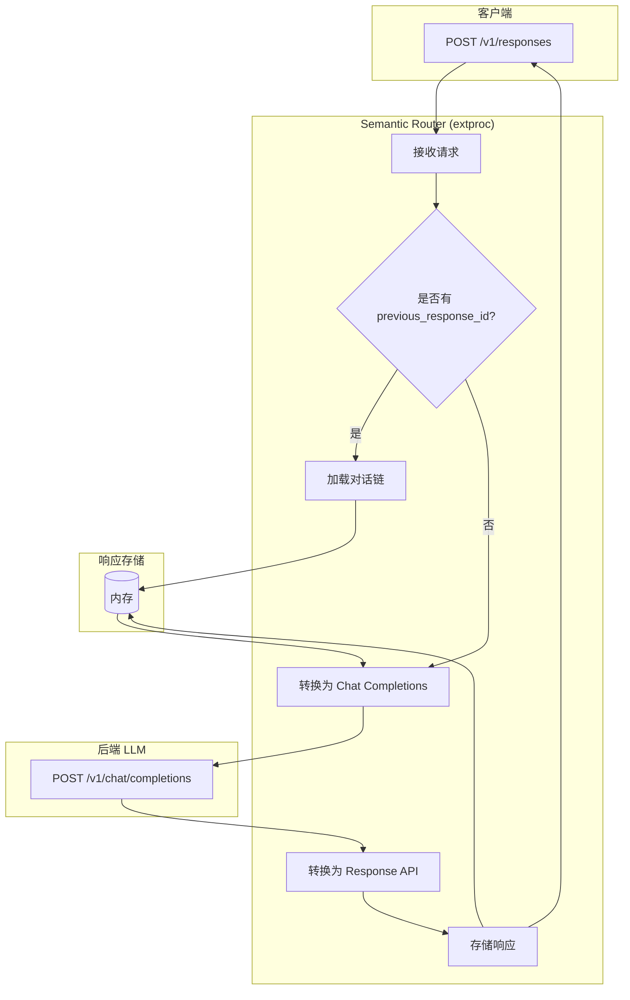

---
translation:
  source_commit: "bac2743"
  source_file: "docs/tutorials/intelligent-route/router-memory.md"
  outdated: false
---

# 多轮对话 (Multi Turn Conversations)

路由记忆 (Router Memory) 通过 [OpenAI Response API](https://platform.openai.com/docs/api-reference/responses) 实现有状态对话，支持使用 `previous_response_id` 进行对话链式调用。

## 概览

Semantic Router 充当仅支持 Chat Completions API 的多个 LLM 后端的**统一大脑**。它提供：

- **跨模型有状态对话**：跨不同模型维护对话历史
- **统一的 Response API**：无论后端模型如何，均使用单一的 API 接口
- **透明转换**：Response API 与 Chat Completions 之间的自动转换



通过路由记忆，您可以从一个模型开始对话并使用另一个模型继续对话——对话历史保存在路由中，而不是保存在任何单个后端中。

## 请求流程



## 端点 (Endpoints)

| 端点 | 方法 | 描述 |
|----------|--------|-------------|
| `/v1/responses` | POST | 创建新响应 |
| `/v1/responses/{id}` | GET | 获取已存储的响应 |
| `/v1/responses/{id}` | DELETE | 删除已存储的响应 |
| `/v1/responses/{id}/input_items` | GET | 列出响应的输入项 |

## 配置

```yaml
response_api:
  enabled: true
  store_backend: "memory"   # 目前仅支持 "memory"
  ttl_seconds: 86400        # 默认：30 天
  max_responses: 1000
```

## 用法

### 1. 创建响应

```bash
curl -X POST http://localhost:8801/v1/responses \
  -H "Content-Type: application/json" \
  -d '{
    "model": "openai/gpt-oss-120b",
    "input": "讲个笑话。",
    "instructions": "记住我的名字是 Xunzhuo。稍后我会问你！",
    "temperature": 0.7,
    "max_output_tokens": 100
  }'
```

响应：

```json
{
  "id": "resp_7cb437001e1ad5b84b6dd8ef",
  "object": "response",
  "status": "completed",
  "output": [
    {
      "type": "message",
      "role": "assistant",
      "content": [{"type": "output_text", "text": "没问题，Xunzhuo！为什么科学家不相信原子？因为它们构成了万物！😄"}]
    }
  ],
  "usage": {"input_tokens": 94, "output_tokens": 75, "total_tokens": 169}
}
```

### 2. 继续对话

使用 `previous_response_id` 链式调用对话：

```bash
curl -X POST http://localhost:8801/v1/responses \
  -H "Content-Type: application/json" \
  -d '{
    "model": "openai/gpt-oss-120b",
    "input": "我的名字是什么？",
    "previous_response_id": "resp_7cb437001e1ad5b84b6dd8ef",
    "max_output_tokens": 100
  }'
```

响应：

```json
{
  "id": "resp_ec2822df62e390dcb87aa61d",
  "status": "completed",
  "output": [
    {
      "type": "message",
      "role": "assistant",
      "content": [{"type": "output_text", "text": "你的名字是 Xunzhuo。"}]
    }
  ],
  "previous_response_id": "resp_7cb437001e1ad5b84b6dd8ef"
}
```

### 3. 获取响应

```bash
curl http://localhost:8801/v1/responses/resp_7cb437001e1ad5b84b6dd8ef
```

### 4. 列出输入项

```bash
curl http://localhost:8801/v1/responses/resp_7cb437001e1ad5b84b6dd8ef/input_items
```

响应：

```json
{
  "object": "list",
  "data": [
    {
      "type": "message",
      "role": "system",
      "content": [{"type": "input_text", "text": "记住我的名字是 Xunzhuo。"}]
    }
  ],
  "has_more": false
}
```

### 5. 删除响应

```bash
curl -X DELETE http://localhost:8801/v1/responses/resp_7cb437001e1ad5b84b6dd8ef
```

## API 映射

| Response API | Chat Completions |
|--------------|------------------|
| `input` | `messages[].content` (role: user) |
| `instructions` | `messages[0]` (role: system) |
| `previous_response_id` | 展开为完整的 `messages` 数组 |
| `max_output_tokens` | `max_tokens` |

## 参考

- [OpenAI Response API](https://platform.openai.com/docs/api-reference/responses)
