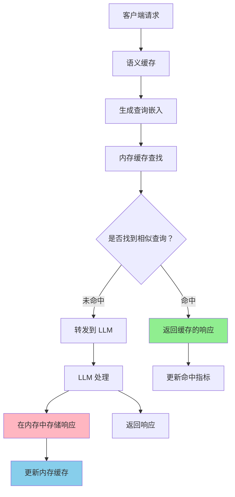

---
translation:
  source_commit: "bac2743"
  source_file: "docs/tutorials/semantic-cache/in-memory-cache.md"
  outdated: false
---

# 内存语义缓存 (In-Memory Semantic Cache)

内存缓存后端直接在内存中存储语义嵌入和缓存的响应，以实现快速的本地缓存。

## 概览

内存缓存将所有缓存数据存储在应用程序的内存中，提供低延迟访问，且无需外部依赖。

## 架构



## 工作原理

### 写入路径 (Write Path)

缓存响应时：

1. 使用配置的嵌入模型为查询生成嵌入
2. 在内存中存储嵌入和响应
3. 应用 TTL（如果已配置）
4. 如果达到 `max_entries` 限制，驱逐最早/最少使用的条目

### 读取路径 (Read Path)

搜索缓存的响应时：

1. 为传入的查询生成嵌入
2. 在内存缓存中搜索相似的嵌入
3. 如果相似度超过阈值，返回缓存的响应（缓存命中）
4. 否则，转发到 LLM 并缓存新的响应（缓存未命中）

### 搜索方法

该缓存支持两种搜索方法：

- **线性搜索**：将查询嵌入与所有缓存的嵌入进行对比
- **HNSW 索引**：使用分层图结构实现更快的近似最近邻搜索

## 配置

### 基础配置

```yaml
# config/config.yaml
semantic_cache:
  enabled: true
  backend_type: "memory"
  similarity_threshold: 0.8       # 全局默认阈值
  max_entries: 1000
  ttl_seconds: 3600
  eviction_policy: "fifo"
```

### 带有 HNSW 的配置

```yaml
semantic_cache:
  enabled: true
  backend_type: "memory"
  similarity_threshold: 0.8
  max_entries: 1000
  ttl_seconds: 3600
  eviction_policy: "fifo"
  # 使用 HNSW 索引以实现更快的搜索
  use_hnsw: true
  hnsw_m: 16
  hnsw_ef_construction: 200
```

### 类别级配置（新功能）

按类别配置缓存设置，以实现精细控制：

```yaml
semantic_cache:
  enabled: true
  backend_type: "memory"
  similarity_threshold: 0.8       # 全局默认值
  max_entries: 1000
  ttl_seconds: 3600
  eviction_policy: "fifo"

categories:
  - name: health
    system_prompt: "你是一位健康专家..."
    semantic_cache_enabled: true
    semantic_cache_similarity_threshold: 0.95  # 对医疗准确性要求非常严格
    model_scores:
      - model: your-model
        score: 0.5
        use_reasoning: false

  - name: general_chat
    system_prompt: "你是一位乐于助人的助手..."
    semantic_cache_similarity_threshold: 0.75  # 放宽以获得更好的命中率
    model_scores:
      - model: your-model
        score: 0.7
        use_reasoning: false

  - name: troubleshooting
    # 无缓存设置 - 使用全局默认值 (0.8)
    model_scores:
      - model: your-model
        score: 0.7
        use_reasoning: false
```

### 配置选项

| 参数 | 类型 | 默认值 | 描述 |
|-----------|------|---------|-------------|
| `enabled` | boolean | `false` | 全局启用/禁用语义缓存 |
| `backend_type` | string | `"memory"` | 缓存后端类型（必须为 "memory"） |
| `similarity_threshold` | float | `0.8` | 全局缓存命中的最小相似度 (0.0-1.0) |
| `max_entries` | integer | `1000` | 缓存条目的最大数量 |
| `ttl_seconds` | integer | `3600` | 缓存条目的生存时间（秒，0 = 永不过期） |
| `eviction_policy` | string | `"fifo"` | 驱逐策略：`"fifo"`, `"lru"`, `"lfu"` |
| `use_hnsw` | boolean | `false` | 启用 HNSW 索引进行相似度搜索 |
| `hnsw_m` | integer | `16` | HNSW M 参数（每个节点的双向链路数） |
| `hnsw_ef_construction` | integer | `200` | HNSW efConstruction 参数（构建质量） |

### HNSW 参数

内存缓存支持 HNSW (Hierarchical Navigable Small World) 索引，可显著加快相似度搜索速度，尤其在缓存规模较大时效果显著。

#### 何时使用 HNSW

- **大型缓存规模** (>100 条目)：HNSW 提供对数级的搜索时间，而线性搜索是线性的
- **高查询吞吐量**：降低相似度搜索的 CPU 使用率
- **生产部署**：在高负载下表现更好

#### HNSW 配置

```yaml
semantic_cache:
  enabled: true
  backend_type: "memory"
  similarity_threshold: 0.8
  max_entries: 10000           # 大型缓存受益于 HNSW
  ttl_seconds: 3600
  eviction_policy: "lru"
  use_hnsw: true               # 启用 HNSW 索引
  hnsw_m: 16                   # 默认值：16（越高 = 召回率越好，内存占用越多）
  hnsw_ef_construction: 200    # 默认值：200（越高 = 质量越好，构建越慢）
```

#### HNSW 参数详解

- **`hnsw_m`**：为图中每个节点创建的双向链路数量。
  - 较低值 (8-12)：构建更快，内存占用更少，召回率较低。
  - 默认值 (16)：性能均衡。
  - 较高值 (32-64)：召回率更好，内存占用更多，构建更慢。

- **`hnsw_ef_construction`**：索引构建期间动态候选列表的大小。
  - 较低值 (100-150)：索引构建速度更快。
  - 默认值 (200)：良好的平衡。
  - 较高值 (400-800)：质量更好，构建更慢。

#### 性能对比

| 缓存大小 | 线性搜索 | HNSW 搜索 | 加速倍数 |
|-----------|---------------|-------------|---------|
| 100 条目 | ~0.5ms | ~0.4ms | 1.25x |
| 1,000 条目 | ~5ms | ~0.8ms | 6.25x |
| 10,000 条目 | ~50ms | ~1.2ms | 41.7x |
| 100,000 条目 | ~500ms | ~1.5ms | 333x |

*在典型硬件上使用 384 维嵌入进行基准测试的结果*

### 类别级配置选项

| 参数 | 类型 | 默认值 | 描述 |
|-----------|------|---------|-------------|
| `semantic_cache_enabled` | boolean | (继承全局) | 为此类别启用/禁用缓存 |
| `semantic_cache_similarity_threshold` | float | (继承全局) | 类别特定的相似度阈值 (0.0-1.0) |

类别级设置会覆盖全局设置。如果未指定，类别将使用全局缓存配置。

### 决策级配置（基于插件）

通过插件在决策级别配置语义缓存，以实现精细控制：

```yaml
signals:
  domains:
    - name: "math"
      description: "数学查询"
      mmlu_categories: ["math"]

decisions:
  - name: math_route
    description: "路由数学查询并使用严格缓存"
    priority: 100
    rules:
      operator: "AND"
      conditions:
        - type: "domain"
          name: "math"
    modelRefs:
      - model: "openai/gpt-oss-120b"
        use_reasoning: true
    plugins:
      - type: "semantic-cache"
        configuration:
          enabled: true
          similarity_threshold: 0.95  # 对数学准确性要求非常严格

  - name: general_route
    description: "路由通用查询并使用宽松缓存"
    priority: 50
    rules:
      operator: "AND"
      conditions:
        - type: "domain"
          name: "other"
    modelRefs:
      - model: "openai/gpt-oss-120b"
        use_reasoning: false
    plugins:
      - type: "semantic-cache"
        configuration:
          enabled: true
          similarity_threshold: 0.75  # 放宽以获得更好的命中率
```

**插件配置选项**：

- **`enabled`**：为此决策启用/禁用缓存 (boolean)
- **`similarity_threshold`**：决策特定的相似度阈值 (0.0-1.0)

决策级插件设置会同时覆盖全局和类别级设置。

### 环境示例

#### 开发环境 (Development)

```yaml
semantic_cache:
  enabled: true
  backend_type: "memory"
  similarity_threshold: 0.9     # 测试时使用严格匹配
  max_entries: 500             # 开发时使用小型缓存
  ttl_seconds: 1800            # 30 分钟
  eviction_policy: "fifo"
  use_hnsw: false              # 小型开发缓存可选
```

#### 生产环境 (Production) - 开启 HNSW

```yaml
semantic_cache:
  enabled: true
  backend_type: "memory"
  similarity_threshold: 0.85
  max_entries: 50000           # 大型生产环境缓存
  ttl_seconds: 7200            # 2 小时
  eviction_policy: "lru"
  use_hnsw: true               # 生产环境建议开启
  hnsw_m: 16
  hnsw_ef_construction: 200
```

## 设置与测试

### 启用内存缓存

更新您的配置文件：

```bash
# 编辑 config/config.yaml
cat >> config/config.yaml << EOF
semantic_cache:
  enabled: true
  backend_type: "memory"
  similarity_threshold: 0.85
  max_entries: 1000
  ttl_seconds: 3600
EOF
```

### 启动路由

```bash
# 启动Semantic Router 
make run-router

# 或直接运行
./bin/router --config config/config.yaml
```

### 测试缓存功能

发送请求以验证缓存行为：

```bash
# 第一次请求（缓存未命中）
curl -X POST http://localhost:8080/v1/chat/completions \
  -H "Content-Type: application/json" \
  -d '{
    "model": "MoM",
    "messages": [{"role": "user", "content": "什么是机器学习？"}]
  }'

# 第二次完全相同的请求（缓存命中）
curl -X POST http://localhost:8080/v1/chat/completions \
  -H "Content-Type: application/json" \
  -d '{
    "model": "MoM",
    "messages": [{"role": "user", "content": "什么是机器学习？"}]
  }'

# 相似的请求（语义缓存命中）
curl -X POST http://localhost:8080/v1/chat/completions \
  -H "Content-Type: application/json" \
  -d '{
    "model": "MoM",
    "messages": [{"role": "user", "content": "解释机器学习的概念"}]
  }'
```

## 特性

### 存储

- 数据存储在应用程序内存中
- 应用程序重启时缓存会被清空
- 受限于可用的系统内存

### 访问模式

- 直接内存访问，无网络开销
- 无需外部依赖

### 驱逐策略 (Eviction Policies)

- **FIFO**：先进先出 - 移除最早的条目
- **LRU**：最近最少使用 - 移除最近最少访问的条目
- **LFU**：最不经常使用 - 移除访问频率最低的条目

### TTL 管理

- 条目可以具有生存时间 (TTL)
- 过期条目会在清理操作期间被移除

## 下一步

- **[混合缓存](./hybrid-cache.md)** - 了解 HNSW + Milvus 混合缓存
- **[Milvus 缓存](./milvus-cache.md)** - 了解持久化向量数据库缓存
- **[可观测性](../observability/metrics.md)** - 监控缓存性能
