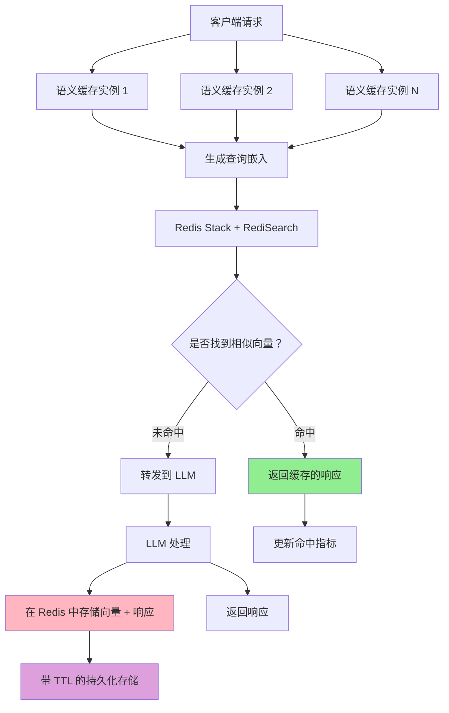

---
translation:
  source_commit: "bac2743"
  source_file: "docs/tutorials/semantic-cache/redis-cache.md"
  outdated: false
---

# Redis 语义缓存 (Redis Semantic Cache)

Redis 缓存后端使用带有 RediSearch 的 Redis Stack 提供持久化、高性能的语义缓存。与专用向量数据库相比，该方案在提供卓越性能的同时，具有较低的运维复杂度。

## 概览

Redis 缓存非常适合：

- 需要快速响应时间的**生产环境**
- **单机或集群** Redis 部署
- 具有高效内存使用要求的**中大型应用**
- 具有可选 TTL 过期功能的**持久化存储**
- 使用熟悉的 Redis 工具实现**简化运维**

## 架构



## 配置

### Redis 后端配置

在 `config/semantic-cache/redis.yaml` 中配置：

```yaml
# config/semantic-cache/redis.yaml
connection:
  address: "localhost:6379"
  password: ""
  db: 0
  pool_size: 10
  max_retries: 3
  dial_timeout_ms: 5000
  read_timeout_ms: 3000
  write_timeout_ms: 3000
  tls:
    enabled: false

index:
  name: "semantic_cache_idx"
  prefix: "doc:"
  vector_field:
    name: "embedding"
    dimension: 384  # 必须与嵌入模型的维度匹配
    algorithm: "HNSW"
    metric_type: "COSINE"
    hnsw:
      m: 16
      ef_construction: 200
      ef_runtime: 10

search:
  top_k: 5

development:
  drop_index_on_startup: false
  log_level: "info"
```

## 设置与部署

### 1. 启动 Redis Stack

```bash
# 使用 Docker
make start-redis

# 验证 Redis 是否正在运行
docker exec redis-semantic-cache redis-cli PING
```

### 2. 配置Semantic Router 

基础 Redis 配置：

- 在 `config/config.yaml` 中设置 `backend_type: "redis"`
- 在 `config/config.yaml` 中设置 `backend_config_path: "config/semantic-cache/redis.yaml"`

```yaml
# config/config.yaml
semantic_cache:
  enabled: true
  backend_type: "redis"
  backend_config_path: "config/semantic-cache/redis.yaml"
  similarity_threshold: 0.8
  ttl_seconds: 3600
```

### 决策级配置（基于插件）

您还可以使用插件在决策级别配置 Redis 缓存：

```yaml
signals:
  domains:
    - name: "math"
      description: "数学查询"
      mmlu_categories: ["math"]

decisions:
  - name: math_route
    description: "路由数学查询并使用严格缓存"
    priority: 100
    rules:
      operator: "AND"
      conditions:
        - type: "domain"
          name: "math"
    modelRefs:
      - model: "openai/gpt-oss-120b"
        use_reasoning: true
    plugins:
      - type: "semantic-cache"
        configuration:
          enabled: true
          similarity_threshold: 0.95  # 对数学准确性要求非常严格
```

### 3. 运行Semantic Router 

```bash
# 启动路由
make run-router
```

运行 EnvoyProxy：

```bash
# 启动 Envoy 代理
make run-envoy
```

### 4. 测试 Redis 缓存

```bash
# 发送完全相同的请求以观察缓存命中
curl -X POST http://localhost:8080/v1/chat/completions \
  -H "Content-Type: application/json" \
  -d '{
    "model": "MoM",
    "messages": [{"role": "user", "content": "什么是机器学习？"}]
  }'

# 发送相似请求（应由于语义相似度而命中缓存）
curl -X POST http://localhost:8080/v1/chat/completions \
  -H "Content-Type: application/json" \
  -d '{
    "model": "MoM",
    "messages": [{"role": "user", "content": "解释机器学习"}]
  }'
```

## 下一步

- **[Milvus 缓存](./milvus-cache.md)** - 与 Milvus 向量数据库进行对比
- **[内存缓存](./in-memory-cache.md)** - 与内存缓存进行对比
- **[可观测性](../observability/metrics.md)** - 监控 Redis 性能
