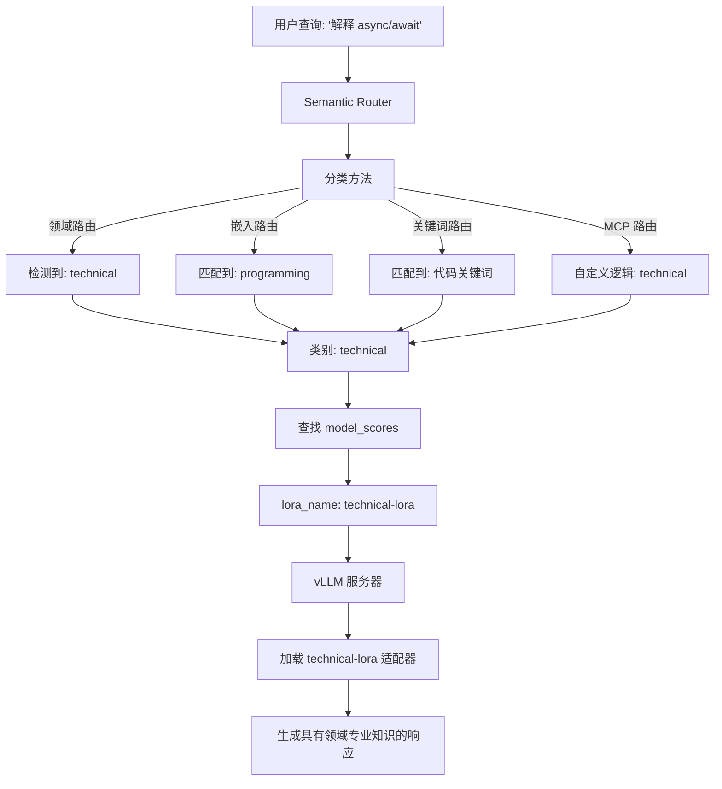

---
translation:
  source_commit: "bac2743"
  source_file: "docs/tutorials/intelligent-route/lora-routing.md"
  outdated: false
---

# 智能 LoRA 路由 (Intelligent LoRA Routing)

本指南向您展示如何结合智能路由（领域/嵌入/关键词/MCP）与 LoRA 适配器，将请求路由到特定领域的模型。LoRA 路由使用前述指南中的分类方法来检测意图，然后自动在 vLLM 后端选择适当的 LoRA 适配器。

## 关键优势

- **意图感知的适配器选择**：结合任何分类方法（领域/嵌入/关键词/MCP）与 LoRA 适配器
- **内存高效**：跨多个领域适配器共享基础模型权重（每个适配器增加的参数量 &lt;1%）
- **对用户透明**：用户向一个端点发送请求，路由负责处理适配器选择
- **灵活的分类**：为您的用例选择最佳路由方法（为了准确性选择领域路由，为了合规性选择关键词路由等）

## 它解决了什么问题？

vLLM 支持多个 LoRA 适配器，但用户必须手动指定使用哪个适配器。LoRA 路由将此过程自动化：

- **手动适配器选择**：用户不知道该使用哪个适配器 → 路由分类意图并自动选择适配器
- **内存效率**：多个完整模型无法装入 GPU → LoRA 适配器共享基础权重（每个适配器约 1% 开销）
- **部署简化**：管理多个模型端点很复杂 → 单个 vLLM 实例即可服务所有适配器
- **意图检测**：通用基础模型缺乏领域专业知识 → 路由根据查询内容路由到专业的适配器

## 何时使用

- 具有针对不同领域（技术、医疗、法律等）的 LoRA 适配器的**多领域 vLLM 部署**
- 希望用户发送请求而无需知道适配器名称的**自动适配器选择**场景
- **结合分类 + LoRA**：使用领域路由获得准确性，使用关键词路由满足合规性，或使用 MCP 实现自定义逻辑
- 多个完整模型无法装入但 LoRA 适配器可以装入的**内存受限场景**
- 通过调整类别评分来**A/B 测试**不同版本的适配器

## 配置

### 前提条件

- 一个运行中且启用了 LoRA 支持的 vLLM 服务器
- LoRA 适配器文件（针对特定领域进行了微调）
- Envoy + 路由（见 [安装](../../installation/installation.md) 指南）

### 1. 启动带有 LoRA 适配器的 vLLM

首先，启动您的 vLLM 服务器并启用 LoRA 支持：

```bash
vllm serve meta-llama/Llama-2-7b-hf \
  --enable-lora \
  --lora-modules \
    technical-lora=/path/to/technical-adapter \
    medical-lora=/path/to/medical-adapter \
    legal-lora=/path/to/legal-adapter \
  --host 0.0.0.0 \
  --port 8000
```

**关键标志**：

- `--enable-lora`：启用 LoRA 适配器支持
- `--lora-modules`：注册 LoRA 适配器的名称和路径
- 格式：`adapter-name=/path/to/adapter`

### 2. 路由配置

将以下内容放入 `config/config.yaml`（或合并到现有配置中）：

```yaml
# 类别分类器（意图检测所需）
classifier:
  category_model:
    model_id: "models/mom-domain-classifier"
    threshold: 0.6
    use_cpu: true
    category_mapping_path: "models/mom-domain-classifier/category_mapping.json"

# 托管您的基础模型 + LoRA 适配器的 vLLM 端点
vllm_endpoints:
  - name: "vllm-primary"
    address: "127.0.0.1"
    port: 8000
    weight: 1

# 定义基础模型和可用的 LoRA 适配器
model_config:
  "llama2-7b":
    reasoning_family: "llama2"
    preferred_endpoints: ["vllm-primary"]
    # 重要：在此处定义所有可用的 LoRA 适配器
    loras:
      - name: "technical-lora"
        description: "针对编程和技术问题进行了优化"
      - name: "medical-lora"
        description: "专注于医疗和健康领域"
      - name: "legal-lora"
        description: "针对法律问题进行了微调"

# 回退的默认模型
default_model: "llama2-7b"

# 带有 LoRA 路由的类别
categories:
  - name: "technical"
    description: "编程、软件工程和技术问题"
    system_prompt: "你是一位资深软件工程师。"
    model_scores:
      - model: "llama2-7b"           # 基础模型名称
        lora_name: "technical-lora"  # 要使用的 LoRA 适配器
        score: 1.0
        use_reasoning: true
        reasoning_effort: "medium"

  - name: "medical"
    description: "医疗和健康问题"
    system_prompt: "你是一位医学专家。"
    model_scores:
      - model: "llama2-7b"
        lora_name: "medical-lora"    # 医疗类使用不同的 LoRA
        score: 1.0
        use_reasoning: true
        reasoning_effort: "high"

  - name: "legal"
    description: "法律问题和法律相关主题"
    system_prompt: "你是一位法律专家。"
    model_scores:
      - model: "llama2-7b"
        lora_name: "legal-lora"      # 法律类使用不同的 LoRA
        score: 1.0
        use_reasoning: true
        reasoning_effort: "high"

  - name: "general"
    description: "通用问题"
    system_prompt: "你是一位乐于助人的助手。"
    model_scores:
      - model: "llama2-7b"           # 无 lora_name = 使用基础模型
        score: 0.8
        use_reasoning: false
```

## 工作原理

LoRA 路由结合了智能分类与 vLLM 的 LoRA 适配器支持：



**流程**：

1. **用户向路由发送查询**（不指定适配器）
2. 使用任何方法（领域/嵌入/关键词/MCP）进行**分类**以检测意图
3. **匹配到类别**（例如 "technical" 类别）
4. **路由查找**该类别的 `model_scores`
5. 通过 `lora_name` 字段**选择 LoRA 适配器**（例如 "technical-lora"）
6. **请求被转发**到 vLLM，并带有 `model="technical-lora"`
7. **vLLM 加载适配器**并生成具有领域特定知识的响应

**核心洞察**：分类方法（领域/嵌入/关键词/MCP）决定类别，然后类别的 `lora_name` 决定使用哪个适配器。

### 测试领域感知的 LoRA 路由

发送测试查询并验证它们是否被正确分类：

```bash
# 技术查询
curl -X POST http://localhost:8080/v1/chat/completions \
  -H "Content-Type: application/json" \
  -d '{"model": "MoM", "messages": [{"role": "user", "content": "解释 JavaScript 中的 async/await"}]}'

# 医疗查询
curl -X POST http://localhost:8080/v1/chat/completions \
  -H "Content-Type: application/json" \
  -d '{"model": "MoM", "messages": [{"role": "user", "content": "高血压的原因是什么？"}]}'
```

检查路由日志以确认每个查询是否选择了正确的 LoRA 适配器。

## 真实世界用例

### 1. 医疗平台（领域路由 + LoRA）

**问题**：医疗查询需要专业的适配器，但用户不知道该使用哪个
**解决方案**：领域路由将其分类为诊断/药剂/心理健康，并路由到相应的 LoRA 适配器
**影响**：适配器自动选择，占用 70GB 内存，而 3 个完整模型需要 210GB

### 2. 法律科技（关键词路由 + LoRA 以满足合规性）

**问题**：合规性要求将请求路由到特定司法管辖区的法律适配器，且需可审计
**解决方案**：关键词路由检测 "美国法律"/"欧盟法律"/"合同" 关键词，并路由到合规的 LoRA 适配器
**影响**：路由决策 100% 可审计，专业适配器的引用准确率达 95%

### 3. 客户支持（嵌入路由 + LoRA）

**问题**：支持查询涵盖 IT/HR/财务，用户表达方式多种多样
**解决方案**：嵌入路由匹配语义意图，并路由到部门特定的 LoRA 适配器
**影响**：能够处理释义，单个端点即可服务所有部门，适配器切换延迟 &lt;10ms

### 4. 教育科技平台（领域路由 + LoRA）

**问题**：学生询问数学/科学/文学问题，需要学科特定的导师
**解决方案**：领域路由分类学术科目，并路由到学科特定的 LoRA 适配器
**影响**：以 1.2 个基础模型的成本获得 4 个专业导师，节省 70% 成本

### 5. 多租户 SaaS (MCP 路由 + LoRA)

**问题**：每个租户都有自定义 LoRA 适配器，需要根据租户 ID 进行动态路由
**解决方案**：MCP 路由查询租户数据库，返回租户特定的 LoRA 适配器名称
**影响**：支持 1000+ 租户的自定义适配器，实现私有的路由逻辑，支持 A/B 测试

## 下一步

- 查看 [完整的 LoRA 路由示例](https://github.com/vllm-project/semantic-router/blob/main/config/intelligent-routing/in-tree/lora_routing.yaml)
- 了解 [决策配置](../../installation/configuration.md#决策规则---信号融合)
- 阅读 [模块化 LoRA 博客文章](https://blog.vllm.ai/2025/10/27/semantic-router-modular.html) 了解架构详情
