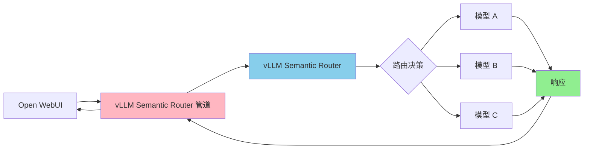

---
translation:
  source_commit: "7400d1f"
  source_file: "docs/tutorials/observability/open-webui-integration.md"
  outdated: false
---

# Open WebUI 集成

本指南介绍如何使用提供的管道 (Pipe) 将 vLLM Semantic Router 与 Open WebUI 集成。

## 架构



## 前提条件

- 已部署且可访问的 **vLLM Semantic Router **（推荐：通过 `kubectl apply -k deploy/kubernetes/` 进行 Kubernetes 部署）
- 已安装并运行的 **Open WebUI**

## 安装步骤

### 第 1 步：在 Open WebUI 中安装管道 (Pipe)

1. 打开您的 Open WebUI 实例，前往 **管理面板 (Admin Panel)** → **设置 (Settings)** → **管道 (Pipelines)**
2. 点击 **"+"** 添加新管道
3. 从 URL 导入管道：

   ```text
   https://raw.githubusercontent.com/vllm-project/semantic-router/main/tools/openwebui-pipe/vllm_semantic_router_pipe.py
   ```

1. 将管道切换为 **"已启用 (Enabled)"** 并点击 **"保存 (Save)"**

### 第 2 步：配置管道

点击管道旁边的**齿轮图标**以配置设置：

| 设置 | 描述 | 示例 |
|---------|-------------|---------|
| `vsr_base_url` | Semantic Router 端点 URL | `http://semantic-router.vllm-semantic-router-system.svc.cluster.local:8000` |
| `show_vsr_info` | 在聊天中显示路由决策 | `true` |
| `timeout` | 请求超时（秒） | `300` |

**对于 Kubernetes 部署**，请使用服务 DNS 名称：

```text
http://semantic-router.vllm-semantic-router-system.svc.cluster.local:8000
```

点击 **"保存 (Save)"** 应用配置。

### 第 3 步：使用模型

1. 进入 **聊天 (Chat)** 界面
2. 从模型下拉菜单中选择 **"vllm-semantic-router/auto"**
3. 开始聊天！

## 用法

管道将在聊天界面中显示路由信息：

```text
🔀 vLLM Semantic Router Decision 🔀

📂 用户意图类别: general-qa
⚡ 思维链 (CoT): off
🥷 隐藏模型: qwen2.5-7b-instruct
🎯 系统提示词优化: true
🔥 语义缓存: Hit (快速响应)
```

要隐藏此信息，请在管道配置中将 `show_vsr_info` 设置为 `false`。

## 故障排除

### 连接问题

如果您看到连接错误：

1. 验证Semantic Router 正在运行
2. 检查 `vsr_base_url` 是否正确
3. 对于 Kubernetes，确保服务 DNS 名称可以从 Open WebUI pod 访问

### 模型未出现

如果模型没有出现在选择器中：

1. 验证管道已在 **管理面板** → **管道** 中**启用**
2. 刷新 Open WebUI 页面
3. 如果需要，重启 Open WebUI
