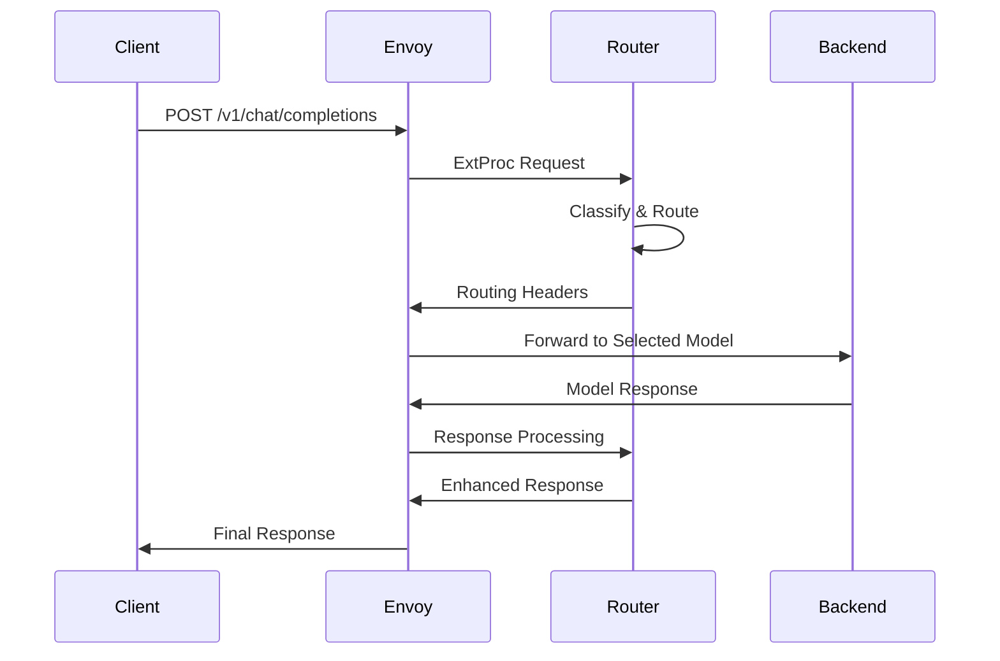

# Router API Reference

The Semantic Router provides a gRPC-based API that integrates seamlessly with Envoy's External Processing (ExtProc) protocol. This document covers the API endpoints, request/response formats, and integration patterns.

## API Overview

The Semantic Router operates as an ExtProc server that processes HTTP requests through Envoy Proxy. It doesn't expose direct REST endpoints but rather processes OpenAI-compatible API requests routed through Envoy.

> Note: In addition to the ExtProc path, this project also starts a lightweight HTTP Classification API on port 8080 for health/info and classification utilities. The OpenAI-compatible `/v1/models` endpoint is provided by this HTTP API (8080) and can be optionally exposed through Envoy (8801) via routing rules.

### Ports and endpoint mapping

- 8801 (HTTP, Envoy public entry)
  - Typical client entry for OpenAI-compatible requests like `POST /v1/chat/completions`.
  - Can proxy `GET /v1/models` to Router 8080 if you add an Envoy route; otherwise `/v1/models` at 8801 may return “no healthy upstream”.

- 8080 (HTTP, Classification API)
  - `GET /v1/models`  → OpenAI-compatible model list (includes synthetic `MoM`)
  - `GET /health`      → Classification API health
  - `GET /info/models` → Loaded classifier models + system info
  - `GET /info/classifier` → Classifier configuration details
  - `POST /api/v1/classify/intent|pii|security|batch` → Direct classification utilities

- 50051 (gRPC, ExtProc)
  - Envoy External Processing (ExtProc) for in-path classification/routing of `/v1/chat/completions`.
  - Not an HTTP port; not directly accessible via curl.

- 9190 (HTTP, Prometheus metrics)
  - `GET /metrics` → Prometheus scrape endpoint (global process metrics).

### Request Flow



## OpenAI API Compatibility

The router processes standard OpenAI API requests:

### Models Endpoint

Lists available models and includes a synthetic "MoM" (Mixture of Models) model that uses the router's intent classification to select the best underlying model per request.

- Endpoint: `GET /v1/models`
- Response:

```json
{
  "object": "list",
  "data": [
    { "id": "MoM", "object": "model", "created": 1726890000, "owned_by": "semantic-router" },
    { "id": "gpt-4o-mini", "object": "model", "created": 1726890000, "owned_by": "upstream-endpoint" },
    { "id": "llama-3.1-8b-instruct", "object": "model", "created": 1726890000, "owned_by": "upstream-endpoint" }
  ]
}
```

Notes:

- The concrete model list is sourced from your configured vLLM endpoints in `config.yaml` (see `vllm_endpoints[].models`).
- The special `MoM` (Mixture of Models) model is always present and instructs the router to classify and route to the best backend model automatically. For backward compatibility, the model name `auto` is also accepted as an alias.

### Chat Completions Endpoint

**Endpoint:** `POST /v1/chat/completions`

#### Request Format

```json
{
  "model": "gpt-3.5-turbo",
  "messages": [
    {
      "role": "user", 
      "content": "What is the derivative of x^2?"
    }
  ],
  "max_tokens": 150,
  "temperature": 0.7,
  "tools": [
    {
      "type": "function",
      "function": {
        "name": "calculator",
        "description": "Perform mathematical calculations"
      }
    }
  ]
}
```

#### Response Format

```json
{
  "id": "chatcmpl-abc123",
  "object": "chat.completion", 
  "created": 1677858242,
  "model": "gpt-3.5-turbo",
  "choices": [
    {
      "index": 0,
      "message": {
        "role": "assistant",
        "content": "The derivative of x^2 is 2x."
      },
      "finish_reason": "stop"
    }
  ],
  "usage": {
    "prompt_tokens": 12,
    "completion_tokens": 8,
    "total_tokens": 20
  },
  "routing_metadata": {
    "selected_model": "mathematics",
    "confidence": 0.96,
    "processing_time_ms": 15,
    "cache_hit": false,
    "security_checks": {
      "pii_detected": false,
      "jailbreak_detected": false
    }
  }
}
```

## Routing Headers

The router adds metadata headers to both requests and responses:

### Request Headers (Added by Router)

| Header | Description | Example |
|--------|-------------|---------|
| `x-vsr-destination-endpoint` | Backend endpoint selected | `endpoint1` |
| `x-selected-model` | Model category determined | `mathematics` |
| `x-routing-confidence` | Classification confidence | `0.956` |
| `x-request-id` | Unique request identifier | `req-abc123` |
| `x-cache-status` | Cache hit/miss status | `miss` |

### Response Headers (Added by Router)

| Header | Description | Example |
|--------|-------------|---------|
| `x-processing-time` | Total processing time (ms) | `45` |
| `x-classification-time` | Classification time (ms) | `12` |
| `x-security-checks` | Security check results | `pii:false,jailbreak:false` |
| `x-tools-selected` | Number of tools selected | `2` |

## Health Check API

The router provides health check endpoints for monitoring:

### Router Health

**Endpoint:** `GET http://localhost:8080/health`

```json
{
  "status": "healthy",
  "version": "1.0.0",
  "uptime": 3600,
  "models": {
    "category_classifier": "loaded",
    "pii_detector": "loaded", 
    "jailbreak_guard": "loaded"
  },
  "cache": {
    "status": "healthy",
    "entries": 1247,
    "hit_rate": 0.73
  },
  "endpoints": {
    "endpoint1": "healthy",
    "endpoint2": "healthy", 
    "endpoint3": "degraded"
  }
}
```

## Metrics API

Prometheus-compatible metrics are available:

**Endpoint:** `GET http://localhost:9090/metrics`

### Key Metrics

```prometheus
# Request metrics
semantic_router_requests_total{endpoint="endpoint1",category="mathematics",status="success"} 1247
semantic_router_request_duration_seconds{endpoint="endpoint1"} 0.045

# Classification metrics
semantic_router_classification_accuracy{category="mathematics"} 0.94
semantic_router_classification_duration_seconds 0.012

# Cache metrics  
semantic_router_cache_hit_ratio 0.73
semantic_router_cache_size 1247

# Security metrics
semantic_router_pii_detections_total{action="block"} 23
semantic_router_jailbreak_attempts_total{action="block"} 5

# Error metrics
llm_request_errors_total{model="gpt-4",reason="timeout"} 12
llm_request_errors_total{model="claude-3",reason="upstream_5xx"} 3
llm_request_errors_total{model="phi4",reason="upstream_4xx"} 5
llm_request_errors_total{model="phi4",reason="pii_policy_denied"} 8
```

### Reasoning Mode Metrics

The router exposes dedicated Prometheus counters to monitor reasoning mode decisions and template usage across model families. These metrics are emitted by the router and can be scraped by your Prometheus server.

- `llm_reasoning_decisions_total{category, model, enabled, effort}`
  - Description: Count of reasoning decisions made per category and selected model, with whether reasoning was enabled and the applied effort level.
  - Labels:
    - category: category name determined during routing
    - model: final selected model for the request
    - enabled: "true" or "false" depending on the decision
    - effort: effort level used when enabled (e.g., low|medium|high)

- `llm_reasoning_template_usage_total{family, param}`
  - Description: Count of times a model-family-specific template parameter was applied to requests.
  - Labels:
    - family: normalized model family (e.g., qwen3, deepseek, gpt-oss, gpt)
    - param: name of the template knob applied (e.g., enable_thinking, thinking, reasoning_effort)

- `llm_reasoning_effort_usage_total{family, effort}`
  - Description: Count of times a reasoning effort level was set for a given model family.
  - Labels:
    - family: normalized model family
    - effort: effort level (e.g., low|medium|high)

Example PromQL:

```prometheus
# Reasoning decisions by category and model (last 5m)
sum by (category, model, enabled, effort) (
  rate(llm_reasoning_decisions_total[5m])
)

# Template usage by model family and parameter (last 5m)
sum by (family, param) (
  rate(llm_reasoning_template_usage_total[5m])
)

# Effort distribution by model family (last 5m)
sum by (family, effort) (
  rate(llm_reasoning_effort_usage_total[5m])
)
```

### Cost and Routing Metrics

The router exposes additional metrics for cost accounting and routing decisions.

- `llm_model_cost_total{model, currency}`
  - Description: Total accumulated cost attributed to each model (computed from token usage and per-1M pricing), labeled by currency.
  - Labels:
    - model: model name used for the request
    - currency: currency code (e.g., "USD")

- `llm_routing_reason_codes_total{reason_code, model}`
  - Description: Count of routing decisions by reason code and selected model.
  - Labels:
    - reason_code: why a routing decision happened (e.g., auto_routing, model_specified, pii_policy_alternative_selected)
    - model: final selected model

Example PromQL:

```prometheus
# Cost by model and currency over the last hour
sum by (model, currency) (increase(llm_model_cost_total[1h]))

# Or, if you only use USD, a common query is:
sum by (model) (increase(llm_model_cost_total{currency="USD"}[1h]))

# Routing decisions by reason code over the last 15 minutes
sum by (reason_code) (increase(llm_routing_reason_codes_total[15m]))
```

### Request Error Metrics

The router tracks request-level failures by model and reason so you can monitor both absolute error throughput and the share of requests that fail.

- `llm_request_errors_total{model, reason}`
  - Description: Total number of request errors categorized by failure reason
  - Labels:
    - model: target model name for the failed request
    - reason: error category (timeout, upstream_4xx, upstream_5xx, pii_policy_denied, jailbreak_block, parse_error, serialization_error, cancellation, classification_failed, unknown)

Example PromQL queries:

```prometheus
# Total errors by reason over the last hour
sum by (reason) (increase(llm_request_errors_total[1h]))

# Error throughput (errors/sec) by model over the last 15 minutes.
# Helpful for incident response because it shows how many failing requests are impacting users.
sum by (model) (rate(llm_request_errors_total[15m]))

# Error ratio (% of requests failing) by model over the last 15 minutes.
# Use increase() to align numerator and denominator with the same lookback window.
100 * sum by (model) (increase(llm_request_errors_total[15m])) /
    sum by (model) (increase(llm_model_requests_total[15m]))

# PII policy blocks over the last 24 hours
sum(increase(llm_request_errors_total{reason="pii_policy_denied"}[24h]))
```

### TTFT and TPOT Metrics

Time-to-first-token (TTFT) and time-per-output-token (TPOT) are exported as Prometheus histograms and can be visualized at p95 with histogram_quantile.

- `llm_model_ttft_seconds{model}`
  - Histogram: Exposes `_bucket`, `_sum`, `_count`
  - Description: Time to first token since the router started processing the request
  - Example p95 (last 5m) by model:

```prometheus
histogram_quantile(0.95, sum(rate(llm_model_ttft_seconds_bucket[5m])) by (le, model))
```

- `llm_model_tpot_seconds{model}`
  - Histogram: Exposes `_bucket`, `_sum`, `_count`
  - Description: Seconds per output token (completion latency / completion tokens)
  - Example p95 (last 5m) by model:

```prometheus
histogram_quantile(0.95, sum(rate(llm_model_tpot_seconds_bucket[5m])) by (le, model))
```

These are included in the provided Grafana dashboard at deploy/llm-router-dashboard.json as “TTFT (p95) by Model” and “TPOT (p95) by Model (sec/token)”.

#### Streaming (SSE) notes

- For Server-Sent Events (SSE) responses, the router measures TTFT on the first streamed body chunk (i.e., the first token), not on response headers.
- No manual change to your Envoy config is required: the ExtProc handler automatically sets a ModeOverride with `response_body_mode: STREAMED` for SSE responses so the first chunk reaches ExtProc immediately.
- Prerequisite: Envoy’s ext_proc filter must have `allow_mode_override: true` (the default configs in `config/envoy.yaml` and `config/envoy-docker.yaml` already include this). Keeping `response_body_mode: BUFFERED` in the static processing mode is fine; the router will flip it to STREAMED at runtime for SSE.

### Pricing Configuration

Provide per-1M pricing for your models so the router can compute request cost and emit metrics/logs.

```yaml
model_config:
  phi4:
    pricing:
      currency: USD
      prompt_per_1m: 0.07
      completion_per_1m: 0.35
  "mistral-small3.1":
    pricing:
      currency: USD
      prompt_per_1m: 0.1
      completion_per_1m: 0.3
  gemma3:27b:
    pricing:
      currency: USD
      prompt_per_1m: 0.067
      completion_per_1m: 0.267
```

Notes:

- Pricing is optional; if omitted, cost is treated as 0 and only token metrics are emitted.
- Cost is computed as: (prompt_tokens * prompt_per_1m + completion_tokens * completion_per_1m) / 1_000_000 (in the configured currency).

## gRPC ExtProc API

For direct integration with the ExtProc protocol:

### Service Definition

```protobuf
syntax = "proto3";

package envoy.service.ext_proc.v3;

service ExternalProcessor {
  rpc Process(stream ProcessingRequest) returns (stream ProcessingResponse);
}

message ProcessingRequest {
  oneof request {
    RequestHeaders request_headers = 1;
    RequestBody request_body = 2;
    ResponseHeaders response_headers = 3;
    ResponseBody response_body = 4;
  }
}

message ProcessingResponse {
  oneof response {
    RequestHeadersResponse request_headers = 1;
    RequestBodyResponse request_body = 2;
    ResponseHeadersResponse response_headers = 3;
    ResponseBodyResponse response_body = 4;
  }
}
```

### Processing Methods

#### Request Headers Processing

```go
func (r *Router) handleRequestHeaders(headers *ProcessingRequest_RequestHeaders) *ProcessingResponse {
    // Extract request metadata
    // Set up request context
    // Return continue response
}
```

#### Request Body Processing

```go
func (r *Router) handleRequestBody(body *ProcessingRequest_RequestBody) *ProcessingResponse {
    // Parse OpenAI request
    // Classify query intent
    // Run security checks
    // Select optimal model
    // Return routing headers
}
```

## Error Handling

### Error Response Format

```json
{
  "error": {
    "message": "PII detected in request",
    "type": "security_violation",
    "code": "pii_detected",
    "details": {
      "entities_found": ["EMAIL", "PERSON"],
      "action_taken": "block"
    }
  }
}
```

### HTTP Status Codes

| Status | Description |
|--------|-------------|
| 200 | Success |
| 400 | Bad Request (malformed input) |
| 403 | Forbidden (security violation) |
| 429 | Too Many Requests (rate limited) |
| 500 | Internal Server Error |
| 503 | Service Unavailable (backend down) |

## Configuration API

### Runtime Configuration Updates

**Endpoint:** `POST /admin/config/update`

```json
{
  "classification": {
    "confidence_threshold": 0.8
  },
  "security": {
    "enable_pii_detection": true
  },
  "cache": {
    "ttl_seconds": 7200
  }
}
```

## WebSocket API (Optional)

For real-time streaming responses:

**Endpoint:** `ws://localhost:8801/v1/chat/stream`

```javascript
const ws = new WebSocket('ws://localhost:8801/v1/chat/stream');

ws.send(JSON.stringify({
  "model": "gpt-3.5-turbo",
  "messages": [{"role": "user", "content": "Tell me a story"}],
  "stream": true
}));

ws.onmessage = function(event) {
  const chunk = JSON.parse(event.data);
  console.log(chunk.choices[0].delta.content);
};
```

## Client Libraries

### Python Client

```python
import requests

class SemanticRouterClient:
    def __init__(self, base_url="http://localhost:8801"):
        self.base_url = base_url
        
    def chat_completion(self, messages, model="gpt-3.5-turbo", **kwargs):
        response = requests.post(
            f"{self.base_url}/v1/chat/completions",
            json={
                "model": model,
                "messages": messages,
                **kwargs
            }
        )
        return response.json()
        
    def get_health(self):
        response = requests.get(f"{self.base_url}/health")
        return response.json()

# Usage
client = SemanticRouterClient()
result = client.chat_completion([
    {"role": "user", "content": "What is 2 + 2?"}
])
```

### JavaScript Client

```javascript
class SemanticRouterClient {
    constructor(baseUrl = 'http://localhost:8801') {
        this.baseUrl = baseUrl;
    }
    
    async chatCompletion(messages, model = 'gpt-3.5-turbo', options = {}) {
        const response = await fetch(`${this.baseUrl}/v1/chat/completions`, {
            method: 'POST',
            headers: {
                'Content-Type': 'application/json'
            },
            body: JSON.stringify({
                model,
                messages,
                ...options
            })
        });
        
        return response.json();
    }
    
    async getHealth() {
        const response = await fetch(`${this.baseUrl}/health`);
        return response.json();
    }
}

// Usage
const client = new SemanticRouterClient();
const result = await client.chatCompletion([
    { role: 'user', content: 'Solve x^2 + 5x + 6 = 0' }
]);
```

## Rate Limiting

The router implements rate limiting with the following headers:

### Rate Limit Headers

```http
X-RateLimit-Limit: 1000
X-RateLimit-Remaining: 999
X-RateLimit-Reset: 1640995200
X-RateLimit-Retry-After: 60
```

### Rate Limit Response

```json
{
  "error": {
    "message": "Rate limit exceeded",
    "type": "rate_limit_error",
    "code": "too_many_requests",
    "details": {
      "limit": 1000,
      "window": "1h",
      "retry_after": 60
    }
  }
}
```

## Best Practices

### 1. Request Optimization

```python
# Include relevant context
messages = [
    {
        "role": "system", 
        "content": "You are a mathematics tutor."
    },
    {
        "role": "user",
        "content": "Explain derivatives in simple terms"
    }
]

# Use appropriate tools
tools = [
    {
        "type": "function",
        "function": {
            "name": "calculator",
            "description": "For mathematical calculations"
        }
    }
]
```

### 2. Error Handling

```python
try:
    response = client.chat_completion(messages)
    if 'error' in response:
        handle_router_error(response['error'])
    else:
        process_response(response)
        
except requests.exceptions.Timeout:
    handle_timeout_error()
except requests.exceptions.ConnectionError:
    handle_connection_error()
```

### 3. Monitoring Integration

```python
import time

start_time = time.time()
response = client.chat_completion(messages)
duration = time.time() - start_time

# Log routing metadata
routing_info = response.get('routing_metadata', {})
logger.info(f"Request routed to {routing_info.get('selected_model')} "
           f"with confidence {routing_info.get('confidence')} "
           f"in {duration:.2f}s")
```

## Next Steps

- **[Classification API](classification.md)**: Detailed classification endpoints
- **[Quick Start Guide](../installation/installation.md)**: Real-world integration examples
- **[Configuration Guide](../installation/configuration.md)**: Production configuration

For more advanced API usage and custom integrations, refer to the examples directory or join our community discussions.
