# TruthLens: Real-Time Hallucination Mitigation

**Version:** 1.0
**Authors:** vLLM Semantic Router Team
**Date:** December 2025

---

## Abstract

Large Language Models (LLMs) have demonstrated remarkable capabilities, yet their tendency to generate hallucinations—fluent but factually incorrect or ungrounded content—remains a critical barrier to enterprise AI adoption. Industry surveys consistently show that hallucination risks are among the top concerns preventing organizations from deploying LLM-powered applications in production environments, particularly in high-stakes domains such as healthcare, finance, and legal services.

We propose **TruthLens**, a real-time hallucination detection and mitigation framework integrated into the vLLM Semantic Router. By positioning hallucination control at the inference gateway layer, TruthLens provides a model-agnostic, centralized solution that addresses the "accuracy-latency-cost" triangle through configurable mitigation strategies. Users can select from three operational modes based on their tolerance for cost and accuracy trade-offs: (1) **Lightweight Mode**—single-round detection with warning injection, (2) **Standard Mode**—iterative self-refinement with the same model, and (3) **Premium Mode**—multi-model cross-verification and collaborative correction. This design enables organizations to deploy trustworthy AI systems while maintaining control over operational costs and response latency.

---

## 1. Introduction: The Hallucination Crisis in Enterprise AI

### 1.1 The Core Problem

Hallucinations represent the most significant barrier to enterprise AI adoption today. Unlike traditional software bugs, LLM hallucinations are:

- **Unpredictable**: They occur randomly across different queries and contexts
- **Convincing**: Hallucinated content often appears fluent, confident, and plausible
- **High-stakes**: A single hallucination in medical, legal, or financial domains can cause irreversible harm
- **Invisible**: Without specialized detection, users cannot distinguish hallucinations from accurate responses

**Industry Impact by Domain:**

| Domain | Hallucination Risk Tolerance | Typical Mitigation Approach |
|--------|------------------------------|----------------------------|
| Healthcare | Near-zero (life-critical) | Mandatory human verification, liability concerns |
| Financial Services | Very low (regulatory) | Compliance-driven review processes |
| Legal | Very low (liability) | Restricted to internal research and drafting |
| Customer Support | Moderate | Escalation protocols for uncertain responses |
| Creative/Marketing | High tolerance | Minimal intervention required |

*Note: Based on enterprise deployment patterns observed across industry surveys (McKinsey 2024, Gartner 2024, Menlo Ventures 2024).*

### 1.2 Why Existing Solutions Fall Short

Current approaches to hallucination mitigation operate at the wrong layer of the AI stack:

```mermaid
flowchart TB
    subgraph "Current Approaches (Fragmented)"
        direction TB
        A[RAG/Grounding] -->|Pre-generation| B[Reduces but doesn't eliminate]
        C[Fine-tuning] -->|Training time| D[Expensive, model-specific]
        E[Prompt Engineering] -->|Per-application| F[Inconsistent, no guarantees]
        G[Offline Evaluation] -->|Post-hoc| H[Cannot prevent real-time harm]
    end

    subgraph "The Gap"
        I[❌ No real-time detection at inference]
        J[❌ No centralized control point]
        K[❌ No cost-aware mitigation options]
    end
```

### 1.3 Why vLLM Semantic Router is the Ideal Solution Point

The vLLM Semantic Router occupies a unique position in the AI infrastructure stack that makes it ideally suited for hallucination mitigation:

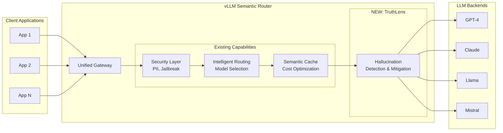

**Key Advantages of Gateway-Level Hallucination Control:**

| Advantage | Description |
|-----------|-------------|
| **Model-Agnostic** | Works with any LLM backend without modification |
| **Centralized Policy** | Single configuration point for all applications |
| **Cost Control** | Organization-wide visibility into accuracy vs. cost trade-offs |
| **Incremental Adoption** | Enable per-decision, per-domain policies |
| **Observability** | Unified metrics, logging, and alerting for hallucination events |
| **Defense in Depth** | Complements (not replaces) RAG and prompt engineering |

### 1.4 Formal Problem Definition

We formalize hallucination detection in Retrieval-Augmented Generation (RAG) systems as a **token-level sequence labeling** problem.

**Definition 1 (RAG Context).** Let a RAG interaction be defined as a tuple *(C, Q, R)* where:

- *C = \{c₁, c₂, ..., cₘ\}* is the retrieved context (set of documents/passages)
- *Q* is the user query
- *R = (r₁, r₂, ..., rₙ)* is the generated response as a sequence of *n* tokens

**Definition 2 (Grounded vs. Hallucinated Tokens).** A token *rᵢ* in response *R* is:

- **Grounded** if there exists evidence in *C* that supports the claim containing *rᵢ*
- **Hallucinated** if *rᵢ* contributes to a claim that:
  - (a) Contradicts information in *C* (contradiction hallucination), or
  - (b) Cannot be verified from *C* and is not common knowledge (ungrounded hallucination)

**Definition 3 (Hallucination Detection Function).** The detection task is to learn a function:

*f: (C, Q, R) → Y*

where *Y = (y₁, y₂, ..., yₙ)* and *yᵢ ∈ \{0, 1\}* indicates whether token *rᵢ* is hallucinated.

**Definition 4 (Hallucination Score).** Given predictions *Y* and confidence scores *P = (p₁, ..., pₙ)* where *pᵢ = P(yᵢ = 1)*, we define:

- **Token-level score**: *s_token(rᵢ) = pᵢ*
- **Span-level score**: For a contiguous span *S = (rᵢ, ..., rⱼ)*, *s_span(S) = max(pᵢ, ..., pⱼ)*
- **Response-level score**: *s_response(R) = 1 - ∏(1 - pᵢ)* for all *i* where *pᵢ > τ_token*

**Definition 5 (Mitigation Decision).** Given threshold *τ*, the system takes action:

```text
Action(R) =
  PASS        if s_response(R) < τ
  MITIGATE    if s_response(R) ≥ τ
```

---

## 2. Related Work: State-of-the-Art in Hallucination Mitigation

### 2.1 Taxonomy of Hallucination Types

Before reviewing detection methods, we establish a taxonomy of hallucination types:

**Type 1: Intrinsic Hallucination** — Generated content contradicts the provided context.

*Example*: Context says "The meeting is on Tuesday." Response says "The meeting is scheduled for Wednesday."

**Type 2: Extrinsic Hallucination** — Generated content cannot be verified from the context and is not common knowledge.

*Example*: Context discusses a company's Q3 earnings. Response includes Q4 projections not mentioned anywhere.

**Type 3: Fabrication** — Entirely invented entities, citations, or facts.

*Example*: "According to Smith et al. (2023)..." where no such paper exists.

| Type | Detection Difficulty | Mitigation Approach |
|------|---------------------|---------------------|
| Intrinsic | Easier (direct contradiction) | Context re-grounding |
| Extrinsic | Medium (requires knowledge boundary) | Uncertainty expression |
| Fabrication | Harder (requires external verification) | Cross-reference checking |

### 2.2 Detection Methods

| Category | Representative Work | Mechanism | Accuracy | Latency | Cost |
|----------|---------------------|-----------|----------|---------|------|
| **Encoder-Based** | LettuceDetect (2025), Luna (2025) | Token classification with ModernBERT/DeBERTa | F1: 75-79% | 15-35ms | Low |
| **Self-Consistency** | SelfCheckGPT (2023) | Multiple sampling + consistency check | Varies | Nx base | High |
| **Cross-Model** | Finch-Zk (2025) | Multi-model response comparison | F1: +6-39% | 2-3x base | High |
| **Internal States** | MIND (ACL 2024) | Hidden layer activation analysis | High | \<10ms | Requires instrumentation |

#### 2.2.1 Encoder-Based Detection (Deep Dive)

**LettuceDetect** (Kovács et al., 2025) frames hallucination detection as **token-level sequence labeling**:

- **Architecture**: ModernBERT-large (395M parameters) with classification head
- **Input**: Concatenated [Context, Query, Response] with special tokens
- **Output**: Per-token probability of hallucination
- **Training**: Fine-tuned on RAGTruth dataset (18K examples)
- **Key Innovation**: Long-context handling (8K tokens) enables full RAG context inclusion

**Performance on RAGTruth Benchmark**:

| Model | Token F1 | Example F1 | Latency |
|-------|----------|------------|---------|
| LettuceDetect-large | 79.22% | 74.8% | ~30ms |
| LettuceDetect-base | 76.5% | 71.2% | ~15ms |
| Luna (DeBERTa) | 73.1% | 68.9% | ~25ms |
| GPT-4 (zero-shot) | 61.2% | 58.4% | ~2s |

**Why Encoder-Based for TruthLens**: The combination of high accuracy, low latency, and fixed cost makes encoder-based detection ideal for gateway-level deployment.

#### 2.2.2 Self-Consistency Methods

**SelfCheckGPT** (Manakul et al., 2023) exploits the observation that hallucinations are inconsistent across samples:

- **Mechanism**: Generate N responses, measure consistency
- **Intuition**: Factual content is reproducible; hallucinations vary
- **Limitation**: Requires N LLM calls (typically N=5-10)

**Theoretical Basis**: If *P(fact)* is high, the fact appears in most samples. If *P(hallucination)* is low per-sample, it rarely repeats.

#### 2.2.3 Cross-Model Verification

**Finch-Zk** (2025) leverages model diversity:

- **Mechanism**: Compare responses from different model families
- **Key Insight**: Different models hallucinate differently
- **Segment-Level Correction**: Replace inconsistent segments with higher-confidence version

### 2.3 Mitigation Strategies

| Strategy | Representative Work | Mechanism | Effectiveness | Overhead |
|----------|---------------------|-----------|---------------|----------|
| **Self-Refinement** | Self-Refine (NeurIPS 2023) | Iterative feedback loop | 40-60% reduction | 2-4x latency |
| **Chain-of-Verification** | CoVe (ACL 2024) | Generate verification questions | 50-70% reduction | 3-5x latency |
| **Multi-Agent Debate** | MAD (2024) | Multiple agents argue and converge | 60-80% reduction | 5-10x latency |
| **Cross-Model Correction** | Finch-Zk (2025) | Targeted segment replacement | Up to 9% accuracy gain | 3x latency |

#### 2.3.1 Self-Refinement (Deep Dive)

**Self-Refine** (Madaan et al., NeurIPS 2023) demonstrates that LLMs can improve their own outputs:

```text
Loop:
  1. Generate initial response R₀
  2. Generate feedback F on R₀ (same model)
  3. Generate refined response R₁ using F
  4. Repeat until convergence or max iterations
```

**Key Findings**:

- Works best when feedback is **specific** (not just "improve this")
- Diminishing returns after 2-3 iterations
- Requires the model to have the knowledge to correct itself

**Limitation for Hallucination**: If the model lacks the correct knowledge, self-refinement may not help or may introduce new errors.

#### 2.3.2 Chain-of-Verification (CoVe)

**CoVe** (Dhuliawala et al., ACL 2024) generates verification questions:

```text
1. Generate response R
2. Extract factual claims from R
3. For each claim, generate verification question
4. Answer verification questions using context
5. Revise R based on verification results
```

**Advantage**: Explicit verification step catches subtle errors.
**Disadvantage**: High latency (3-5x) due to multi-step process.

#### 2.3.3 Multi-Agent Debate

**Multi-Agent Debate** (Du et al., 2024) uses multiple LLM instances:

```text
1. Multiple agents generate responses
2. Agents critique each other's responses
3. Agents revise based on critiques
4. Repeat for N rounds
5. Synthesize final response
```

**Theoretical Advantage**: Diverse perspectives catch blind spots.
**Practical Challenge**: High cost (5-10x) and latency.

### 2.3 The Accuracy-Latency-Cost Triangle

Research consistently shows a fundamental trade-off:

```mermaid
graph TD
    subgraph "The Trade-off Triangle"
        ACC[🎯 Accuracy]
        LAT[⚡ Latency]
        COST[💰 Cost]

        ACC ---|Trade-off| LAT
        LAT ---|Trade-off| COST
        COST ---|Trade-off| ACC
    end

    subgraph "Strategy Positioning"
        L[Lightweight Mode<br/>⚡💰 Fast & Cheap<br/>🎯 Moderate Accuracy]
        S[Standard Mode<br/>⚡🎯 Balanced<br/>💰 Moderate Cost]
        P[Premium Mode<br/>🎯💰 High Accuracy<br/>⚡ Higher Latency]
    end

    L --> LAT
    L --> COST
    S --> ACC
    S --> LAT
    P --> ACC
```

**Key Insight**: No single approach optimizes all three dimensions. TruthLens addresses this by offering **user-selectable operational modes** that let organizations choose their position on this trade-off triangle.

---

## 3. Theoretical Foundations

This section establishes the theoretical basis for TruthLens's three-mode architecture, drawing from sequence labeling, iterative optimization, ensemble learning, and multi-agent systems theory.

### 3.1 Hallucination Detection as Sequence Labeling

#### 3.1.1 Token Classification Architecture

Modern hallucination detection leverages transformer-based encoders fine-tuned for token classification. Given input sequence *X = [CLS] C [SEP] Q [SEP] R [SEP]*, the encoder produces contextualized representations:

*H = Encoder(X) ∈ ℝ^(L×d)*

where *L* is sequence length and *d* is hidden dimension. For each token *rᵢ* in the response, we compute:

*P(yᵢ = 1|X) = σ(W · hᵢ + b)*

where *W ∈ ℝ^d*, *b ∈ ℝ* are learned parameters and *σ* is the sigmoid function.

#### 3.1.2 Why ModernBERT for Detection

The choice of encoder architecture significantly impacts detection quality. We adopt ModernBERT (Warner et al., 2024) for the following theoretical advantages:

| Property | ModernBERT | Traditional BERT | Impact on Detection |
|----------|------------|------------------|---------------------|
| **Context Length** | 8,192 tokens | 512 tokens | Handles full RAG context without truncation |
| **Attention** | Rotary Position Embeddings (RoPE) | Absolute positional | Better long-range dependency modeling |
| **Architecture** | GeGLU activations, no biases | GELU, with biases | Improved gradient flow for fine-grained classification |
| **Efficiency** | Flash Attention, Unpadding | Standard attention | 2x inference speedup enables real-time detection |

#### 3.1.3 Scoring Function Design

The aggregation from token-level to response-level scores requires careful design. We propose a **noisy-OR** aggregation model:

*s_response(R) = 1 - ∏ᵢ(1 - pᵢ · 𝟙[pᵢ > τ_token])*

**Theoretical Justification**: The noisy-OR model assumes independence between hallucination events at different tokens. While this is an approximation, it provides:

1. **Monotonicity**: Adding a hallucinated token never decreases the response score
2. **Sensitivity**: Single high-confidence hallucination triggers detection
3. **Calibration**: Score approximates *P(∃ hallucination in R)*

**Alternative: Span-Based Aggregation**

For correlated hallucinations (common in fabricated entities), we first group contiguous hallucinated tokens into spans, then aggregate:

*s_response(R) = max\{s_span(S₁), s_span(S₂), ..., s_span(Sₖ)\}*

This reduces sensitivity to tokenization artifacts and focuses on semantic units.

#### 3.1.4 Threshold Selection Theory

The detection threshold *τ* controls the precision-recall trade-off. From decision theory:

**Proposition 1 (Optimal Threshold).** *Given cost ratio λ = C_FN / C_FP (cost of false negative vs. false positive), the optimal threshold satisfies:*

*τ* = 1 / (1 + λ · (1-π)/π)*

*where π is the prior probability of hallucination.*

**Practical Implications**:

| Domain | λ (Cost Ratio) | Recommended τ | Rationale |
|--------|----------------|---------------|-----------|
| Medical | 10-100 | 0.3-0.5 | Missing hallucination is catastrophic |
| Financial | 5-20 | 0.4-0.6 | Regulatory risk from false information |
| Customer Support | 1-2 | 0.6-0.7 | Balance user experience and accuracy |
| Creative | 0.1-0.5 | 0.8-0.9 | Over-flagging harms creativity |

### 3.2 Self-Refinement Theory

#### 3.2.1 Iterative Refinement as Fixed-Point Iteration

Standard Mode employs iterative self-refinement, which can be formalized as seeking a fixed point of a refinement operator.

**Definition 6 (Refinement Operator).** Let *T: R → R* be the refinement operator where:

*T(Rₜ) = LLM(Prompt_refine(C, Q, Rₜ, Detect(Rₜ)))*

The iteration proceeds as: *R₀ → R₁ → R₂ → ... → R**

**Theorem 1 (Convergence Conditions).** *The refinement sequence \{Rₜ\} converges to a fixed point R\* if:*

1. *The hallucination score sequence \{s(Rₜ)\} is monotonically non-increasing*
2. *The score is bounded below (s(R) ≥ 0)*
3. *The LLM exhibits consistency: similar prompts yield similar outputs*

**Proof Sketch**: Conditions 1 and 2 ensure the score sequence converges by the Monotone Convergence Theorem. Condition 3 (LLM consistency) ensures the response sequence itself converges, not just the scores.

#### 3.2.2 Convergence Rate Analysis

**Empirical Observation**: Self-refinement typically exhibits **sublinear convergence**:

*s(Rₜ) - s(R*) ≤ O(1/t)*

This is because:

1. **Easy hallucinations** (explicit contradictions) are corrected in early iterations
2. **Hard hallucinations** (subtle ungrounded claims) may persist or oscillate
3. **Diminishing returns** after 2-3 iterations in practice

```mermaid
graph LR
    subgraph "Convergence Pattern"
        R0[R₀<br/>s=0.8] -->|Iteration 1| R1[R₁<br/>s=0.5]
        R1 -->|Iteration 2| R2[R₂<br/>s=0.35]
        R2 -->|Iteration 3| R3[R₃<br/>s=0.3]
        R3 -.->|Diminishing returns| R4[R₄<br/>s=0.28]
    end
```

#### 3.2.3 Prompt Engineering Principles for Correction

Effective refinement prompts must satisfy several theoretical properties:

**Principle 1 (Specificity)**: The prompt must identify *which* spans are hallucinated, not just that hallucination exists.

**Principle 2 (Grounding)**: The prompt must provide the original context *C* to enable fact-checking.

**Principle 3 (Preservation)**: The prompt must instruct the model to preserve accurate content.

**Principle 4 (Uncertainty)**: When correction is not possible, the model should express uncertainty rather than fabricate alternatives.

**Refinement Prompt Template Structure**:

```text
Given:
- Context: [Retrieved passages C]
- Query: [User question Q]
- Response: [Current response Rₜ with hallucinated spans marked]

The following spans may be hallucinated: [List of (span, confidence)]

Instructions:
1. For each flagged span, verify against the context
2. If contradicted: correct using context evidence
3. If unverifiable and not common knowledge: remove or qualify with uncertainty
4. Preserve all accurate, well-grounded content
5. Maintain coherent narrative flow
```

### 3.3 Multi-Model Collaboration Theory

Premium Mode leverages multiple LLMs for cross-verification. We ground this in ensemble learning and multi-agent debate theory.

#### 3.3.1 Ensemble Learning Perspective

**Theorem 2 (Diversity-Accuracy Trade-off).** *For an ensemble of M models with individual error rate ε and pairwise correlation ρ, the ensemble error rate under majority voting is:*

*ε_ensemble ≈ ε · (1 + (M-1)ρ) / M*    *when ε < 0.5*

**Corollary**: Ensemble error approaches zero as M → ∞ only if ρ < 1 (models are diverse).

**Implications for TruthLens**:

| Model Combination | Expected Diversity (1-ρ) | Error Reduction |
|-------------------|--------------------------|-----------------|
| Same model family (GPT-4 variants) | Low (0.2-0.4) | 10-20% |
| Different families (GPT-4 + Claude) | Medium (0.4-0.6) | 30-50% |
| Different architectures (Transformer + other) | High (0.6-0.8) | 50-70% |

#### 3.3.2 Multi-Agent Debate Framework

Beyond simple voting, multi-agent debate enables models to **argue** about factual claims and converge on truth.

**Definition 7 (Argumentation Framework).** An argumentation framework is a pair *AF = (A, →)* where:

- *A* is a set of arguments (factual claims from each model)
- *→ ⊆ A × A* is an attack relation (contradictions between claims)

**Definition 8 (Grounded Extension).** The grounded extension *E* of AF is the maximal conflict-free set of arguments that defends itself against all attacks.

**Multi-Agent Debate Protocol**:

```mermaid
sequenceDiagram
    participant Q as Query
    participant M1 as Model A<br/>(Proponent)
    participant M2 as Model B<br/>(Critic)
    participant J as Judge Model

    Q->>M1: Generate response R₁
    Q->>M2: Generate response R₂

    M1->>M2: "Claim X is supported by context passage P"
    M2->>M1: "Claim X contradicts passage Q"

    loop Debate Rounds (max 3)
        M1->>M2: Refine argument with evidence
        M2->>M1: Counter-argument or concession
    end

    M1->>J: Final position + evidence
    M2->>J: Final position + evidence
    J->>Q: Synthesized response (grounded extension)
```

#### 3.3.3 Consensus Mechanisms

**Mechanism 1: Majority Voting**

*y_final(token) = argmax_y |\{m : f_m(token) = y\}|*

- Simple, fast
- Requires odd number of models
- Does not account for model confidence

**Mechanism 2: Weighted Confidence Aggregation**

*p_final(token) = Σₘ wₘ · pₘ(token) / Σₘ wₘ*

where *wₘ* is model m's calibrated reliability weight.

- Accounts for varying model expertise
- Requires calibrated confidence scores

**Mechanism 3: Segment-Level Replacement (Finch-Zk)**

For each claim segment *S* in response *R₁*:

1. Check if *S* appears (semantically) in *R₂*
2. If consistent: keep *S*
3. If inconsistent: replace with version from more reliable model
4. If only in *R₁*: flag as potentially hallucinated

This mechanism achieves fine-grained correction without full response regeneration.

### 3.4 Theoretical Justification for Three-Mode Architecture

#### 3.4.1 Pareto Frontier Analysis

The Accuracy-Latency-Cost space admits a Pareto frontier: points where improving one dimension requires sacrificing another.

**Proposition 2 (Three Operating Points).** *The Pareto frontier in the A-L-C space has three natural "knee points" corresponding to:*

1. **Cost-dominated regime** (Lightweight): Minimal intervention, detection-only
2. **Balanced regime** (Standard): Moderate refinement, single-model
3. **Accuracy-dominated regime** (Premium): Maximum verification, multi-model

```mermaid
graph TD
    subgraph "Pareto Frontier Visualization"
        direction LR

        A[Accuracy] ---|Trade-off| L[Latency]
        L ---|Trade-off| C[Cost]
        C ---|Trade-off| A

        subgraph "Operating Points"
            L1[🟢 Lightweight<br/>Low A, Low L, Low C]
            S1[🟡 Standard<br/>Med A, Med L, Med C]
            P1[🔴 Premium<br/>High A, High L, High C]
        end
    end
```

#### 3.4.2 Why Not Continuous Control?

One might ask: why discrete modes rather than continuous parameters?

**Argument 1 (Cognitive Load)**: Users cannot effectively reason about continuous trade-offs. Three discrete modes map to intuitive concepts: "fast/cheap," "balanced," "best quality."

**Argument 2 (Operational Complexity)**: Each mode involves qualitatively different mechanisms (detection-only vs. iteration vs. multi-model). Intermediate points would require complex interpolation.

**Argument 3 (Empirical Gaps)**: The Pareto frontier is not smooth—there are natural gaps where intermediate configurations offer little benefit over the nearest discrete mode.

#### 3.4.3 Mode Selection as Online Learning

In production, mode selection can be formulated as a **multi-armed bandit** problem:

- **Arms**: \{Lightweight, Standard, Premium\}
- **Reward**: User satisfaction (proxy: no negative feedback)
- **Cost**: Latency + API costs

**Thompson Sampling** approach: Maintain Beta distributions over success probability for each mode, sample and select, update based on outcome. This enables adaptive mode selection per query type.

---

## 4. System Architecture

### 4.1 High-Level Architecture

TruthLens integrates into the vLLM Semantic Router's ExtProc pipeline, creating a comprehensive request-response security boundary:

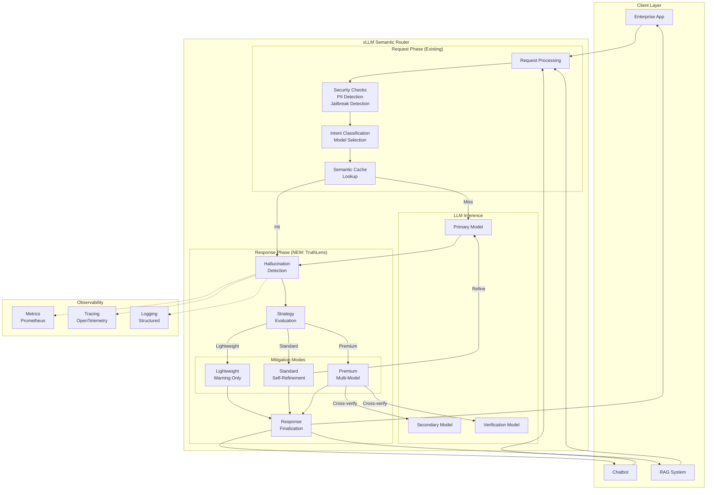

### 4.2 Detection Flow

The hallucination detection process operates on the complete context-query-response triple:

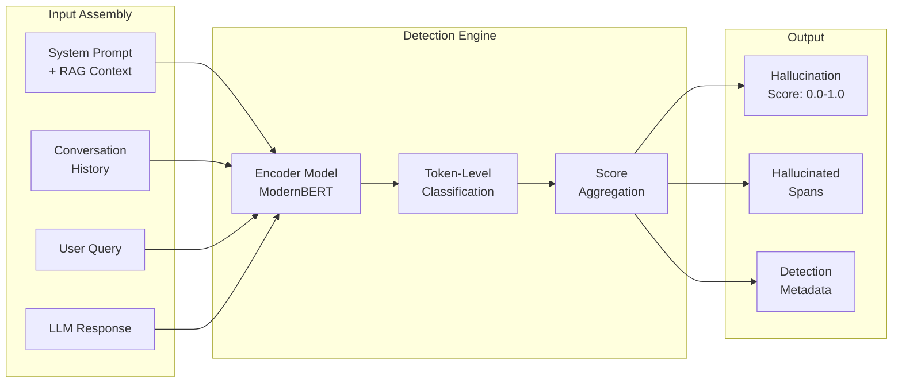

---

## 5. User Strategy Options: The Cost-Accuracy Spectrum

TruthLens provides three operational modes that allow organizations to position themselves on the cost-accuracy trade-off spectrum based on their specific requirements.

### 5.1 Strategy Overview

```mermaid
flowchart TB
    subgraph "User Selection"
        USER[Organization<br/>Requirements]
    end

    subgraph "Mode Selection"
        direction LR
        L[🟢 Lightweight Mode<br/>Cost Priority]
        S[🟡 Standard Mode<br/>Balanced]
        P[🔴 Premium Mode<br/>Accuracy Priority]
    end

    subgraph "Lightweight Mode"
        L1[Single Detection Pass]
        L2[Warning Injection Only]
        L3[No Additional LLM Calls]
    end

    subgraph "Standard Mode"
        S1[Detection + Self-Refinement]
        S2[Same Model Iteration]
        S3[Max 3-5 Iterations]
    end

    subgraph "Premium Mode"
        P1[Multi-Model Detection]
        P2[Cross-Verification]
        P3[Collaborative Correction]
    end

    USER --> L
    USER --> S
    USER --> P

    L --> L1 --> L2 --> L3
    S --> S1 --> S2 --> S3
    P --> P1 --> P2 --> P3
```

### 5.2 Mode Comparison Matrix

| Dimension | 🟢 Lightweight | 🟡 Standard | 🔴 Premium |
|-----------|---------------|-------------|------------|
| **Primary Goal** | Cost efficiency | Balanced | Maximum accuracy |
| **Detection Method** | Single encoder pass | Encoder + self-check | Multi-model cross-verification |
| **Mitigation Action** | Warning injection | Iterative self-refinement | Multi-model collaborative correction |
| **Latency Overhead** | +15-35ms | +200-500ms (2-4x) | +1-3s (5-10x) |
| **Cost Multiplier** | 1.0x (detection only) | 1.5-2.5x | 3-5x |
| **Hallucination Reduction** | Awareness only | 40-60% | 70-85% |
| **Best For** | Internal tools, chatbots | Business applications | Medical, legal, financial |

### 5.3 Lightweight Mode: Cost-Optimized Detection

**Philosophy**: Minimize operational cost while providing hallucination awareness. This mode treats hallucination detection as an **information service** rather than an intervention system.

#### 5.3.1 Theoretical Basis

Lightweight Mode is grounded in **Bounded Rationality Theory** (Simon, 1955): when optimization costs exceed benefits, satisficing (accepting "good enough") is rational.

**Cost-Benefit Analysis**:

Let *C_detect* = cost of detection, *C_mitigate* = cost of mitigation, *p* = probability of hallucination, *L* = expected loss from undetected hallucination.

Lightweight Mode is optimal when: *C_detect < p · L* but *C_detect + C_mitigate > p · L*

In other words: detection is worth the cost, but full mitigation is not.

#### 5.3.2 Mechanism

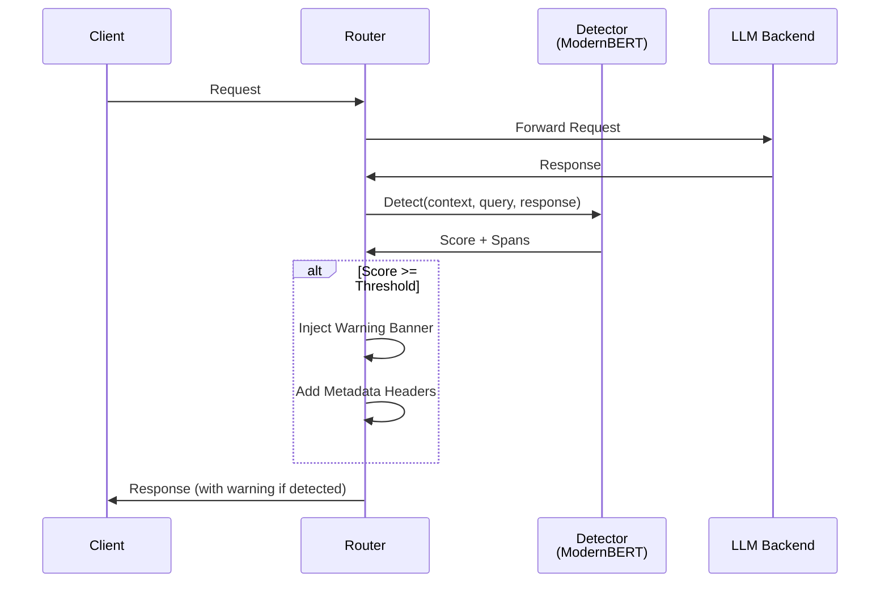

**Characteristics**:

- **No additional LLM calls** after initial generation
- **Fixed detection cost** regardless of response length
- **User-facing warning** empowers human verification
- **Rich metadata** for downstream analytics

#### 5.3.3 Theoretical Guarantees

**Proposition 3 (Detection Latency Bound).** *For ModernBERT-large with sequence length L ≤ 8192:*

*T_detect ≤ O(L²/chunk_size) + O(L · d)*

*In practice: T_detect ≤ 35ms for L ≤ 4096 on modern GPUs.*

**Proposition 4 (No False Negatives on Pass-Through).** *In Lightweight Mode, all hallucinations above threshold τ are flagged. The mode never suppresses detection results.*

#### 5.3.4 Ideal Use Cases

- Internal knowledge bases (users can verify)
- Developer assistants (technical users)
- Creative writing tools (hallucination may be desired)
- Low-stakes customer interactions (human escalation available)

---

### 5.4 Standard Mode: Balanced Self-Refinement

**Philosophy**: Leverage the same model to self-correct detected hallucinations through iterative refinement. This mode implements a **closed-loop feedback system** where the LLM serves as both generator and corrector.

#### 5.4.1 Theoretical Basis

Standard Mode is grounded in **Self-Consistency Theory** and **Iterative Refinement**:

**Theorem 3 (Self-Refinement Effectiveness).** *If an LLM has learned the correct answer distribution for a query class, then prompting with explicit error feedback increases the probability of correct output:*

*P(correct | feedback on error) > P(correct | no feedback)*

*provided the feedback is accurate and actionable.*

**Intuition**: LLMs often "know" the right answer but fail to produce it on first attempt due to:

- Sampling noise (temperature > 0)
- Attention to wrong context regions
- Competing patterns in weights

Explicit error feedback redirects attention and suppresses incorrect patterns.

#### 5.4.2 Convergence Analysis

**Definition 9 (Refinement Sequence).** The sequence *\{Rₜ\}* for *t = 0, 1, 2, ...* where:

*R₀ = LLM(Q, C)*  (initial response)
*Rₜ₊₁ = LLM(Prompt_refine(Q, C, Rₜ, Detect(Rₜ)))*  (refined response)

**Lemma 1 (Monotonic Score Decrease).** *Under mild assumptions (consistent LLM, accurate detection), the hallucination score sequence is non-increasing:*

*s(Rₜ₊₁) ≤ s(Rₜ)* with high probability

**Empirical Convergence Pattern**:

| Iteration | Typical Score Reduction | Marginal Improvement |
|-----------|------------------------|----------------------|
| 1 → 2 | 30-50% | High |
| 2 → 3 | 15-25% | Medium |
| 3 → 4 | 5-15% | Low |
| 4+ | \<5% | Diminishing |

This motivates the default *max_iterations = 3* setting.

#### 5.4.3 Mechanism

```mermaid
sequenceDiagram
    participant C as Client
    participant R as Router
    participant D as Detector
    participant L as Primary LLM

    C->>R: Request
    R->>L: Forward Request
    L->>R: Response₀

    loop Max N Iterations
        R->>D: Detect(context, query, responseᵢ)
        D->>R: Score + Hallucinated Spans

        alt Score >= Threshold
            R->>R: Build Correction Prompt with:<br/>• Original context<br/>• Detected spans<br/>• Correction instructions
            R->>L: Correction Request
            L->>R: Responseᵢ₊₁
        else Score < Threshold
            R->>C: Final Response (Verified)
        end
    end

    Note over R,C: If max iterations reached,<br/>return best response with disclaimer
```

**Characteristics**:

- **Iterative improvement** through self-reflection
- **Same model** maintains consistency
- **Bounded iterations** control costs
- **Graceful degradation** if convergence fails

**Research Foundation**: Based on Self-Refine (NeurIPS 2023) and Chain-of-Verification (ACL 2024) principles.

**Ideal Use Cases**:

- Business intelligence reports
- Customer support (escalated queries)
- Educational content
- Technical documentation

### 5.5 Premium Mode: Multi-Model Collaborative Verification

**Philosophy**: Maximum accuracy through diverse model perspectives and collaborative error correction. This mode implements **ensemble verification** and **adversarial debate** mechanisms.

#### 5.5.1 Theoretical Basis: Ensemble Learning

Premium Mode is grounded in **Condorcet's Jury Theorem** (1785) and modern **ensemble learning** theory:

**Theorem 4 (Condorcet's Jury Theorem, adapted).** *For M independent models each with accuracy p > 0.5 on a binary decision, the majority vote accuracy approaches 1 as M → ∞:*

*P(majority correct) = Σ(k=⌈M/2⌉ to M) C(M,k) · pᵏ · (1-p)^(M-k) → 1*

**Corollary (Diversity Requirement)**: The theorem requires **independence**. Correlated models (same training data, architecture) provide diminishing returns.

**Practical Diversity Sources**:

| Diversity Type | Example | Independence Level |
|----------------|---------|-------------------|
| Training data | GPT vs Claude | High |
| Architecture | Transformer vs Mamba | Very High |
| Fine-tuning | Base vs Instruct | Medium |
| Prompting | Different system prompts | Low |

#### 5.5.2 Theoretical Basis: Multi-Agent Debate

Beyond voting, **debate** enables models to refine each other's reasoning:

**Definition 10 (Debate Protocol).** A debate between models M₁, M₂ with judge J consists of:

1. **Generation Phase**: Both models produce responses R₁, R₂
2. **Critique Phase**: Each model critiques the other's response
3. **Defense Phase**: Models defend their claims with evidence
4. **Synthesis Phase**: Judge J produces final response based on arguments

**Theorem 5 (Debate Improves Grounding).** *When models must justify claims with evidence from context C, the debate process filters ungrounded claims:*

*An ungrounded claim in R₁ will be challenged by M₂ if M₂ cannot find supporting evidence in C.*

**Information-Theoretic View**: Debate acts as a **lossy compression** of the argument space, preserving only claims that survive cross-examination.

#### 5.5.3 Mechanism

```mermaid
sequenceDiagram
    participant C as Client
    participant R as Router
    participant D as Detector
    participant L1 as Primary LLM<br/>(e.g., GPT-4)
    participant L2 as Verifier LLM<br/>(e.g., Claude)
    participant L3 as Judge LLM<br/>(e.g., Llama-3)

    C->>R: Request
    R->>L1: Forward Request
    L1->>R: Response₁

    par Cross-Model Verification
        R->>L2: Same Request
        L2->>R: Response₂
    and
        R->>D: Detect(context, query, response₁)
        D->>R: Initial Detection
    end

    R->>R: Compare Response₁ vs Response₂<br/>Identify Discrepancies

    alt Significant Discrepancies Found
        R->>L3: Arbitration Request:<br/>• Context + Query<br/>• Response₁ + Response₂<br/>• Discrepancy Analysis
        L3->>R: Synthesized Response
        R->>D: Final Verification
        D->>R: Final Score
    end

    R->>C: Verified Response with<br/>Confidence Metadata
```

#### 5.5.4 Consensus Mechanisms

**Mechanism 1: Segment-Level Voting**

For each claim segment *S*:

*vote(S) = Σₘ 𝟙[S ∈ Rₘ] / M*

Accept *S* if *vote(S) > 0.5* (majority agreement).

**Mechanism 2: Confidence-Weighted Fusion**

*R_final = argmax_R Σₘ wₘ · sim(R, Rₘ)*

where *wₘ* is model m's calibrated confidence and *sim* is semantic similarity.

**Mechanism 3: Fine-Grained Replacement (Finch-Zk)**

1. Segment R₁ into claims \{S₁, S₂, ..., Sₖ\}
2. For each Sᵢ, check consistency with R₂
3. If inconsistent: replace Sᵢ with version from more reliable model
4. Output: hybrid response with highest-confidence segments

#### 5.5.5 Cost-Accuracy Trade-off Analysis

| Configuration | Models | Expected Accuracy Gain | Cost Multiplier |
|---------------|--------|----------------------|-----------------|
| Dual-model voting | 2 | +15-25% | 2x |
| Triple-model voting | 3 | +25-35% | 3x |
| Dual + Judge | 2+1 | +30-40% | 3x |
| Full debate (3 rounds) | 2+1 | +40-50% | 5-6x |

#### 5.5.6 Ideal Use Cases

- **Medical diagnosis assistance**: Life-critical decisions
- **Legal document analysis**: Liability implications
- **Financial advisory**: Regulatory compliance required
- **Safety-critical systems**: Aerospace, nuclear, etc.

### 5.6 Mode Selection Decision Tree

```mermaid
flowchart TD
    START[New Application] --> Q1{Regulatory<br/>Requirements?}

    Q1 -->|Healthcare/Finance/Legal| P[🔴 Premium Mode]
    Q1 -->|None/Low| Q2{User Impact<br/>of Errors?}

    Q2 -->|High| Q3{Budget<br/>Constraints?}
    Q2 -->|Low| L[🟢 Lightweight Mode]

    Q3 -->|Flexible| S[🟡 Standard Mode]
    Q3 -->|Tight| Q4{Can Users<br/>Verify?}

    Q4 -->|Yes| L
    Q4 -->|No| S

    P --> CONFIG_P[Configure:<br/>• Multi-model backends<br/>• Max iterations: 5-10<br/>• Threshold: 0.3-0.5]

    S --> CONFIG_S[Configure:<br/>• Self-refinement<br/>• Max iterations: 3-5<br/>• Threshold: 0.5-0.7]

    L --> CONFIG_L[Configure:<br/>• Warning template<br/>• Threshold: 0.6-0.8<br/>• Metadata headers]
```

---

## 6. Configuration Design

### 6.1 Global Configuration

```yaml
# Global hallucination detection settings
hallucination:
  enabled: true

  # Detection model (ModernBERT-based)
  model_id: "models/lettucedetect-large-modernbert-en-v1"
  use_cpu: false

  # Default operational mode
  default_mode: "standard"  # lightweight | standard | premium

  # Detection threshold (0.0 - 1.0)
  # Lower = more strict, Higher = more lenient
  threshold: 0.6

  # Warning template for lightweight mode
  warning_template: |
    ⚠️ **Notice**: This response may contain information that could not be
    fully verified against the provided context. Please verify critical facts
    before taking action.

  # Standard mode settings
  standard:
    max_iterations: 3
    convergence_threshold: 0.4  # Stop if score drops below this

  # Premium mode settings
  premium:
    verification_models:
      - "claude-3-sonnet"
      - "gpt-4-turbo"
    judge_model: "llama-3.1-70b"
    max_iterations: 5
    require_consensus: true
```

### 6.2 Per-Decision Plugin Configuration

```yaml
decisions:
  # Healthcare domain - Maximum accuracy required
  - name: "medical_assistant"
    description: "Medical information queries"
    priority: 100
    rules:
      operator: "OR"
      conditions:
        - type: "domain"
          name: "healthcare"
        - type: "keyword"
          name: "medical_terms"
    modelRefs:
      - model: "gpt-4-turbo"
    plugins:
      - type: "hallucination"
        configuration:
          enabled: true
          mode: "premium"
          threshold: 0.3           # Very strict
          max_iterations: 5
          require_disclaimer: true

  # Financial services - High accuracy
  - name: "financial_advisor"
    description: "Financial analysis and advice"
    priority: 90
    rules:
      operator: "OR"
      conditions:
        - type: "domain"
          name: "finance"
    plugins:
      - type: "hallucination"
        configuration:
          enabled: true
          mode: "standard"
          threshold: 0.5
          max_iterations: 4

  # General customer support - Balanced
  - name: "customer_support"
    description: "General customer inquiries"
    priority: 50
    rules:
      operator: "OR"
      conditions:
        - type: "domain"
          name: "support"
    plugins:
      - type: "hallucination"
        configuration:
          enabled: true
          mode: "standard"
          threshold: 0.6
          max_iterations: 2

  # Internal tools - Cost optimized
  - name: "internal_assistant"
    description: "Internal knowledge base queries"
    priority: 30
    rules:
      operator: "OR"
      conditions:
        - type: "domain"
          name: "internal"
    plugins:
      - type: "hallucination"
        configuration:
          enabled: true
          mode: "lightweight"
          threshold: 0.7

  # Creative writing - Detection disabled
  - name: "creative_writing"
    description: "Creative content generation"
    priority: 20
    rules:
      operator: "OR"
      conditions:
        - type: "domain"
          name: "creative"
    plugins:
      - type: "hallucination"
        configuration:
          enabled: false  # "Hallucination" is a feature here
```

### 6.3 Response Headers

The following headers are added to all responses when hallucination detection is enabled:

| Header | Description | Example Values |
|--------|-------------|----------------|
| `X-TruthLens-Enabled` | Whether detection was performed | `true`, `false` |
| `X-TruthLens-Mode` | Operational mode used | `lightweight`, `standard`, `premium` |
| `X-TruthLens-Score` | Hallucination confidence score | `0.0` - `1.0` |
| `X-TruthLens-Detected` | Whether hallucination exceeded threshold | `true`, `false` |
| `X-TruthLens-Iterations` | Number of refinement iterations | `0`, `1`, `2`, ... |
| `X-TruthLens-Latency-Ms` | Detection/mitigation latency | `35`, `450`, `2100` |

### 6.4 Metrics and Observability

**Prometheus Metrics:**

| Metric | Type | Labels | Description |
|--------|------|--------|-------------|
| `truthlens_detections_total` | Counter | `decision`, `mode`, `detected` | Total detection operations |
| `truthlens_score` | Histogram | `decision`, `mode` | Score distribution |
| `truthlens_latency_seconds` | Histogram | `mode`, `operation` | Processing latency |
| `truthlens_iterations` | Histogram | `decision`, `mode` | Refinement iteration count |
| `truthlens_models_used` | Counter | `model`, `role` | Model usage in premium mode |

---

## 7. References

1. Kovács, Á., & Recski, G. (2025). *LettuceDetect: A Hallucination Detection Framework for RAG Applications*. arXiv:2502.17125

2. Goel, A., Schwartz, D., & Qi, Y. (2025). *Finch-Zk: Zero-knowledge LLM hallucination detection and mitigation through fine-grained cross-model consistency*. arXiv:2508.14314

3. Lin, Z., Niu, Z., Wang, Z., & Xu, Y. (2024). *Interpreting and Mitigating Hallucination in MLLMs through Multi-agent Debate*. arXiv:2407.20505

4. Tran, K.T., et al. (2025). *Multi-Agent Collaboration Mechanisms: A Survey of LLMs*. arXiv:2501.06322

5. Manakul, P., Liusie, A., & Gales, M.J. (2023). *SelfCheckGPT: Zero-Resource Black-Box Hallucination Detection for Generative Large Language Models*. arXiv:2303.08896

6. Tang, L., et al. (2024). *MiniCheck: Efficient Fact-Checking of LLMs on Grounding Documents*. EMNLP 2024

7. Madaan, A., et al. (2023). *Self-Refine: Iterative Refinement with Self-Feedback*. NeurIPS 2023

8. Dhuliawala, S., et al. (2024). *Chain-of-Verification Reduces Hallucination in Large Language Models*. ACL Findings 2024

9. Su, W., et al. (2024). *Unsupervised Real-Time Hallucination Detection based on LLM Internal States (MIND)*. ACL Findings 2024

10. Belyi, M., et al. (2025). *Luna: A Lightweight Evaluation Model to Catch Language Model Hallucinations*. COLING 2025

---

## Appendix A: Full System Flow Diagram

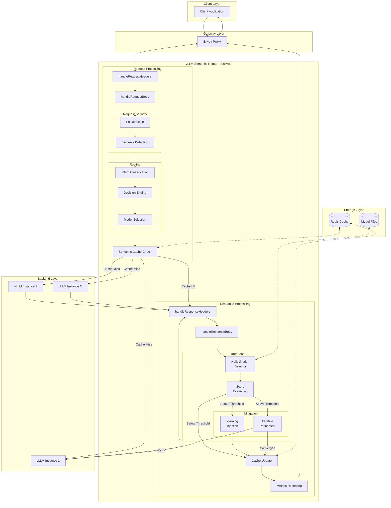

---

## Appendix B: Glossary

| Term | Definition |
|------|------------|
| **Hallucination** | LLM-generated content that is factually incorrect or unsupported by context |
| **Intrinsic Hallucination** | Fabricated facts from the model's internal parametric knowledge |
| **Extrinsic Hallucination** | Content not grounded in the provided context (common in RAG) |
| **ExtProc** | Envoy External Processor - enables request/response modification at the gateway |
| **Token-Level Detection** | Identifying specific tokens/spans that are hallucinated |
| **Self-Refinement** | Iterative process where the same model corrects its own hallucinations |
| **Cross-Model Verification** | Using multiple different models to verify factual consistency |
| **Multi-Agent Debate** | Multiple LLM agents argue positions to converge on factual truth |
| **RAG** | Retrieval-Augmented Generation - grounding LLMs with retrieved documents |
| **ModernBERT** | State-of-the-art encoder architecture with 8K context support |
| **Accuracy-Latency-Cost Triangle** | Fundamental trade-off in hallucination mitigation strategies |
| **Convergence Threshold** | Score below which hallucination is considered resolved |

---

**Document Version:** 1.0 | **Last Updated:** December 2025
